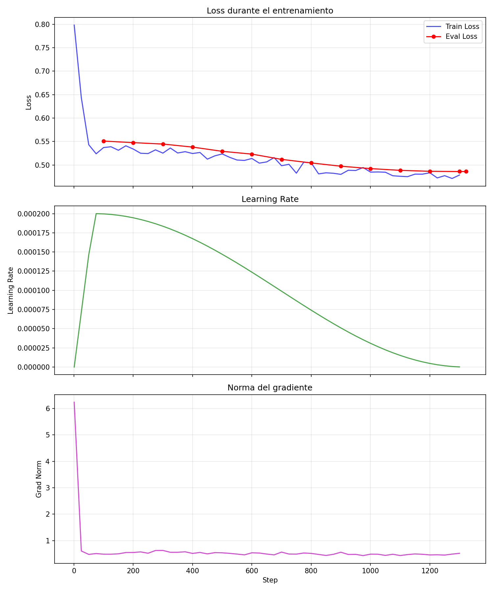
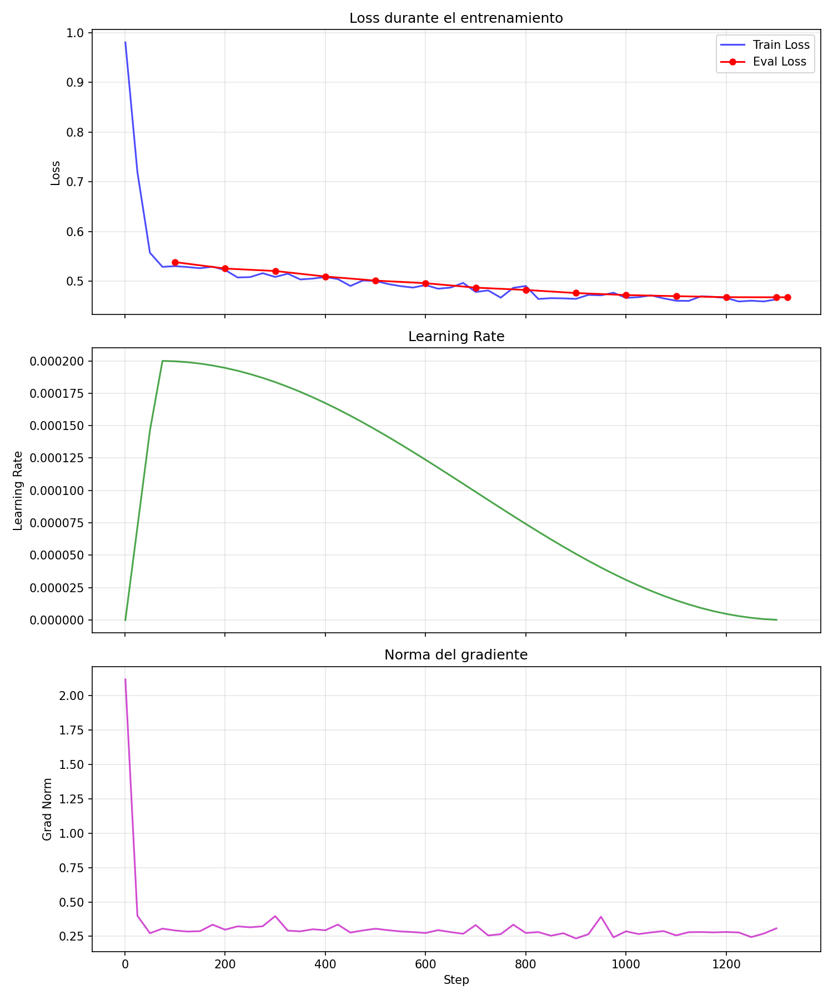

# Teacher — Fine-tuning para RAG Contextual

Trabajo de Fin de Grado — **Universitat Politècnica de València**

Fine-tuning con LoRA para generación fundamentada en contexto (RAG). El modelo aprende a responder exclusivamente a partir de fragmentos documentales proporcionados entre etiquetas `<contexto>...</contexto>`, minimizando alucinaciones. Se despliega localmente con Ollama y se integra con un sistema RAG de consulta de PDFs académicos.

## Evolución del modelo

El proyecto siguió un enfoque iterativo de refinamiento:

1. **Llama 3.1 8B** — Primera iteración. Se obtuvo un modelo funcional pero con limitaciones en faithfulness (0.84) y answer_correctness (0.53), insuficientes para un asistente académico fiable.
2. **Qwen 2.5 14B** — Modelo actual. La mayor capacidad del modelo (14B vs 8B) y la arquitectura Qwen permiten respuestas más precisas y fieles al contexto proporcionado.

Ambos modelos entrenados se conservan en el repositorio para documentar la progresión experimental del TFG.

## Estructura del proyecto

```
├── scripts/
│   ├── training/
│   │   ├── train.py                    # Entrenamiento LoRA (Qwen 2.5)
│   │   ├── plot_training.py            # Visualización de curvas
│   │   ├── run.sh                      # Lanzador SLURM/HPC
│   │   └── requirements.txt
│   └── conversion/
│       ├── merge_lora.py               # Fusión LoRA + modelo base
│       ├── quantize_to_q4km.ps1        # Cuantización GGUF → Q4_K_M
│       └── build_ollama.bat            # Pipeline completo → Ollama
├── training-output/
│   ├── llama-3.1/                      # Adaptadores y métricas (histórico)
│   └── qwen-2.5/                       # Adaptadores y métricas (actual)
├── models/
│   ├── gguf-output/
│   │   ├── llama-3.1/                  # Modelfile + GGUF (histórico)
│   │   └── qwen-2.5/                   # Modelfile + GGUF (actual)
│   └── merged-model/                   # Modelos fusionados (generados)
├── rag/                                # Sistema RAG
│   ├── chat_pdfs.py                    # Pipeline completo
│   └── requirements.txt
├── evaluation/                         # Evaluación RAGAS
│   ├── run_eval.py                     # Script de evaluación
│   ├── dataset_eval.json               # Dataset de preguntas
│   └── requirements.txt
├── imgs/                               # Curvas y capturas para documentación
└── llama.cpp/                          # Herramientas de conversión GGUF
```

## 1. Entrenamiento

Ambos modelos comparten la misma configuración base de LoRA y el mismo dataset multilingüe, permitiendo una comparación directa del impacto del modelo base en las métricas finales.

### Iteración 1: Llama 3.1 8B

| Parámetro | Valor |
|---|---|
| Modelo base | `unsloth/Meta-Llama-3.1-8B-Instruct` |
| Dataset | [`projecte-aina/RAG_Multilingual`](https://huggingface.co/datasets/projecte-aina/RAG_Multilingual) (42 303 ejemplos, ES/CA/EN) |
| LoRA | r=64, alpha=128, dropout=0.05, 7 módulos target |
| Batch efectivo | 32 (batch=2 × grad_accum=16) |
| Learning rate | 2e-4, cosine scheduler, warmup 5% |
| Precisión | BF16 |
| Épocas | 1 (1 322 steps) |
| Loss final | ~0.55 |

<p align="center">
  
</p>

### Iteración 2: Qwen 2.5 14B (Actual)

| Parámetro | Valor |
|---|---|
| Modelo base | `Qwen/Qwen2.5-14B-Instruct` |
| Dataset | [`projecte-aina/RAG_Multilingual`](https://huggingface.co/datasets/projecte-aina/RAG_Multilingual) (42 303 ejemplos, ES/CA/EN) |
| LoRA | r=64, alpha=128, dropout=0.05, 7 módulos target |
| Batch efectivo | 32 (batch=2 × grad_accum=16) |
| Learning rate | 2e-4, cosine scheduler, warmup 5% |
| Precisión | BF16 |
| Épocas | 1 (1 322 steps) |
| Perplexity | 1.60 |

<p align="center">
  
</p>

```bash
# Entrenamiento (requiere GPU con CUDA)
cd scripts/training
pip install -r requirements.txt
python train.py

# Visualizar curvas
python plot_training.py
```

## 2. Conversión y despliegue

Pipeline automático que convierte el adaptador LoRA a un modelo cuantizado Q4_K_M registrado en Ollama. Cada modelo tiene su propio directorio de salida (`models/gguf-output/<modelo>/`):

```
Fusión LoRA → GGUF F16 → Q4_K_M → ollama create teacher-q4km
```

```bash
# Pipeline automático
scripts\conversion\build_ollama.bat

# O paso a paso:
python scripts/conversion/merge_lora.py
python llama.cpp/convert_hf_to_gguf.py models/merged-model/qwen-2.5 --outfile models/gguf-output/qwen-2.5/Qwen-2.5-14B-Teacher-f16.gguf --outtype f16
.\scripts\conversion\quantize_to_q4km.ps1 <input.gguf> <output.gguf>
cd models/gguf-output/qwen-2.5 && ollama create teacher-q4km -f Modelfile
```

El `Modelfile` de cada modelo replica el system prompt y template de chat usados durante su entrenamiento para mantener coherencia train/inference. Parámetros de generación: `temperature=0.15`, `repeat_penalty=1.15`, `top_p=0.9`, `num_ctx=8192`.

## 3. Sistema RAG

Chat interactivo para consulta de PDFs con búsqueda híbrida:

| Componente | Tecnología |
|---|---|
| Extracción PDF | pymupdf4llm (Markdown) / pypdf (fallback) |
| Chunking | Structure-aware, 1 200 chars, overlap 200 |
| Embeddings | embeddinggemma (768d, 2K tokens, multilingüe 100+ idiomas) |
| Vector store | ChromaDB (persistente) |
| Búsqueda | Semántica multi-query + keywords + exhaustiva, fusión RRF |
| Reranking | BAAI/bge-reranker-v2-m3 (cross-encoder multilingual) |
| LLM | teacher-q4km vía Ollama |
| Generación | temperature=0.15, repeat_penalty=1.15, top_p=0.85 |

**Pipeline por pregunta:** descomposición LLM → búsqueda semántica multi-query → keywords → fusión RRF → reranking cross-encoder → generación con contexto.

```bash
cd rag
pip install -r requirements.txt
# Colocar PDFs en rag/pdfs/
python chat_pdfs.py
```

Comandos del chat: `stats`, `docs`, `temas`, `reindex`, `salir`.

## 4. Evaluación con RAGAS

Evaluación objetiva del sistema RAG con 5 métricas (RAGAS v0.2+): `faithfulness`, `answer_relevancy`, `context_precision`, `context_recall` y `answer_correctness`. Utiliza Gemini 2.0 Flash como LLM juez y HuggingFace embeddings locales.

```bash
cd evaluation
pip install -r requirements.txt
python run_eval.py> **Nota:** Para la evaluación se usó **Gemini 2.0 Flash** como juez (`evaluator_llm`) debido a su ventana de contexto y capacidad de razonamiento.
```

### Comparativa: Llama 3.1 8B vs. Qwen 2.5 14B

La migración a Qwen 2.5 14B (cuantizado a Q4_K_M) ha supuesto una mejora consistente en todas las métricas dependientes del generador, manteniendo la eficacia del sistema de recuperación.

| Métrica | Definición | Llama 3.1 8B (Baseline) | Qwen 2.5 14B (SFT) | Mejora |
| :--- | :--- | :---: | :---: | :---: |
| **Faithfulness** | ¿La respuesta se basa en el contexto recuperado? | 0.8400 | **0.8890** | +5.8% 🟢 |
| **Answer Relevancy** | ¿La respuesta es pertinente a la pregunta? | 0.8285 | **0.8604** | +3.9% 🟢 |
| **Answer Correctness** | Exactitud semántica vs. ground truth | 0.5294 | **0.5977** | +12.9% 🟢 |
| **Context Recall** | ¿Se recuperó toda la información necesaria? | 0.9474 | 0.9474 | = |
| **Context Precision** | ¿Los fragmentos relevantes están bien rankeados? | 0.8947 | 0.8947 | = |
| **Score Global** | Promedio de todas las métricas | 0.8080 | **0.8378** | +3.7% 🟢 |

**Conclusiones de la evaluación:**
1. **Menos alucinaciones:** El aumento en `faithfulness` a casi **0.89** indica que el modelo respeta mucho mejor los límites del contexto proporcionado, crucial para un sistema RAG académico.
2. **Mejor redacción:** La mejora en `answer_correctness` y `answer_relevancy` sugiere que Qwen 2.5 genera respuestas más precisas y mejor estructuradas.
3. **Recuperación sólida:** Las métricas de contexto (`recall` y `precision`) se mantienen idénticas y muy altas (>0.90), confirmando que la estrategia de embeddings híbrida (ChromaDB + BM25 + Reranker) es robusta., cuya evaluación RAGAS se incluirá tras la fase de validación.

## Requisitos

| Componente | Entorno | Dependencias |
|---|---|---|
| Entrenamiento | GPU (CUDA), Python 3.10+ | `pip install -r scripts/training/requirements.txt` |
| Conversión | [llama.cpp](https://github.com/ggml-org/llama.cpp) + Ollama | Clonar llama.cpp en la raíz del proyecto |
| RAG | CPU suficiente, Ollama | `pip install -r rag/requirements.txt` |
| Evaluación | `GEMINI_API_KEY` configurada | `pip install -r evaluation/requirements.txt` |

El sistema RAG requiere que Ollama tenga cargados los modelos `teacher-q4km` y `embeddinggemma`.

## Licencia

Sujeto a las licencias de [Meta Llama 3.1](https://llama.meta.com/llama3/license/), [Qwen 2.5](https://huggingface.co/Qwen/Qwen2.5-14B-Instruct/blob/main/LICENSE) y del dataset [RAG_Multilingual](https://huggingface.co/datasets/projecte-aina/RAG_Multilingual) (projecte-aina).
