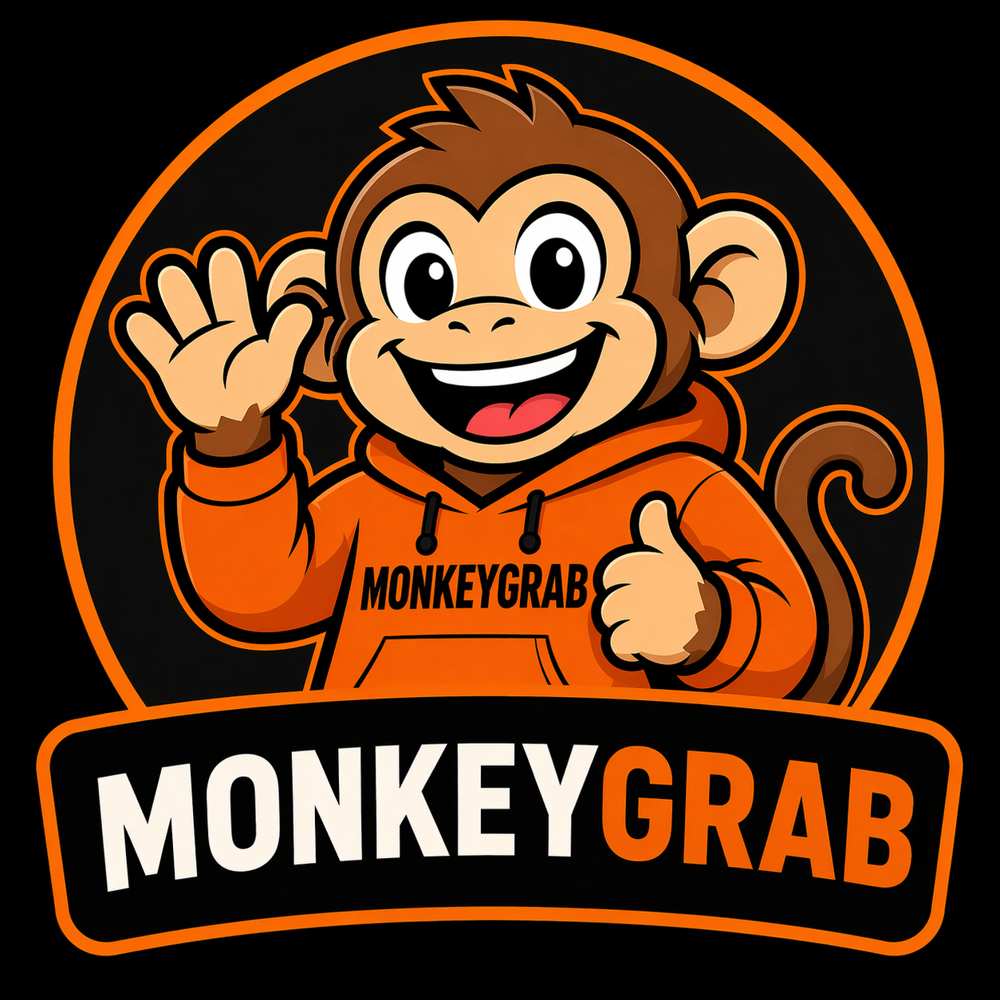
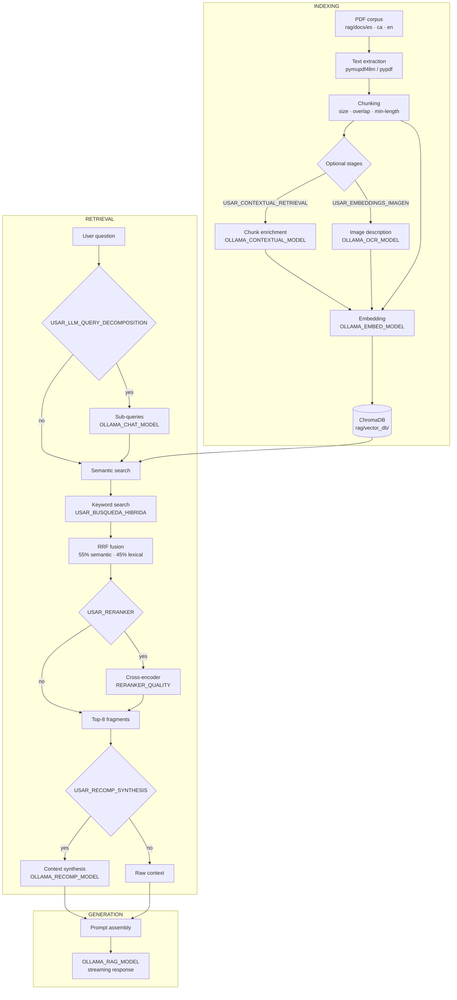
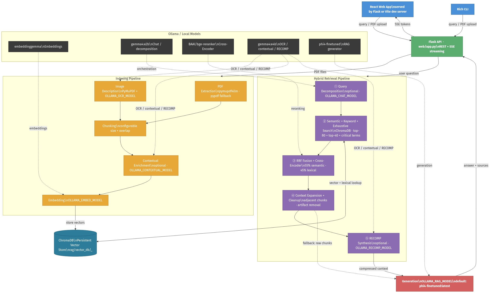

<p align="center">
  
</p>

<h1 align="center">MonkeyGrab</h1>

<p align="center">
  <strong>A local, multilingual RAG system for querying PDF documents with open language models.</strong><br/>
  All indexing, retrieval and generation runs on your own hardware — no data leaves your machine.
</p>

<p align="center">
  <a href="https://www.python.org/"></a>
  <a href="https://ollama.com/"></a>
  <a href="https://www.trychroma.com/"></a>
  
  
  
</p>

<p align="center">
  <a href="#01-overview">Overview</a> ·
  <a href="#02-demo">Demo</a> ·
  <a href="#03-how-it-works">Architecture</a> ·
  <a href="#04-getting-started">Getting started</a> ·
  <a href="#05-configuration">Configuration</a> ·
  <a href="#06-usage">Usage</a> ·
  <a href="#07-evaluation">Evaluation</a>
</p>

---

## 01. Overview

MonkeyGrab is a Retrieval-Augmented Generation (RAG) system designed for researchers and students who need to query PDF documents without sending their data to external services. You point it at a folder of PDFs and ask questions in natural language; it returns answers grounded in the actual content of those files. The system works with any instruction-tuned model available in [Ollama](https://ollama.com/) and adapts to your hardware through environment variables.

<table>
  <tr>
    <td><strong>Local-first</strong></td>
    <td>All indexing, retrieval and generation runs on your own hardware. No API keys required for the core pipeline.</td>
  </tr>
  <tr>
    <td><strong>Hybrid retrieval</strong></td>
    <td>Semantic search and keyword search fused with RRF (55/45 weights), followed by optional cross-encoder reranking.</td>
  </tr>
  <tr>
    <td><strong>Multilingual</strong></td>
    <td>Built and evaluated on English, Spanish and Catalan corpora. Active corpus is selected via environment variable.</td>
  </tr>
  <tr>
    <td><strong>Model-flexible</strong></td>
    <td>Every role — generator, embedder, reranker, RECOMP synthesiser, vision model — is independently configurable.</td>
  </tr>
  <tr>
    <td><strong>PDF-aware</strong></td>
    <td>Optionally describes raster images and figures in PDFs with a vision model, making visual content retrievable.</td>
  </tr>
  <tr>
    <td><strong>Two interfaces</strong></td>
    <td>Rich-based terminal CLI (bilingual ES/EN via <code>MONKEYGRAB_LANG</code>) and a Flask + React 19 web UI with streaming responses.</td>
  </tr>
  <tr>
    <td><strong>Research-ready</strong></td>
    <td>Includes LoRA fine-tuning scripts (Qwen3-14B, Phi-4, Gemma-3-12B), RAGAS evaluation and RAGBench workflows.</td>
  </tr>
</table>

---

## 02. Demo

**Web interface — querying a local document corpus**

https://github.com/user-attachments/assets/22582283-1b28-4054-a341-3aa1cbdc5057

**CLI — querying a local document corpus**

https://github.com/user-attachments/assets/4b8a84ca-422f-44a6-a0d5-a8078fa5e17a

Sample queries against a database of five Wikipedia articles indexed with the default settings. Models and parameters are fully configurable — results are specific to the hardware and models used during recording.

**RAGBench evaluation — indexing 25 documents from scratch**

https://github.com/user-attachments/assets/9bbab813-0b7a-474c-a3b4-aad53f580672

Left terminal: `ollama serve`. Right terminal: the full RAGBench pipeline — indexing, inference and RAGAS scoring in one run.

**An example of document indexing for evaluating questions about specific images**


**LaTeX rendering — math formulas in answers are rendered natively in the web UI**


The web interface uses [KaTeX](https://katex.org/) to render inline (`$...$`) and display (`$$...$$`) LaTeX expressions generated by the model, as in this answer about the DPO gradient update mechanism.

---

## 03. How it works



<p align="center">
  
</p>

---

## 04. Getting started

**Prerequisites:** Python 3.10+, [Ollama](https://ollama.com/) running locally. A CUDA-capable GPU is recommended for the reranker; CPU works for inference.

### Install

```bash
git clone https://github.com/iDiagoValeta/localOllamaRAG
cd localOllamaRAG

pip install -r rag/requirements.txt            # core RAG system (required)
pip install -r web/requirements.txt            # web interface (optional)
pip install -r evaluation/requirements.txt     # RAGAS evaluation (optional)
```

### Pull models

At minimum you need a generator model and an embedding model:

```bash
ollama pull <your OLLAMA_RAG_MODEL>            # required — document Q&A generator
ollama pull <your OLLAMA_EMBED_MODEL>          # required — indexing and retrieval

ollama pull <your OLLAMA_CHAT_MODEL>           # optional — chat mode and query decomposition
ollama pull <your OLLAMA_CONTEXTUAL_MODEL>     # optional — contextual chunk enrichment
ollama pull <your OLLAMA_RECOMP_MODEL>         # optional — context synthesis before generation
ollama pull <your OLLAMA_OCR_MODEL>            # optional — vision model for PDF images
```

> **Any instruction-tuned model available in Ollama works as the generator** (`llama3.2`, `mistral`, `gemma4`, `qwen3`, etc.). The system prompt is injected automatically at query time, so no special configuration is needed. Fine-tuned models below were trained specifically on document Q&A tasks and yield higher accuracy on RAG benchmarks.

**Fine-tuned weights (recommended):**

- **Qwen3-14B RAG** (LoRA, Q4_K_M GGUF): [nadiva1243/qwen3RAG](https://huggingface.co/nadiva1243/qwen3RAG)
- **Phi-4 RAG** (LoRA, Q4_K_M GGUF): [nadiva1243/phi4RAG](https://huggingface.co/nadiva1243/phi4RAG)

`Modelfile` templates and conversion scripts are under `models/gguf-output/` and `scripts/conversion/` respectively. `.gguf` binaries are not committed to the repository.

### Run

Drop your PDFs into `rag/docs/libre/` (the default free-use corpus), then:

```bash
# Terminal CLI (Spanish UI — default)
cd rag && python chat_pdfs.py

# Terminal CLI (English UI)
# bash/zsh
MONKEYGRAB_LANG=en python rag/chat_pdfs.py
# PowerShell
$env:MONKEYGRAB_LANG = "en"; python rag/chat_pdfs.py

# Web interface — http://localhost:5000
python web/app.py
```

The vector index is created automatically in `rag/vector_db/` on first run.

---

## 05. Configuration

All pipeline behaviour is controlled via environment variables. Set them in your shell or in a `.env` file at the project root.

| Variable | Description |
|----------|-------------|
| `OLLAMA_RAG_MODEL` | Generator model for RAG mode |
| `OLLAMA_CHAT_MODEL` | Generator for CHAT mode and query decomposition |
| `OLLAMA_EMBED_MODEL` | Embedding model for indexing and retrieval |
| `OLLAMA_CONTEXTUAL_MODEL` | Auxiliary model for contextual chunk enrichment |
| `OLLAMA_RECOMP_MODEL` | Model for context synthesis before generation |
| `OLLAMA_OCR_MODEL` | Vision model for PDF image descriptions |
| `DOCS_FOLDER` | PDF folder to index (default: `rag/docs/libre/`) |
| `RERANKER_QUALITY` | Cross-encoder tier: `quality` (BAAI/bge) or `speed` (MiniLM) |
| `MONKEYGRAB_LANG` | CLI language: `es` (Spanish, default) or `en` (English) |
| `USAR_RECOMP_SYNTHESIS` | Enable/disable RECOMP synthesis (`true`/`false`, default: `true`) |

> **ChromaDB paths** follow the pattern `rag/vector_db/<folder>_<embed_slug>/`. Changing `DOCS_FOLDER` or `OLLAMA_EMBED_MODEL` selects a different index path — re-run `/reindex` when you intentionally switch either.

<details>
<summary><strong>Pipeline flags (advanced)</strong></summary>

These are constants in `rag/chat_pdfs.py`. Edit them directly to change pipeline behaviour without environment variables.

| Flag | Default | Effect |
|------|---------|--------|
| `USAR_CONTEXTUAL_RETRIEVAL` | `True` | Enrich chunks with LLM context before indexing |
| `USAR_LLM_QUERY_DECOMPOSITION` | `True` | Decompose query into sub-queries |
| `USAR_BUSQUEDA_HIBRIDA` | `True` | Enable keyword search alongside semantic search |
| `USAR_RERANKER` | `True` | Enable cross-encoder reranking |
| `USAR_RECOMP_SYNTHESIS` | `True` | Enable RECOMP context compression |
| `EXPANDIR_CONTEXTO` | `True` | Include adjacent chunks around top results |
| `USAR_EMBEDDINGS_IMAGEN` | `False` | Describe raster images in PDFs with a vision model |

</details>

---

## 06. Usage

### Terminal CLI

| Command | Description |
|---------|-------------|
| `/rag` | Switch to RAG mode — answers grounded in your documents |
| `/chat` | Switch to CHAT mode — general conversation without document context |
| `/docs` | List indexed documents |
| `/temas` | Show a topic summary per document |
| `/stats` | Show vector database statistics |
| `/reindex` | Delete the current index and re-index all documents |
| `/limpiar` or `/clear` | Clear the conversation history |
| `/ayuda` or `/help` | Show all available commands |
| `/salir` or `/exit` | Exit and save history |

### Web interface

Available at `http://localhost:5000`. Supports document upload, streaming responses and pipeline settings through the UI.

For development with hot-reload: run `npm run dev` inside `web/zip/` (Vite on :3000 proxies to Flask on :5000); run `npm run build` to compile the production bundle served by Flask.

---

## 07. Evaluation

Requires a **`GOOGLE_API_KEY`** in `.env` ([Gemini](https://ai.google.dev/) as judge LLM) and `pip install -r evaluation/requirements.txt`.

```bash
python evaluation/run_eval.py single --corpus es    # Spanish corpus
python evaluation/run_eval.py single --corpus ca    # Catalan corpus

python evaluation/run_eval.py ragbench-prepare      # build fixed EN eval corpus (25 docs / 5 q each)
python evaluation/run_eval.py ragbench-eval         # index + infer + RAGAS from manifest
python evaluation/run_ragbench_visual_inference.py --n-papers 25 --max-q 5  # table/image RagBench inference only
python evaluation/run_ragbench_visual_inference.py --ragas-only --n-papers 25 --max-q 5  # RAGAS over completed visual inference
python evaluation/evaluate_ragas_bertscore.py --all-completed  # BERTScore over completed RAGAS outputs
```

<details>
<summary><strong>Ablation comparison and aggregation</strong></summary>

Run multiple pipeline variants against a shared index and compare scores:

```bash
python evaluation/run_eval.py compare --corpus ca --label mi_eval --reindex
python evaluation/run_eval.py list-variants
```

Aggregate per-variant results by dataset subset:

```bash
python evaluation/aggregate_comparison_by_conjunto.py \
  --dir evaluation/runs/ragas/comparisons/mi_eval \
  --etiquetas-es
```

Artifacts: `evaluation/datasets/local/` (local eval datasets), `evaluation/datasets/ragbench/prepared/` (prepared RagBench datasets/manifests), `evaluation/runs/ragas/single/`, `evaluation/runs/ragas/comparisons/`, `evaluation/runs/ragas/ragbench/`, `evaluation/runs/ragas/ragbench_visual/` (RAGAS scores + `inference/` subfolder for pre-RAGAS outputs), and `evaluation/runs/bertscore/`. See `docs/EVALUACIONES_PIPELINE.md` for corpus presets and variant definitions.

BERTScore is computed as a separate post-process over existing RAGAS CSVs. It uses `microsoft/deberta-xlarge-mnli` with `rescale_with_baseline=True` for all languages and never overwrites RAGAS artifacts.

</details>

<details>
<summary><strong>LoRA fine-tuning and reports</strong></summary>

Training scripts are under `scripts/training/`. Each model folder under `training-output/` includes a `generate_reports.py` that produces training curves and evaluation comparison tables:

```bash
python scripts/training/train-qwen3.py    # Qwen3-14B
python scripts/training/train-phi4.py     # Phi-4
python scripts/training/train-gemma3.py   # Gemma-3-12B

python training-output/qwen-3/generate_reports.py
python training-output/phi-4/generate_reports.py
python training-output/gemma-3/generate_reports.py
```

Output: `plots/train/` (loss, learning rate, grad norm curves) and `plots/eval/` (per-metric tables and base vs. adapted comparison figures). Optional flags: `--model-dir`, `--eval-input`, `--train-input`, `--plots-dir`, `--no-figures`.

</details>

---

<details>
<summary><strong>Repository structure</strong></summary>

```
localOllamaRAG/
├── generate_diagram.py           # Architecture diagram (Kroki.io)
├── rag/
│   ├── chat_pdfs.py              # Public API facade + global config; implementation lives in engine/
│   ├── engine/                   # RAG pipeline implementation modules
│   │   ├── runtime.py            # Sync layer: exposes chat_pdfs globals/flags to sub-modules
│   │   ├── chunking.py           # Markdown chunking, neighbor IDs
│   │   ├── lexical.py            # Stopwords, keyword extraction, lexical + exhaustive search
│   │   ├── reranking.py          # LLM query decomposition, CrossEncoder reranking
│   │   ├── retrieval.py          # Hybrid retrieval orchestration (semantic + lexical + RRF)
│   │   ├── context.py            # Context cleanup, model formatting, RECOMP synthesis
│   │   ├── debug.py              # Per-query RAG debug dumps
│   │   ├── generation.py         # Ollama generation (streaming + silent eval path)
│   │   ├── contextual.py         # Contextual retrieval helpers (chunk enrichment at indexing)
│   │   ├── images.py             # PDF image extraction and OCR with LLM
│   │   ├── history.py            # Chat history persistence
│   │   └── indexing.py           # PDF indexing into ChromaDB, document listing
│   ├── show_fragments/
│   │   └── export_fragments.py   # Export ChromaDB chunks to TXT/JSONL for debug
│   ├── cli/
│   │   ├── app.py                # MonkeyGrabCLI: interactive loop, command dispatch, session stats
│   │   ├── display.py            # `ui` singleton: Rich/ANSI/plain backends, QueryTimer, SessionStats
│   │   ├── commands.py           # Single source of truth for slash-commands and aliases
│   │   └── strings.py            # ES/EN string tables; s(key, lang) for CLI i18n
│   ├── docs/
│   │   ├── libre/                # Default free-use corpus (any PDFs; default DOCS_FOLDER)
│   │   ├── es/                   # Spanish Wikipedia corpus (TFG evidence)
│   │   ├── ca/                   # Catalan Wikipedia corpus (TFG evidence)
│   │   ├── en/                   # Generic English corpus (empty)
│   │   ├── en_ragbench_dev/      # Frozen RagBench EN dev split (TFG evidence)
│   │   ├── en_ragbench_eval/     # RagBench EN final eval corpus (TFG evidence)
│   │   └── en_ragbench_visual/   # RagBench EN visual corpus — tables/images (TFG evidence)
│   ├── vector_db/                # ChromaDB indexes — gitignored, created at runtime
│   ├── debug_rag/                # Per-query debug dumps — gitignored
│   └── requirements.txt
├── web/
│   ├── app.py                    # Flask backend (REST + SSE); serves React build
│   └── zip/                      # React source + Vite config; production build → dist/
├── scripts/
│   ├── training/                 # LoRA fine-tuning (Qwen3, Phi-4, Gemma-3)
│   ├── evaluation/               # Baseline benchmark + split inspection + SLURM helpers
│   ├── conversion/               # LoRA merge, GGUF build, quantization notes
│   └── tests/                    # Ollama / pipeline smoke tests
├── evaluation/
│   ├── datasets/                 # Question datasets (ES, CA, mix)
│   ├── scripts/
│   │   └── push_wikipedia_es_ca_hf.py  # Merge ES+CA datasets and push to HF Hub
│   ├── run_eval.py               # RAGAS entrypoint: single | compare | ragbench
│   ├── run_ragbench_visual_inference.py  # RagBench table/image inference without RAGAS
│   ├── runs/                     # Evaluation artifacts: ragas/ and inference/
│   ├── aggregate_comparison_by_conjunto.py
│   └── requirements.txt
├── training-output/
│   ├── qwen-3/                   # LoRA artifacts + generate_reports.py
│   ├── phi-4/                    # LoRA artifacts; other ranks under phi-4/<rank>/
│   ├── gemma-3/                  # LoRA artifacts + generate_reports.py
│   └── baseline/                 # Seven-model baseline benchmark artifacts
├── models/gguf-output/           # Modelfile + docs per model (binaries gitignored)
├── docs/                         # Architecture assets, methodology notes and EVALUACIONES_PIPELINE.md
├── README.md
└── CLAUDE.md
```

</details>

---

## Known limitations

- Vector graphics (SVG-based figures) embedded in PDFs are not extracted and will not be retrievable.
- The RAGAS evaluation pipeline requires a `GOOGLE_API_KEY` and is therefore not fully local.

---

## Links

**RAG pipeline**

| Technology | Role |
|------------|------|
| [Ollama](https://ollama.com/) | Local LLM and embedding server |
| [ChromaDB](https://www.trychroma.com/) | Vector store |
| [pymupdf4llm](https://pymupdf.readthedocs.io/en/latest/pymupdf4llm/) | PDF text extraction (primary) |
| [pypdf](https://pypdf.readthedocs.io/) | PDF text extraction (fallback) |
| [sentence-transformers](https://www.sbert.net/) | Cross-encoder reranker (BAAI/bge, MiniLM) |

**Interfaces**

| Technology | Role |
|------------|------|
| [Rich](https://rich.readthedocs.io/) | Terminal UI |
| [Flask](https://flask.palletsprojects.com/) | Web backend |
| [React](https://react.dev/) | Web frontend |
| [Vite](https://vitejs.dev/) | Frontend build tool |

**Training**

| Technology | Role |
|------------|------|
| [PyTorch](https://pytorch.org/) | Deep learning framework |
| [Transformers](https://huggingface.co/docs/transformers/) | Model loading and training |
| [PEFT](https://huggingface.co/docs/peft/) | LoRA fine-tuning |
| [bitsandbytes](https://github.com/bitsandbytes-foundation/bitsandbytes) | Quantization and QLoRA |
| [llama.cpp](https://github.com/ggml-org/llama.cpp) | GGUF conversion and quantization |
| [Hugging Face Hub](https://huggingface.co/) | Model hosting |

**Evaluation**

| Technology | Role |
|------------|------|
| [RAGAS](https://docs.ragas.io/) | RAG evaluation framework |
| [BERTScore](https://github.com/Tiiiger/bert_score) | Semantic similarity metric |
| [Google Gemini](https://ai.google.dev/) | Judge LLM for RAGAS (requires API key) |

---

*Bachelor's thesis (TFG) — Grado en Ingeniería Informática, ETSINF, Universitat Politècnica de València. Author: Ignacio Diago Valeta. Tutor: Adrià Giménez Pastor. 2025–2026.*
