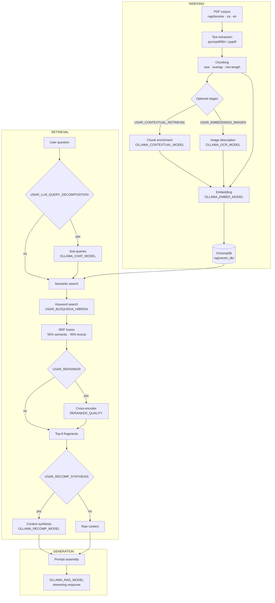

<p align="center">
  
</p>

<h1 align="center">MonkeyGrab</h1>

<p align="center">
  <strong>A local, multilingual RAG system for querying PDF documents with open language models.</strong><br/>
  All indexing, retrieval and generation runs on your own hardware — no data leaves your machine.
</p>

<p align="center">
  <a href="https://www.python.org/"></a>
  <a href="https://ollama.com/"></a>
  <a href="https://www.trychroma.com/"></a>
  
  
  
</p>

<p align="center">
  <a href="#01-quick-start">Quick start</a> ·
  <a href="#02-demo">Demo</a> ·
  <a href="#03-what-makes-it-different">Features</a> ·
  <a href="#04-how-it-works">Architecture</a> ·
  <a href="#07-configuration">Configuration</a> ·
  <a href="#08-usage">Usage</a> ·
  <a href="#09-evaluation">Evaluation</a>
</p>

---

## 01. Quick start

```bash
git clone https://github.com/iDiagoValeta/localOllamaRAG
cd localOllamaRAG

pip install -r rag/requirements.txt

# Pull at minimum a generator and an embedding model from Ollama
ollama pull phi4-finetuned:latest   # or any instruction-tuned model you prefer
ollama pull embeddinggemma:latest   # or any embedding model

# Drop your PDFs into rag/docs/es/ and start
cd rag && python chat_pdfs.py
```

Once running, use these commands inside the CLI:

| Command | Description |
|---------|-------------|
| `/rag` | Switch to RAG mode — answers grounded in your documents |
| `/chat` | Switch to general conversation mode |
| `/reindex` | Rebuild the vector index after adding new PDFs |
| `/docs` | List indexed documents |
| `/ayuda` or `/help` | Show all available commands |

> **Web interface:** `python web/app.py` → opens at `http://localhost:5000`

---

## 02. Demo

**CLI — querying a local document corpus**

https://github.com/user-attachments/assets/cc36fc27-e4b9-49ac-a1f1-131f6e6afe4f

This clip shows a sample query against a database containing five Wikipedia articles, indexed with the default settings. Models and parameters are fully configurable — the results you see are specific to the hardware and models used during recording.

**RAGBench evaluation — indexing 25 documents from scratch**

https://github.com/user-attachments/assets/f3e2bf0b-095a-416f-982e-9fdf4647c85e

Left terminal: `ollama serve`. Right terminal: the full RAGBench evaluation pipeline — indexing, inference and RAGAS scoring in one run.

---

## 03. What makes it different?

<table>
  <tr>
    <td><strong>Local-first</strong></td>
    <td>All indexing, retrieval and generation runs on your own hardware. No API keys required for the core pipeline.</td>
  </tr>
  <tr>
    <td><strong>Hybrid retrieval</strong></td>
    <td>Combines semantic search and keyword search with RRF fusion (55/45 weights) and an optional cross-encoder reranking stage.</td>
  </tr>
  <tr>
    <td><strong>Multilingual</strong></td>
    <td>Built and evaluated on English, Spanish and Catalan corpora. Corpus and vector index are selected via environment variable.</td>
  </tr>
  <tr>
    <td><strong>Model-flexible</strong></td>
    <td>Every model role (generator, embedder, reranker, RECOMP, vision) is independently configurable through environment variables.</td>
  </tr>
  <tr>
    <td><strong>PDF-aware</strong></td>
    <td>Optionally describes raster images and figures found in PDFs using a vision model, making visual content retrievable.</td>
  </tr>
  <tr>
    <td><strong>Research-ready</strong></td>
    <td>Includes LoRA fine-tuning scripts (Qwen3-14B, Phi-4, Gemma-3-12B), RAGAS evaluation, RAGBench workflows and ablation tooling.</td>
  </tr>
  <tr>
    <td><strong>Two interfaces</strong></td>
    <td>Rich-based terminal CLI for power users; Flask + React 19 web UI with streaming responses for everyone else.</td>
  </tr>
</table>

---

## 04. How it works



<p align="center">
  
</p>

---

## 05. What is MonkeyGrab?

MonkeyGrab is a Retrieval-Augmented Generation (RAG) system that runs entirely on your own hardware. You point it at a folder of PDF documents, and it lets you ask questions about them in natural language — receiving answers grounded in the actual content of those files.

No data leaves your machine. All inference, indexing and retrieval happens locally through [Ollama](https://ollama.com/). MonkeyGrab is designed for researchers and students who need to query academic documents in English, Spanish or Catalan without sending their data to external services.

The system works with any instruction-tuned language model available in Ollama. You configure which models to use via environment variables, so it adapts to whatever hardware you have available.

This project was developed as a Bachelor's thesis (TFG) for the Grado en Ingeniería Informática at ETSINF, Universitat Politècnica de València (UPV), by Ignacio Diago Valeta, tutored by Adrià Giménez Pastor (2025–2026). It combines a functional RAG production system with a research layer for LoRA fine-tuning and evaluation of open language models.

---

## 06. Requirements

- [Python](https://www.python.org/) 3.10 or higher
- [Ollama](https://ollama.com/) installed and running locally
- A GPU with [CUDA](https://developer.nvidia.com/cuda-toolkit) is recommended for reranking; CPU works for inference but is slower

---

## 07. Installation

```bash
git clone https://github.com/iDiagoValeta/localOllamaRAG
cd localOllamaRAG

# Core RAG system (required)
pip install -r rag/requirements.txt

# Web interface (optional)
pip install -r web/requirements.txt

# RAGAS evaluation (optional; requires GOOGLE_API_KEY)
pip install -r evaluation/requirements.txt
```

### Pull your models

MonkeyGrab needs at minimum a generator model and an embedding model running in Ollama:

```bash
# Required
ollama pull <your OLLAMA_RAG_MODEL>
ollama pull <your OLLAMA_EMBED_MODEL>

# Optional pipeline stages
ollama pull <your OLLAMA_CHAT_MODEL>         # chat mode and query decomposition
ollama pull <your OLLAMA_CONTEXTUAL_MODEL>   # contextual chunk enrichment during indexing
ollama pull <your OLLAMA_RECOMP_MODEL>       # context synthesis before generation
ollama pull <your OLLAMA_OCR_MODEL>          # must be a vision-language model
```

### Model weights (GGUF)

Large **`.gguf`** files are not committed to this repository. The repo keeps **`Modelfile`** files under `models/gguf-output/<model>/` plus conversion scripts in `scripts/conversion/`. Build or quantize locally, or download weights from Hugging Face Hub and point Ollama at the file path.

**Qwen3-14B RAG (LoRA, Q4_K_M GGUF):** [nadiva1243/qwen3RAG](https://huggingface.co/nadiva1243/qwen3RAG)

**Phi-4 RAG (LoRA, Q4_K_M GGUF):** [nadiva1243/phi4RAG](https://huggingface.co/nadiva1243/phi4RAG)

---

## 07. Configuration

All pipeline behaviour is controlled via environment variables. Set them in your shell or in a `.env` file at the project root.

| Variable | Description |
|----------|-------------|
| `OLLAMA_RAG_MODEL` | Generator model for RAG mode (document Q&A) |
| `OLLAMA_CHAT_MODEL` | Generator model for CHAT mode and query decomposition |
| `OLLAMA_EMBED_MODEL` | Embedding model used for indexing and retrieval |
| `OLLAMA_CONTEXTUAL_MODEL` | Auxiliary model for contextual chunk enrichment during indexing |
| `OLLAMA_RECOMP_MODEL` | Model used to synthesise/compress retrieved fragments before generation |
| `OLLAMA_OCR_MODEL` | Vision model for describing images found in PDFs |
| `DOCS_FOLDER` | Path to the PDF folder to index (default: `rag/docs/es/`) |
| `RERANKER_QUALITY` | Cross-encoder tier: `quality` (BAAI/bge) or `speed` (MiniLM) |
| `USAR_RECOMP_SYNTHESIS` | Enable/disable RECOMP context synthesis (`true`/`false`, default: `true`) |

<details>
<summary><strong>Advanced: ChromaDB paths and pipeline flags</strong></summary>

**ChromaDB path naming:** indexes live under `rag/vector_db/<folder>_<embed_slug>/`, where `<folder>` is the basename of `DOCS_FOLDER` (e.g. `es`, `ca`, `en`) and `<embed_slug>` comes from `OLLAMA_EMBED_MODEL`. Changing the embedding model or the docs folder selects a different path — re-index when you intentionally switch either.

**Pipeline flags** (edit directly in `rag/chat_pdfs.py`):

| Flag | Default | Effect |
|------|---------|--------|
| `USAR_CONTEXTUAL_RETRIEVAL` | `True` | Enrich chunks with LLM context before indexing |
| `USAR_LLM_QUERY_DECOMPOSITION` | `True` | Decompose query into sub-queries |
| `USAR_BUSQUEDA_HIBRIDA` | `True` | Enable keyword search alongside semantic search |
| `USAR_RERANKER` | `True` | Enable cross-encoder reranking |
| `USAR_RECOMP_SYNTHESIS` | `True` | Enable RECOMP context compression |
| `EXPANDIR_CONTEXTO` | `True` | Include adjacent chunks around top results |
| `USAR_EMBEDDINGS_IMAGEN` | `False` | Describe raster images in PDFs with a vision model |

</details>

---

## 08. Usage

### Terminal CLI

Place your PDF files under **`rag/docs/es/`** by default (Spanish corpus). Catalan and English corpora use **`rag/docs/ca/`** and **`rag/docs/en/`** respectively. The ChromaDB directory **`rag/vector_db/`** is gitignored and created automatically on first index.

```bash
cd rag
python chat_pdfs.py
```

| Command | Description |
|---------|-------------|
| `/rag` | Switch to RAG mode — answers are grounded in your documents |
| `/chat` | Switch to CHAT mode — general conversation without document context |
| `/docs` | List indexed documents |
| `/temas` | Show a topic summary per document |
| `/stats` | Show vector database statistics |
| `/reindex` | Delete the current index and re-index all documents |
| `/limpiar` or `/clear` | Clear the conversation history |
| `/ayuda` or `/help` | Show all available commands |
| `/salir` or `/exit` | Exit and save history |

### Web interface

```bash
python web/app.py
```

Opens at `http://localhost:5000`. Supports document upload, streaming responses and pipeline settings through the UI. For development with hot-reload, run `npm run dev` inside `web/zip/` (Vite on :3000 proxies to Flask on :5000).

<details>
<summary><strong>LoRA train/eval reports</strong></summary>

Each fine-tuned model folder under `training-output/` includes the same `generate_reports.py`. After training (via `scripts/training/train-qwen3.py`, `train-phi4.py`, `train-gemma3.py`), regenerate tables and figures:

```bash
python training-output/qwen-3/generate_reports.py
python training-output/phi-4/generate_reports.py
python training-output/gemma-3/generate_reports.py
```

Output layout per model:
- `plots/train/` — training curves (loss, learning rate, grad norm) and CSV summaries
- `plots/eval/` — per-metric CSV tables, markdown report tables, and base vs. adapted comparison figures

Optional flags: `--model-dir`, `--eval-input`, `--train-input`, `--plots-dir`, `--no-figures`.

</details>

---

## 09. Evaluation

Requires `pip install -r evaluation/requirements.txt` and a **`GOOGLE_API_KEY`** in `.env` ([Gemini](https://ai.google.dev/) as judge LLM). [RAGAS](https://docs.ragas.io/) is the evaluation framework used.

```bash
# Single-corpus runs
python evaluation/run_eval.py single --corpus es
python evaluation/run_eval.py single --corpus ca

# RAGBench (English)
python evaluation/run_eval.py ragbench-prepare   # builds fixed EN eval corpus (25 docs / 5 q each)
python evaluation/run_eval.py ragbench-eval      # indexes + runs inference + RAGAS from the manifest
```

<details>
<summary><strong>Ablation comparison and aggregation</strong></summary>

Run multiple pipeline variants against a shared index and compare:

```bash
python evaluation/run_eval.py compare --corpus ca --label mi_eval --reindex
python evaluation/run_eval.py list-variants
```

After a comparison run, aggregate per-variant scores by dataset subset:

```bash
python evaluation/aggregate_comparison_by_conjunto.py \
  --dir evaluation/debug/comparison_runs/mi_eval \
  --etiquetas-es
```

Artifacts go under **`evaluation/scores/`** (CSVs), **`evaluation/debug/`** (JSON traces) and **`evaluation/debug/checkpoints/`** (resume state). See `evaluation/EVALUACIONES_PIPELINE.md` for corpus presets and variant names.

</details>

---

<details>
<summary><strong>Repository structure</strong></summary>

```
localOllamaRAG/
├── generate_diagram.py           # Architecture diagram (Kroki.io)
├── rag/
│   ├── chat_pdfs.py              # Main RAG engine (indexing, retrieval, generation)
│   ├── show_fragments/
│   │   └── export_fragments.py   # Export ChromaDB chunks to TXT/JSONL for debug
│   ├── docs/
│   │   ├── es/                   # Spanish PDF corpus (default DOCS_FOLDER; .gitkeep only in Git)
│   │   ├── ca/                   # Catalan PDF corpus
│   │   ├── en/                   # Generic English corpus
│   │   ├── en_ragbench_dev/      # Frozen RagBench EN dev PDFs (local .gitignore)
│   │   └── en_ragbench_eval/     # RagBench EN final eval PDFs (local .gitignore)
│   ├── vector_db/                # ChromaDB per corpus + embedding slug (gitignored at runtime)
│   ├── debug_rag/                # Optional per-query debug dumps (gitignored)
│   ├── historial_chat.json       # CHAT mode history (gitignored)
│   ├── cli/                      # Rich terminal UI (MonkeyGrabCLI)
│   └── requirements.txt
├── web/
│   ├── app.py                    # Flask backend (REST + SSE); serves React build
│   └── zip/                      # React source (src/) + Vite config; production build → dist/
├── scripts/
│   ├── hf_upload_model_cards.py  # Hugging Face model cards / optional GGUF upload helper
│   ├── training/                 # LoRA fine-tuning (Qwen3, Phi-4, Gemma-3)
│   ├── evaluation/               # Baseline benchmark + split inspection + SLURM helpers
│   ├── conversion/               # LoRA merge, GGUF build, quantization notes
│   └── tests/                    # Ollama / pipeline smoke tests
├── evaluation/
│   ├── datasets/                 # Question datasets (ES, CA, mix; add EN as needed)
│   ├── scores/                   # RAGAS CSV outputs
│   ├── debug/                    # Debug JSON + resumable checkpoints
│   ├── run_eval.py               # RAGAS entrypoint: single | compare | ragbench
│   ├── aggregate_comparison_by_conjunto.py
│   ├── EVALUACIONES_PIPELINE.md  # Detailed eval presets, ablation variants, aggregation notes
│   └── requirements.txt
├── models/
│   ├── merged-model/             # Dense HF weights after LoRA merge (gitignored)
│   └── gguf-output/              # Modelfile + docs per model (GGUF binaries gitignored)
├── training-output/
│   ├── qwen-3/
│   ├── phi-4/                    # Other LoRA ranks may live under phi-4/<rank>/
│   ├── gemma-3/
│   └── baseline/                 # Seven-model baseline benchmark artifacts
├── docs/                         # Architecture assets, methodology notes (thesis)
├── README.md
└── CLAUDE.md                     # Contributor / internal conventions
```

</details>

---

## Known limitations

- Vector graphics embedded in PDFs (SVG-based figures) are not extracted during indexing and will not be retrievable.
- The [RAGAS](https://docs.ragas.io/) evaluation pipeline requires a `GOOGLE_API_KEY` ([Google Gemini](https://ai.google.dev/)) and is therefore not fully local.

---

*Bachelor's thesis (TFG) — Grado en Ingeniería Informática, ETSINF, Universitat Politècnica de València. Author: Ignacio Diago Valeta. Tutor: Adrià Giménez Pastor. 2025–2026.*
