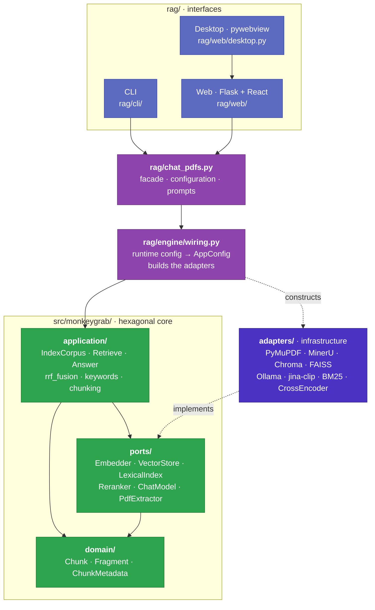
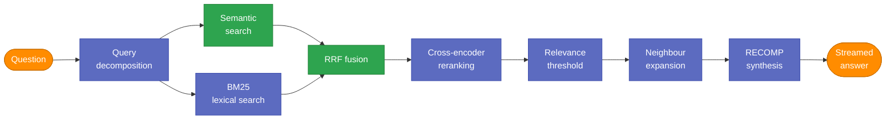

<p align="center">
  
</p>

<h1 align="center">MonkeyGrab</h1>

<p align="center">
  <strong>A local, multilingual RAG system for querying PDF documents with open language models.</strong><br/>
  All indexing, retrieval and generation runs on your own hardware — no data leaves your machine.
</p>

<p align="center">
  <a href="https://www.python.org/"></a>
  <a href="https://ollama.com/"></a>
  <a href="#what-it-runs-on"></a>
  <a href="https://react.dev/"></a>
</p>

<p align="center">
  
  
  
  
</p>

<p align="center">
  <a href="#overview">Overview</a> ·
  <a href="#architecture">Architecture</a> ·
  <a href="#what-it-runs-on">What it runs on</a> ·
  <a href="#the-query-pipeline">Pipeline</a> ·
  <a href="#running-it">Running it</a> ·
  <a href="#development">Development</a>
</p>

---

## Overview

Ask questions about your PDFs in natural language and get answers grounded in
what those files actually say. Point MonkeyGrab at a folder, start the CLI or the
web interface, and nothing leaves the machine.

- **Local-first** — indexing, retrieval and generation all run on your hardware via [Ollama](https://ollama.com/). No API keys.
- **Hybrid retrieval** — vector search and [Okapi BM25](https://www.staff.city.ac.uk/~sbrp622/papers/foundations_bm25_review.pdf) fused with [Reciprocal Rank Fusion](https://plg.uwaterloo.ca/~gvcormac/cormacksigir09-rrf.pdf), then re-scored by a [cross-encoder](https://www.sbert.net/examples/applications/cross-encoder/README.html).
- **Multilingual** — Castellano, English and Valencià, in both the interface and the corpus.
- **Image-aware** — figures and tables are described by a vision model at indexing time, so visual content becomes retrievable.
- **Swappable backends** — extraction, vector store and embedder are each one environment variable, so comparing two technologies is a config change, not a rewrite.
- **Three interfaces** — terminal CLI, [Flask](https://flask.palletsprojects.com/) + [React](https://react.dev/) web app, and a packaged Windows desktop app.

<p align="center">
  
</p>

<details>
<summary><strong>See it in action</strong></summary>
<br/>

**Web interface:** https://github.com/user-attachments/assets/f5f8fa1d-b193-4f94-85c2-8f903afa2348

**CLI:** https://github.com/user-attachments/assets/a27b6fef-52c1-4d4a-846e-7c4cd36863fa

**LaTeX rendering** (formulas via [KaTeX](https://katex.org/) in the web UI):


</details>

---

## Architecture

The pipeline logic lives in a [hexagonal core](https://alistair.cockburn.us/hexagonal-architecture/)
under [`src/monkeygrab/`](src/monkeygrab/README.md). It depends on *ports* —
plain [`Protocol`](https://docs.python.org/3/library/typing.html#typing.Protocol)
definitions — and never on ChromaDB, Ollama or PyMuPDF. The adapters that wrap
those libraries are handed in from outside, which is what makes a backend
replaceable by configuration instead of by editing.


```mermaid
flowchart TB
    subgraph IFACE["rag/ · interfaces"]
        CLI["CLI<br/>rag/cli/"]
        WEB["Web · Flask + React<br/>rag/web/"]
        APP["Desktop · pywebview<br/>rag/web/desktop.py"]
    end

    FAC["<b>rag/chat_pdfs.py</b><br/>facade · configuration · prompts"]
    WIR["<b>rag/engine/wiring.py</b><br/>runtime config → AppConfig<br/>builds the adapters"]

    subgraph CORE["src/monkeygrab/ · hexagonal core"]
        direction LR
        UC["<b>application/</b><br/>IndexCorpus · Retrieve · Answer<br/>rrf_fusion · keywords · chunking"]
        PT["<b>ports/</b><br/>Embedder · VectorStore · LexicalIndex<br/>Reranker · ChatModel · PdfExtractor"]
        DM["<b>domain/</b><br/>Chunk · Fragment · ChunkMetadata"]
    end

    INFRA["<b>adapters/</b> · infrastructure<br/>PyMuPDF · MinerU · Chroma · FAISS<br/>Ollama · jina-clip · BM25 · CrossEncoder"]

    CLI --> FAC
    WEB --> FAC
    APP --> WEB
    FAC --> WIR
    WIR --> UC
    UC --> PT
    UC --> DM
    PT --> DM
    INFRA -.implements.-> PT
    WIR -.constructs.-> INFRA

    classDef iface fill:#5C6BC0,stroke:#3949AB,color:#fff
    classDef bridge fill:#8E44AD,stroke:#6C3483,color:#fff
    classDef core fill:#2EA44F,stroke:#1E7E34,color:#fff
    classDef infra fill:#4B32C3,stroke:#372593,color:#fff
    class CLI,WEB,APP iface
    class FAC,WIR bridge
    class UC,PT,DM core
    class INFRA infra
```

**The dependency rule points one way.** `application` may import
`domain`, `ports` and `config`; `ports` may import `domain`; `domain` and
`config` import nothing internal. Adapters implement ports but are never
imported by any of them. This is not a convention to trust by eye — it is
enforced by [`tests/unit/test_architecture_boundaries.py`](tests/unit/test_architecture_boundaries.py),
which parses every import statement in the package.

**No silent fallbacks.** Every adapter raises on failure instead of quietly
degrading. A reranker that cannot load its model fails the query rather than
returning unranked results that look the same. The reasoning is in the
[design doc](docs/design/2026-07-26-monkeygrab-v2.md); the practical consequence
is that two runs are always comparable.

### What is wired today

| Stage | Runs through the core? |
|---|---|
| **Indexing** | Yes — [`IndexCorpus`](src/monkeygrab/application/index_corpus.py), built by [`composition.build_stack`](src/monkeygrab/composition.py) |
| **Retrieval** | Yes — [`Retrieve`](src/monkeygrab/application/retrieve.py), the same use case the [evaluation gate](tests/eval/README.md) constructs |
| **Generation** | Not yet — [`rag/engine/generation.py`](rag/engine/generation.py) still owns it; [`Answer`](src/monkeygrab/application/answer.py) is tested but unwired |

That retrieval runs through one path is the point: the CLI, the web app and the
acceptance gate cannot measure different behaviour, because there is only one
implementation to measure.

> [!TIP]
> Deeper reading: [`src/monkeygrab/README.md`](src/monkeygrab/README.md) for the
> layers and how to add an adapter, [`rag/README.md`](rag/README.md) for the
> interfaces, and [`docs/README.md`](docs/README.md) for what gets documented
> where.

---

## What it runs on

Everything below is a default you can change. Model roles are separate on
purpose: a small model is enough to rewrite a query, and a large one is wasted
on it.

| Role | Default | Change with |
|---|---|---|
| **Answer generation** | `gemma4:e4b` on [Ollama](https://ollama.com/library) | `OLLAMA_RAG_MODEL` |
| **Chat & query decomposition** | `gemma4:e4b` | `OLLAMA_CHAT_MODEL` |
| **Embeddings** | [`embeddinggemma`](https://ollama.com/library/embeddinggemma) | `OLLAMA_EMBED_MODEL` |
| **Contextual enrichment** | `gemma4:e4b` | `OLLAMA_CONTEXTUAL_MODEL` |
| **Context synthesis (RECOMP)** | `gemma4:e4b` | `OLLAMA_RECOMP_MODEL` |
| **Vision / OCR** | `gemma4:e4b` | `OLLAMA_OCR_MODEL` |
| **Reranker** | [`BAAI/bge-reranker-v2-m3`](https://huggingface.co/BAAI/bge-reranker-v2-m3) · `fast` tier is [`ms-marco-MiniLM-L-6-v2`](https://huggingface.co/cross-encoder/ms-marco-MiniLM-L-6-v2) | `RERANKER_QUALITY` |
| **Lexical search** | [Okapi BM25](https://github.com/dorianbrown/rank_bm25) | always on when hybrid search is enabled |
| **Vector store** | [ChromaDB](https://www.trychroma.com/) | `VECTOR_STORE` |
| **PDF extraction** | [PyMuPDF4LLM](https://pymupdf.readthedocs.io/en/latest/pymupdf4llm/) | `PDF_EXTRACTOR` |

### Swappable backends

Three ports have a second implementation, so a technology can be measured
against the default rather than argued about.

| Variable | Default | Alternative |
|---|---|---|
| `PDF_EXTRACTOR` | `pymupdf` — fast, flattens tables to text | [`mineru`](https://github.com/opendatalab/MinerU) — slow, keeps tables as HTML and formulas as LaTeX |
| `VECTOR_STORE` | `chroma` — storage, metadata and index together | [`faiss`](https://github.com/facebookresearch/faiss) — index only, with a metadata sidecar |
| `EMBEDDER` | `ollama` — text only, so figures must be captioned first | [`jina_clip`](https://huggingface.co/jinaai/jina-clip-v2) — text and images in one vector space |

An unrecognised value fails at startup instead of falling back, so a typo cannot
hand you a run you thought was something else.

> [!NOTE]
> A non-default combination writes to its own index directory, suffixed with the
> stack slug (`..._mineru-jina_clip-faiss`): vectors from different embedders are
> not comparable and must never share a store. Switching stacks means indexing
> again.
>
> The alternatives carry setup the defaults do not. MinerU is an external CLI,
> and `jina_clip` runs in an isolated interpreter because its dependencies
> conflict with the product's — see [`src/monkeygrab/README.md`](src/monkeygrab/README.md).

---

## The query pipeline

Green stages always run. Blue ones are toggled at runtime from the web UI's
**RAG Pipeline** panel, and turning one off applies to the next query with no
restart.


```mermaid
flowchart LR
    Q(["Question"]) --> DEC["Query<br/>decomposition"]
    DEC --> SEM["Semantic<br/>search"]
    DEC --> BM["BM25<br/>lexical search"]
    SEM --> RRF["RRF fusion"]
    BM --> RRF
    RRF --> RNK["Cross-encoder<br/>reranking"]
    RNK --> THR["Relevance<br/>threshold"]
    THR --> EXP["Neighbour<br/>expansion"]
    EXP --> REC["RECOMP<br/>synthesis"]
    REC --> GEN(["Streamed<br/>answer"])

    classDef req fill:#2EA44F,stroke:#1E7E34,color:#fff
    classDef opt fill:#5C6BC0,stroke:#3949AB,color:#fff
    classDef io fill:#FF8C00,stroke:#CC7000,color:#fff
    class SEM,RRF req
    class DEC,BM,RNK,THR,EXP,REC opt
    class Q,GEN io
```

| Stage | What it does |
|---|---|
| **Query decomposition** | An auxiliary model rewrites long questions into sub-queries targeting different aspects. Short questions instead get one extra variant built from their own keywords. |
| **Semantic search** | Each variant is embedded and matched against the store. |
| **BM25** | Term-frequency ranking over the same corpus, which catches identifiers, acronyms and numbers that embeddings blur. |
| **RRF fusion** | Merges both rankings by reciprocal rank, so a chunk both branches found outranks one that merely topped a single branch. |
| **Reranking** | A cross-encoder reads query and chunk together and re-scores the shortlist. |
| **Threshold** | Drops anything below the reranker's relevance floor, so a question with no answer in the corpus returns nothing rather than the least-bad chunk. Applies only when reranking ran — without its scores there is nothing to threshold on. |
| **Neighbour expansion** | Pulls in adjacent chunks of the top hits, recovering sentences cut by the chunk boundary. |
| **RECOMP synthesis** | Compresses the evidence into a facts briefing before generation, following [RECOMP](https://arxiv.org/abs/2310.04408). |

At indexing time, [contextual retrieval](https://www.anthropic.com/news/contextual-retrieval)
optionally prepends a short situational summary to each chunk so it can be found
by queries whose wording appears nowhere in it.

---

## Running it

Requires [Python 3.10+](https://www.python.org/downloads/) and
[Ollama](https://ollama.com/download) running locally, with at least a generator
and an embedding model pulled. Drop PDFs into `rag/docs/en/` — the index builds
itself on first run.

```bash
python rag/chat_pdfs.py    # CLI
python rag/web/app.py      # web UI at http://localhost:5000
```

<details>
<summary><strong>Install, models and configuration</strong></summary>
<br/>

Dependencies are in [`rag/requirements.txt`](rag/requirements.txt) (core) and
[`rag/web/requirements.txt`](rag/web/requirements.txt) (web UI). Pull the models
named in [What it runs on](#what-it-runs-on), or point the variables at models
you already have.

Copy [`.env.example`](.env.example) to `.env` at the project root; it documents
every supported variable with its default. The shell environment always wins over
the file. `MONKEYGRAB_LANG` sets the interface language (`es`, `en`, `ca`) and
`DOCS_FOLDER` the corpus.

Index paths follow `rag/vector_db/<folder>_<embed_slug>/`, so changing the
embedding model or the corpus selects a different index — run `/reindex` when you
switch either on purpose.

</details>

### Interfaces

The **CLI** takes slash commands: `/rag` and `/chat` switch mode, `/docs` lists
what is indexed, `/temas` shows corpus topics, `/stats` the active pipeline
configuration, `/reindex` rebuilds the index, `/limpiar` clears history and
`/ayuda` lists everything. Each has English and Valencian aliases.

The **web UI** adds document upload, per-role model assignment, the pipeline
toggles, and an inline PDF viewer that opens cited sources at the right page.
Ollama is started automatically if it is installed but not running. Three fixed
language stores — English, Castellano, Valencià — map to `rag/docs/{en,es,ca}/`.

The **desktop app** packages all of it into a standalone Windows executable with
[PyInstaller](https://pyinstaller.org/) and [pywebview](https://pywebview.flowrl.com/),
needing no Python on the target machine. See [`packaging/README.md`](packaging/README.md).

---

## Known limitations

> [!WARNING]
> - **Vector graphics** (SVG figures) embedded in PDFs are not extracted.
> - **Math, tables and images** are not plain text — expect occasional errors on those pages even with OCR captions. Table retrieval is the known weak point of the default extractor, which is what `mineru` exists to address.
> - **The reranker downloads its model on first use**, a one-time step that needs internet. Everything after runs offline; turn reranking off if you need a fully air-gapped first run.
> - **Optional stages fail loudly.** If an enabled stage cannot run, the query raises instead of silently returning worse results. Turn the stage off to proceed without it.
> - **Indexing cost** grows with chunk size, contextual enrichment and image captions.

---

## Development

Two CI gates, deliberately not one. The **fast gate**
([`ci.yml`](.github/workflows/ci.yml)) runs on every pull request: lint, the
architecture dependency rules, the unit suite against test doubles, and the
frontend build — no GPU, no models, no network. The **full gate**
([`full-eval.yml`](.github/workflows/full-eval.yml)) runs the real pipeline
against a corpus of hand-verified gold cases and fails if the pass rate drops
below the recorded baseline. It is required before merging anything that touches
retrieval or generation, because the fast gate never exercises a real model.

```bash
pytest                                              # full suite, no GPU required
python tests/eval/run_eval.py --models <model...>   # full gate; needs Ollama + GPU
```

Tests are split by what they protect:
[`tests/unit/`](tests/unit/) for the pure layers and the adapters,
[`tests/characterization/`](tests/characterization/) to pin observed pipeline
behaviour, and [`tests/eval/`](tests/eval/README.md) for the gold-case gate.
Contributor rules are in [`.claude/CLAUDE.md`](.claude/CLAUDE.md).

---

## License

[MIT](LICENSE) © Ignacio Diago Valeta.
