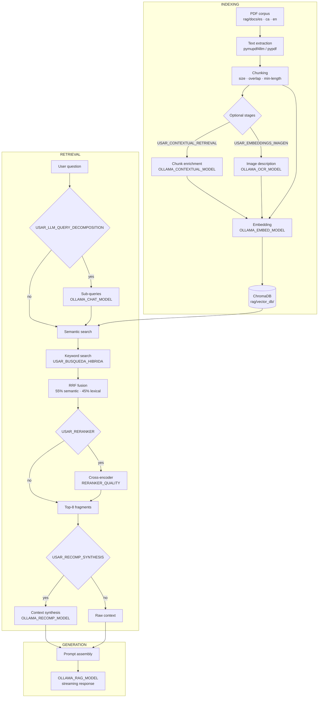

<p align="center">
  
</p>

<h1 align="center">MonkeyGrab</h1>

<p align="center">
  <strong>A local, multilingual RAG system for querying PDF documents with open language models.</strong><br/>
  All indexing, retrieval and generation runs on your own hardware — no data leaves your machine.
</p>

<p align="center">
  <a href="https://www.python.org/"></a>
  <a href="https://ollama.com/"></a>
  <a href="https://www.trychroma.com/"></a>
  
  
  
</p>

<p align="center">
  <a href="#1-overview">Overview</a> ·
  <a href="#2-architecture">Architecture</a> ·
  <a href="#3-demo">Demo</a> ·
  <a href="#4-getting-started">Getting started</a> ·
  <a href="#5-configuration">Configuration</a> ·
  <a href="#6-usage">Usage</a>
</p>

---

## 1. Overview

MonkeyGrab lets you ask questions about your PDF documents in natural language. Point it at a folder of PDFs, start the CLI or the web interface, and get answers grounded in the actual content of those files — no data sent to any cloud.

| | |
|---|---|
| **Local-first** | All indexing, retrieval and generation runs on your hardware. No API keys required for the core pipeline. |
| **Any model** | Works with any instruction-tuned model in [Ollama](https://ollama.com/) — `llama3.2`, `mistral`, `gemma4`, `qwen3`, etc. |
| **Hybrid retrieval** | Semantic search + keyword search fused with RRF, followed by optional [cross-encoder reranking](https://www.sbert.net/). |
| **Multilingual UI** | Spanish, English and Valencian out of the box. The CLI uses `MONKEYGRAB_LANG`; the web UI has an `ES / EN / VAL` selector. |
| **Two interfaces** | [Rich](https://rich.readthedocs.io/en/stable/)-based terminal CLI and a [Flask](https://flask.palletsprojects.com/) + [React](https://react.dev/) web UI with streaming responses. |
| **Image-aware** | Optionally describes raster images in PDFs with a vision model via [pymupdf4llm](https://pymupdf.readthedocs.io/en/latest/pymupdf4llm/), making visual content retrievable. |

---

## 2. Architecture

PDFs are indexed once into a [ChromaDB](https://www.trychroma.com/) vector store. Each query then passes through a configurable multi-stage retrieval pipeline before reaching the generator — all running locally via [Ollama](https://ollama.com/).


```mermaid
flowchart TD
    subgraph INDEXING
        A[PDF corpus\nrag/docs/es · ca · en] --> B[Text extraction\npymupdf4llm / pypdf]
        B --> C[Chunking\nsize · overlap · min-length]
        C --> D{Optional stages}
        D -->|USAR_CONTEXTUAL_RETRIEVAL| E[Chunk enrichment\nOLLAMA_CONTEXTUAL_MODEL]
        D -->|USAR_EMBEDDINGS_IMAGEN| F[Image description\nOLLAMA_OCR_MODEL]
        E --> G[Embedding\nOLLAMA_EMBED_MODEL]
        F --> G
        C --> G
        G --> H[(ChromaDB\nrag/vector_db/)]
    end
    subgraph RETRIEVAL
        I[User question] --> J{USAR_LLM_QUERY_DECOMPOSITION}
        J -->|yes| K[Sub-queries\nOLLAMA_CHAT_MODEL]
        J -->|no| L[Semantic search]
        K --> L
        L --> M[Keyword search\nUSAR_BUSQUEDA_HIBRIDA]
        M --> N[RRF fusion\n55% semantic · 45% lexical]
        N --> O{USAR_RERANKER}
        O -->|yes| P[Cross-encoder\nRERANKER_QUALITY]
        O -->|no| Q[Top-8 fragments]
        P --> Q
        Q --> R{USAR_RECOMP_SYNTHESIS}
        R -->|yes| S[Context synthesis\nOLLAMA_RECOMP_MODEL]
        R -->|no| T[Raw context]
    end
    subgraph GENERATION
        S --> U[Prompt assembly]
        T --> U
        U --> V[OLLAMA_RAG_MODEL\nstreaming response]
    end
    H --> L
```

---

## 3. Demo

**Web interface — querying a local document corpus**

https://github.com/user-attachments/assets/e62d6f0a-bdfb-4887-9bfe-429cdbd54e68

**CLI — querying a local document corpus**

https://github.com/user-attachments/assets/714f3347-f3b2-407e-a45f-0d7f85de7833

**LaTeX rendering — math formulas rendered natively in the web UI**


The web interface uses [KaTeX](https://katex.org/) to render inline (`$...$`) and display (`$$...$$`) LaTeX expressions generated by the model.

---

## 4. Getting started

**Prerequisites:** Python 3.10+, [Ollama](https://ollama.com/) running locally.

### Install

```bash
git clone https://github.com/iDiagoValeta/localOllamaRAG
cd localOllamaRAG

pip install -r rag/requirements.txt        # core RAG pipeline (required)
pip install -r rag/web/requirements.txt    # web interface (optional)
```

### Pull models

You need at minimum a generator and an embedding model:

```bash
ollama pull <OLLAMA_RAG_MODEL>      # document Q&A generator (required)
ollama pull <OLLAMA_EMBED_MODEL>    # indexing and retrieval (required)

ollama pull <OLLAMA_CHAT_MODEL>     # chat mode + query decomposition (optional)
ollama pull <OLLAMA_RECOMP_MODEL>   # context synthesis before generation (optional)
ollama pull <OLLAMA_OCR_MODEL>      # vision model for PDF images (optional)
```

**Fine-tuned weights trained specifically for RAG (recommended):**

- **Qwen3-14B RAG** — [nadiva1243/qwen3RAG](https://huggingface.co/nadiva1243/qwen3RAG) on [Hugging Face](https://huggingface.co/)
- **Phi-4 RAG** — [nadiva1243/phi4RAG](https://huggingface.co/nadiva1243/phi4RAG) on [Hugging Face](https://huggingface.co/)

### Run

Drop your PDFs into `rag/docs/libre/` and start:

```bash
# CLI (Spanish UI by default)
python rag/chat_pdfs.py

# CLI in English
MONKEYGRAB_LANG=en python rag/chat_pdfs.py          # bash/zsh
$env:MONKEYGRAB_LANG = "en"; python rag/chat_pdfs.py # PowerShell

# CLI in Valencian
MONKEYGRAB_LANG=ca python rag/chat_pdfs.py          # bash/zsh
$env:MONKEYGRAB_LANG = "ca"; python rag/chat_pdfs.py # PowerShell

# Web interface → http://localhost:5000
python rag/web/app.py
```

PowerShell note: use `$env:MONKEYGRAB_LANG = "en"` / `"ca"`. The `set MONKEYGRAB_LANG=...` syntax is for `cmd.exe`, not PowerShell.

The vector index is created automatically in `rag/vector_db/` on first run.

---

## 5. Configuration

Set these in your shell or in a `.env` file at the project root.

| Variable | Description |
|----------|-------------|
| `OLLAMA_RAG_MODEL` | Generator model for RAG mode |
| `OLLAMA_CHAT_MODEL` | Generator for chat mode and query decomposition |
| `OLLAMA_EMBED_MODEL` | Embedding model for indexing and retrieval |
| `OLLAMA_RECOMP_MODEL` | Model for context synthesis before generation |
| `OLLAMA_OCR_MODEL` | Vision model for PDF image descriptions |
| `OLLAMA_CONTEXTUAL_MODEL` | Auxiliary model for contextual chunk enrichment at indexing |
| `OLLAMA_NUM_CTX` | Default context window requested from Ollama model calls |
| `OLLAMA_RAG_NUM_CTX` | Context window requested for the final RAG generator; defaults to `OLLAMA_NUM_CTX` |
| `OLLAMA_AUX_NUM_CTX` | Fallback context window for auxiliary LLM calls; defaults to `OLLAMA_NUM_CTX` |
| `OLLAMA_QUERY_NUM_CTX` | Context window for LLM query decomposition; defaults to `OLLAMA_AUX_NUM_CTX` |
| `OLLAMA_RECOMP_NUM_CTX` | Context window for RECOMP synthesis; defaults to `OLLAMA_AUX_NUM_CTX` |
| `OLLAMA_CONTEXTUAL_NUM_CTX` | Context window for contextual retrieval at indexing time; defaults to `OLLAMA_AUX_NUM_CTX` |
| `OLLAMA_OCR_NUM_CTX` | Context window for PDF image descriptions; defaults to `OLLAMA_AUX_NUM_CTX` |
| `OLLAMA_REQUEST_TIMEOUT` | HTTP timeout in seconds for long Ollama generation calls |
| `MAX_CONTEXTO_CHARS` | Maximum retrieved-context characters sent to the answer/RECOMP stage (default: `24000`) |
| `CONTEXTUAL_DOC_CHARS` | Maximum document-level characters sent to contextual retrieval while indexing each chunk (default: `24000`) |
| `DOCS_FOLDER` | PDF folder to index (default: `rag/docs/libre/`) |
| `RERANKER_QUALITY` | Cross-encoder tier: `quality` ([BAAI/bge](https://huggingface.co/BAAI/bge-reranker-v2-m3)) or `speed` (MiniLM) |
| `MONKEYGRAB_LANG` | CLI language: `es` (default), `en` or `ca` |

> [ChromaDB](https://www.trychroma.com/) paths follow the pattern `rag/vector_db/<folder>_<embed_slug>/`. Changing `DOCS_FOLDER` or `OLLAMA_EMBED_MODEL` selects a different index — run `/reindex` when you intentionally switch either.
> Context variables are requested per Ollama call. The effective window can still be capped by the model/Modelfile; use role-specific variables when only one auxiliary stage needs a larger window.
> `MAX_CONTEXTO_CHARS` is measured in characters, not tokens; it trims retrieved evidence before the model prompt is sent.
> `CONTEXTUAL_DOC_CHARS` is also measured in characters and only affects future indexing/reindexing, because the enriched chunk text is stored in ChromaDB.

<details>
<summary><strong>Advanced pipeline flags</strong></summary>

These constants live in `rag/chat_pdfs.py`. Edit them directly to toggle pipeline stages.

| Flag | Default | Effect |
|------|---------|--------|
| `USAR_CONTEXTUAL_RETRIEVAL` | `True` | Enrich chunks with LLM context at indexing time |
| `USAR_LLM_QUERY_DECOMPOSITION` | `True` | Decompose query into sub-queries |
| `USAR_BUSQUEDA_HIBRIDA` | `True` | Add keyword search alongside semantic search |
| `USAR_RERANKER` | `True` | [Cross-encoder reranking](https://www.sbert.net/) |
| `USAR_RECOMP_SYNTHESIS` | `True` | RECOMP context compression before generation |
| `EXPANDIR_CONTEXTO` | `True` | Include adjacent chunks around top results |
| `USAR_EMBEDDINGS_IMAGEN` | `True` | Describe raster images in PDFs with a vision model |

</details>

---

## 6. Usage

### CLI commands

| Command | Description |
|---------|-------------|
| `/rag` | RAG mode — answers grounded in your documents |
| `/chat` | Chat mode — free conversation without document context |
| `/docs` | List indexed documents |
| `/temas` `/topics` `/temes` | Topic summary per document |
| `/stats` | Vector database statistics |
| `/reindex` | Drop the current index and re-index all documents |
| `/limpiar` `/clear` `/netejar` | Clear conversation history |
| `/ayuda` `/help` `/ajuda` | Show all available commands |
| `/salir` `/exit` `/eixir` | Exit and save history |

### Web interface

Open `http://localhost:5000`. Supports document upload, streaming responses, pipeline settings and an `ES / EN / VAL` language selector through the UI. The selected web language is stored in the browser.

For development with hot-reload: run `npm run dev` inside `rag/web/zip/` ([Vite](https://vitejs.dev/) on :3000 proxies to [Flask](https://flask.palletsprojects.com/) on :5000).

---

## Known limitations

- **Vector graphics** (SVG figures) embedded in PDFs are not extracted.
- **Math, tables and images** are not plain text. Even with OCR and image captions, formulas and complex layouts can be misread, chunked awkwardly or poorly retrieved — expect occasional errors or incomplete answers on those pages.
- **Indexing cost** grows with `CHUNK_SIZE`, contextual enrichment, image captions and similar options (time and memory).

---

*For thesis reproduction, RAGAS evaluation, LoRA fine-tuning and benchmark results see [`research/`](research/README.md).*
