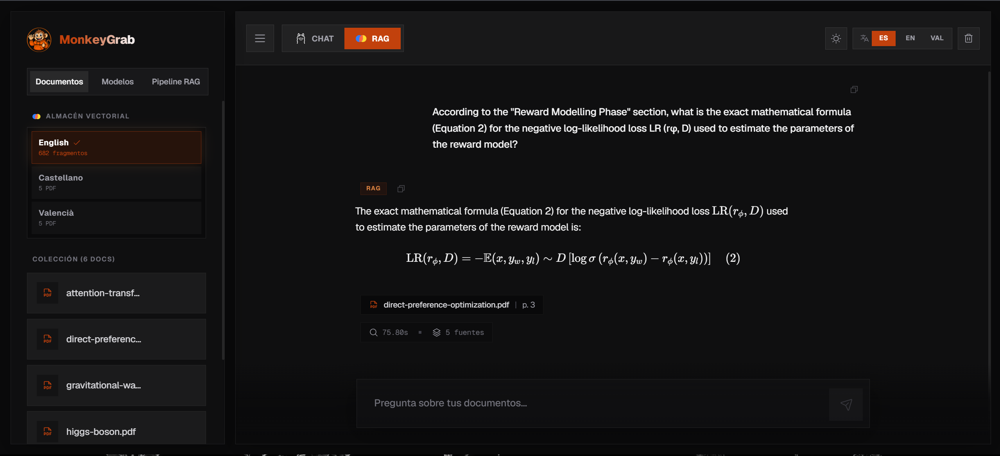

<p align="center">
  
</p>

<h1 align="center">MonkeyGrab</h1>

<p align="center">
  <strong>A local, multilingual RAG system for querying PDF documents with open language models.</strong><br/>
  All indexing, retrieval and generation runs on your own hardware — no data leaves your machine.
</p>

<p align="center">
  <a href="https://www.python.org/"></a>
  <a href="https://ollama.com/"></a>
  <a href="#what-it-runs-on"></a>
  <a href="https://react.dev/"></a>
</p>

<p align="center">
  
  
  
  
</p>

<p align="center">
  <a href="#overview">Overview</a> ·
  <a href="#architecture">Architecture</a> ·
  <a href="#what-it-runs-on">What it runs on</a> ·
  <a href="#the-query-pipeline">Pipeline</a> ·
  <a href="#running-it">Running it</a> ·
  <a href="#development">Development</a>
</p>

---

## Overview

Ask questions about your PDFs in natural language and get answers grounded in
what those files actually say. Point MonkeyGrab at a folder, start the CLI or the
web interface, and nothing leaves the machine.

- **Local-first** — indexing, retrieval and generation all run on your hardware; [Ollama](https://ollama.com/) provides the language models. No API keys.
- **Hybrid retrieval** — vector search and [Okapi BM25](https://www.staff.city.ac.uk/~sbrp622/papers/foundations_bm25_review.pdf) fused with [Reciprocal Rank Fusion](https://plg.uwaterloo.ca/~gvcormac/cormacksigir09-rrf.pdf), then re-scored by a [cross-encoder](https://www.sbert.net/examples/applications/cross-encoder/README.html).
- **Multilingual** — Castellano, English and Valencià, in both the interface and the corpus.
- **Multimodal** — [MinerU](https://github.com/opendatalab/MinerU) preserves document structure, while [Jina CLIP v2](https://huggingface.co/jinaai/jina-clip-v2) makes text and images searchable in the same semantic space.
- **Three interfaces** — terminal CLI, [Flask](https://flask.palletsprojects.com/) + [React](https://react.dev/) web app, and a packaged Windows desktop app.

<details>
<summary><strong>See it in action</strong></summary>
<br/>

**Web interface**

https://github.com/user-attachments/assets/f5f8fa1d-b193-4f94-85c2-8f903afa2348

**CLI**

https://github.com/user-attachments/assets/a27b6fef-52c1-4d4a-846e-7c4cd36863fa

**LaTeX rendering** (formulas via [KaTeX](https://katex.org/) in the web UI):



</details>

---

## Architecture

MonkeyGrab now has one production retrieval stack. The CLI, web app, desktop
app and evaluation pipeline all use the same four-part multimodal path.

1. **[MinerU](https://github.com/opendatalab/MinerU) understands the PDF.**
   It extracts reading order and document structure, keeps tables as structured
   content, and separates figures and charts as images. It does not answer
   questions; it prepares the source material.

2. **[Jina CLIP v2](https://huggingface.co/jinaai/jina-clip-v2) connects text
   and images.** It maps both modalities into one aligned semantic space, so a
   written question can retrieve a figure directly without first turning that
   figure into a text description. MonkeyGrab uses its 512-dimensional
   Matryoshka representation. The downloadable model is licensed under
   [CC BY-NC 4.0](https://creativecommons.org/licenses/by-nc/4.0/), so local
   use is non-commercial unless a separate commercial licence is obtained.

3. **[FAISS](https://github.com/facebookresearch/faiss) stores and searches the
   representations.** MonkeyGrab uses an exact, normalized inner-product index,
   which is equivalent to cosine similarity here. FAISS is a search library,
   not an artificial-intelligence model.

4. **[BGE Reranker v2 M3](https://huggingface.co/BAAI/bge-reranker-v2-m3)
   orders the evidence.** It reads the question together with each candidate
   and assigns a relevance score, moving the most useful fragments to the top.
   It does not generate the final answer.

In short: a PDF becomes structured text, tables and images; those elements
become comparable vectors; exact search finds candidates; the reranker selects
the strongest evidence; and only then does Ollama write the answer.

The pipeline logic itself lives in a
[hexagonal core](https://alistair.cockburn.us/hexagonal-architecture/) under
[`src/monkeygrab/`](src/monkeygrab/README.md). It depends on plain contracts,
not on MinerU, Jina CLIP, FAISS or Ollama. The concrete technologies are
connected at the application boundary.

**The dependency rule points one way.** `application` may import
`domain`, `ports` and `config`; `ports` may import `domain`; `domain` and
`config` import nothing internal. Adapters implement ports but are never
imported by any of them. This is not a convention to trust by eye — it is
enforced by [`tests/unit/test_architecture_boundaries.py`](tests/unit/test_architecture_boundaries.py),
which parses every import statement in the package.

**No silent fallbacks.** Every adapter raises on failure instead of quietly
degrading. A reranker that cannot load its model fails the query rather than
returning unranked results that look the same. The reasoning is in the
[design doc](docs/design/2026-07-26-monkeygrab-v2.md); the practical consequence
is that two runs are always comparable.

### What is wired today

All three stages run through the core. Each entry point under `rag/engine/`
builds its adapters and calls a use case; none of them holds pipeline logic.

| Stage | Use case | Entry point |
|---|---|---|
| **Indexing** | [`IndexCorpus`](src/monkeygrab/application/index_corpus.py) | [`indexing.py`](rag/engine/indexing.py), backends from [`composition.build_stack`](src/monkeygrab/composition.py) |
| **Retrieval** | [`Retrieve`](src/monkeygrab/application/retrieve.py) | [`retrieval.py`](rag/engine/retrieval.py) |
| **Generation** | [`Answer`](src/monkeygrab/application/answer.py) | [`generation.py`](rag/engine/generation.py) |

That there is one path per stage is the point: the CLI, the web app and the
acceptance gate cannot measure different behaviour, because there is only one
implementation to measure.

> [!TIP]
> Deeper reading: [`src/monkeygrab/README.md`](src/monkeygrab/README.md) for the
> layers and how to add an adapter, [`rag/README.md`](rag/README.md) for the
> interfaces, and [`docs/README.md`](docs/README.md) for what gets documented
> where.

---

## What it runs on

Four [Ollama](https://ollama.com/library) roles, each its own environment
variable. They are separate on purpose: a small model is enough to rewrite a
query, and a large one is wasted on it.

| Role | What it does | Set with |
|---|---|---|
| **Answer generation** | Writes the final answer from the retrieved evidence | `OLLAMA_RAG_MODEL` |
| **Chat & query decomposition** | Free conversation, and rewriting a question into sub-queries | `OLLAMA_CHAT_MODEL` |
| **Contextual enrichment** | Summarises each chunk's place in its document, at indexing | `OLLAMA_CONTEXTUAL_MODEL` |
| **Context synthesis (RECOMP)** | Compresses the evidence into a briefing before generation | `OLLAMA_RECOMP_MODEL` |

> [!TIP]
> The current default for each is in [`.env.example`](.env.example), next to
> every other variable. They are deliberately not repeated here: a default
> copied into prose is a default that goes stale the first time it changes.

The rest of the stack is not an Ollama model:

| Component | What it is | Set with |
|---|---|---|
| **Reranker** | [`BAAI/bge-reranker-v2-m3`](https://huggingface.co/BAAI/bge-reranker-v2-m3). Downloaded from Hugging Face on first use. | fixed |
| **Lexical search** | [Okapi BM25](https://github.com/dorianbrown/rank_bm25), always on when hybrid search is | — |
| **Embeddings** | [`jinaai/jina-clip-v2`](https://huggingface.co/jinaai/jina-clip-v2), shared text/image space | fixed |
| **Vector store** | [FAISS](https://github.com/facebookresearch/faiss), exact cosine search | fixed |
| **PDF extraction** | [MinerU](https://github.com/opendatalab/MinerU), structured text, tables and figures | fixed |

> [!NOTE]
> MinerU is an external CLI, and `jina_clip` runs in an isolated interpreter,
> which needs a CUDA GPU, because its dependencies conflict with the
> product's — see [`src/monkeygrab/README.md`](src/monkeygrab/README.md).

---

## The query pipeline

Every question follows the same path: query preparation, semantic and lexical
retrieval, rank fusion, reranking, evidence filtering, optional context
synthesis, and answer generation. Optional stages can be changed from the web
interface and apply to the next query without a restart.

| Stage | What it does |
|---|---|
| **Query decomposition** | An auxiliary model rewrites long questions into sub-queries targeting different aspects. Short questions instead get one extra variant built from their own keywords. |
| **Semantic search** | Each variant is embedded and matched against the store. |
| **BM25** | Term-frequency ranking over the same corpus, which catches identifiers, acronyms and numbers that embeddings blur. |
| **RRF fusion** | Merges both rankings by reciprocal rank, so a chunk both branches found outranks one that merely topped a single branch. |
| **Reranking** | A cross-encoder reads query and chunk together and re-scores the shortlist. |
| **Threshold** | Drops anything below the reranker's relevance floor, so a question with no answer in the corpus returns nothing rather than the least-bad chunk. Applies only when reranking ran — without its scores there is nothing to threshold on. |
| **Neighbour expansion** | Pulls in adjacent chunks of the top hits, recovering sentences cut by the chunk boundary. |
| **RECOMP synthesis** | Compresses the evidence into a facts briefing before generation, following [RECOMP](https://arxiv.org/abs/2310.04408). |

At indexing time, [contextual retrieval](https://www.anthropic.com/news/contextual-retrieval)
optionally prepends a short situational summary to each chunk so it can be found
by queries whose wording appears nowhere in it.

---

## Running it

Requires [Python 3.10+](https://www.python.org/downloads/), a CUDA GPU (the
multimodal embedder hard-fails without one; details below), and
[Ollama](https://ollama.com/download) running locally, with at least a generator
model pulled. Drop PDFs into `rag/docs/en/` — the index builds itself on first
run.

```bash
python rag/chat_pdfs.py    # CLI
python rag/web/app.py      # web UI at http://localhost:5000
```

<details>
<summary><strong>Install, models and configuration</strong></summary>
<br/>

Dependencies are in [`rag/requirements.txt`](rag/requirements.txt) (core) and
[`rag/web/requirements.txt`](rag/web/requirements.txt) (web UI). Pull the Ollama
models selected in your configuration. The reranker downloads itself on first use.

MinerU and Jina CLIP v2 do not run in that environment: their dependencies
collide with the product's, so both are installed together into one isolated
interpreter at `.venv-mineru/Scripts/python.exe` (Windows) or
`.venv-mineru/bin/python` (Linux/Mac), at the project root, following each
project's own install instructions. That interpreter needs a CUDA GPU: Jina
CLIP v2 can run on CPU (that is how the roughly 100 seconds per document
figure was measured, impractical for indexing), but this project's worker
refuses to start it there. That is the same "no silent fallbacks" policy
from above, applied to a slow device instead of a missing one. There is no
setup script for this yet; see
[`src/monkeygrab/README.md`](src/monkeygrab/README.md) for how the isolation
is used.

Copy [`.env.example`](.env.example) to `.env` at the project root; it documents
every supported variable with its default. The shell environment always wins over
the file. `MONKEYGRAB_LANG` sets the interface language (`es`, `en`, `ca`),
`DOCS_FOLDER` the corpus, and `OLLAMA_BASE_URL` the Ollama server — point it at
another machine and every call follows, generation included, which is the way
out when the local card cannot hold the generator you want.

The model roles, pipeline toggles and active store you pick in the web UI are
saved to `settings.json` in the data directory, and the CLI starts from that
same file: one configuration per machine, not one per interface. The precedence
is environment, then saved choices, then defaults, so an exported
`OLLAMA_*_MODEL` or `DOCS_FOLDER` still describes the run you are starting.

`OLLAMA_KEEP_ALIVE` keeps the generator's weights in VRAM for that many seconds
after each call, since loading them back is most of a query's latency — on a
small or shared GPU that also means the model squats on VRAM for that long
afterward, so lower it (or set it to `0`) there.

Each corpus has its own Jina CLIP and FAISS index under `rag/vector_db/`. Both
interfaces detect when a stored index no longer matches the active chunking,
extraction or index-time flags and warn about it, but never reindex on their
own — a settings change must not silently trigger a MinerU + jina-clip pass
over the corpus, which can take an hour. Run `/reindex` (or the web UI's
reindex action) explicitly to rebuild after changing the corpus, extraction
behaviour or chunking rules. This detection needs an index built with this
feature present: an index built by an older version has no recorded recipe to
compare against and is never flagged, however much its actual recipe may have
drifted.

</details>

### Interfaces

The **CLI** takes slash commands: `/rag` and `/chat` switch mode, `/docs` lists
what is indexed, `/temas` shows corpus topics, `/stats` the active pipeline
configuration, `/reindex` rebuilds the index, `/limpiar` clears history, `/salir`
exits and `/ayuda` lists everything. `/temas`, `/limpiar`, `/salir` and `/ayuda`
also have English and Valencian aliases.

The **web UI** adds document upload, per-role model assignment, the pipeline
toggles, and an inline PDF viewer that opens cited sources at the right page.
Ollama is started automatically if it is installed but not running. Three fixed
language stores — English, Castellano, Valencià — map to `rag/docs/{en,es,ca}/`.

The **desktop app** wraps the web interface in a Windows executable with
[PyInstaller](https://pyinstaller.org/) and [pywebview](https://pywebview.flowrl.com/).
It needs the isolated MinerU/Jina runtime beside the executable, and the
packaged build cannot start that worker yet even when the runtime is present
([#26](https://github.com/iDiagoValeta/localOllamaRAG/issues/26)); use the CLI
or web app in the meantime. See [`packaging/README.md`](packaging/README.md).

---

## Known limitations

> [!WARNING]
> - **Vector graphics** (SVG figures) embedded in PDFs are not extracted.
> - **Structured extraction is not perfect.** MinerU preserves tables and separates figures, but complex layouts, mathematical notation and unusual PDFs can still be misread.
> - **Jina CLIP v2 has a non-commercial local licence.** A commercial deployment needs separate licensing or a replacement embedding model.
> - **The reranker downloads its model on first use**, a one-time step that needs internet. Everything after runs offline; turn reranking off if you need a fully air-gapped first run.
> - **Optional stages fail loudly.** If an enabled stage cannot run, the query raises instead of silently returning worse results. Turn the stage off to proceed without it.
> - **Indexing cost** grows with corpus size, contextual enrichment and the number of extracted images.
> - **Concurrent web requests can disable the embedder.** Two overlapping queries can desynchronize the Jina CLIP worker's protocol, which permanently disables it until the process restarts ([#24](https://github.com/iDiagoValeta/localOllamaRAG/issues/24)).
> - **VRAM from the embedder and reranker is not freed before generation**, but measurement found Ollama offloads rather than blocking: contention cost single-digit seconds, not the multi-minute hang once suspected ([#25](https://github.com/iDiagoValeta/localOllamaRAG/issues/25)).
> - **The packaged desktop build cannot start the multimodal worker yet.** Indexing and retrieval fail even with the isolated runtime present ([#26](https://github.com/iDiagoValeta/localOllamaRAG/issues/26)).

---

## Development

Two CI gates, deliberately not one. The **fast gate**
([`ci.yml`](.github/workflows/ci.yml)) runs on every pull request: lint, the
architecture dependency rules, the unit suite against test doubles, and the
frontend build — no GPU, no models, no network. The **full gate**
([`full-eval.yml`](.github/workflows/full-eval.yml)) is launched manually on a
self-hosted GPU runner and executes the real pipeline
against a corpus of hand-verified gold cases and fails if the pass rate drops
below the recorded baseline. It is required before merging anything that touches
retrieval or generation, because the fast gate never exercises a real model.

```bash
pytest                                              # full suite, no GPU required
python tests/eval/run_eval.py --models <model...>   # full gate; needs Ollama + GPU
```

Tests are split by what they protect:
[`tests/unit/`](tests/unit/) for the pure layers and the adapters,
[`tests/characterization/`](tests/characterization/) to pin observed pipeline
behaviour, and [`tests/eval/`](tests/eval/README.md) for the gold-case gate.
Contributor rules are in [`.claude/CLAUDE.md`](.claude/CLAUDE.md).

---

## Acknowledgements

MonkeyGrab is built on external open-source projects and openly available
models. Thank you to the teams behind
[MinerU](https://github.com/opendatalab/MinerU),
[Jina CLIP v2](https://huggingface.co/jinaai/jina-clip-v2),
[FAISS](https://github.com/facebookresearch/faiss) and
[BGE/FlagEmbedding](https://github.com/FlagOpen/FlagEmbedding) for making this
multimodal stack possible. The project also relies on
[Ollama](https://ollama.com/), [rank-bm25](https://github.com/dorianbrown/rank_bm25),
[Flask](https://flask.palletsprojects.com/) and [React](https://react.dev/).

---

## License

[MIT](LICENSE) © Ignacio Diago Valeta.
