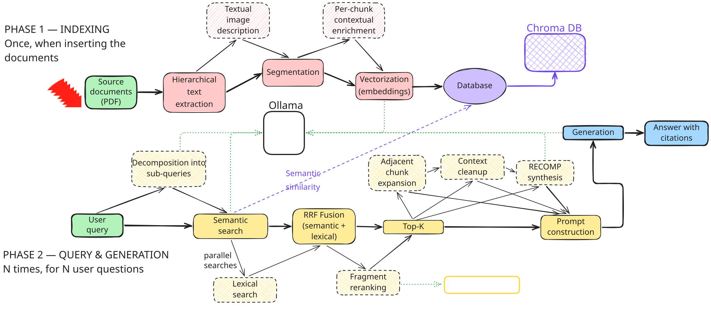
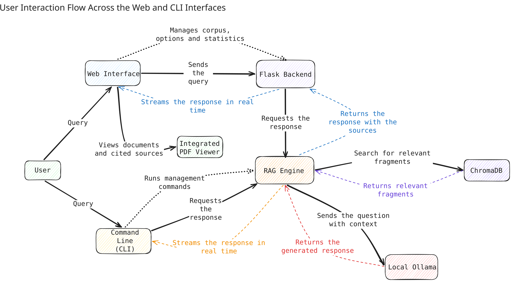

<p align="center">
  
</p>

<h1 align="center">MonkeyGrab</h1>

<p align="center">
  <strong>A local, multilingual RAG system for querying PDF documents with open language models.</strong><br/>
  All indexing, retrieval and generation runs on your own hardware — no data leaves your machine.
</p>

<p align="center">
  <a href="https://www.python.org/"></a>
  <a href="https://ollama.com/"></a>
  <a href="https://www.trychroma.com/"></a>
  <a href="https://react.dev/"></a>
</p>

<p align="center">
  
  
  
</p>

<p align="center">
  <a href="#1-overview">Overview</a> ·
  <a href="#2-architecture">Architecture</a> ·
  <a href="#3-demo">Demo</a> ·
  <a href="#4-getting-started">Getting started</a> ·
  <a href="#5-configuration">Configuration</a> ·
  <a href="#6-usage">Usage</a>
</p>

---

## 1. Overview

MonkeyGrab lets you ask questions about your PDF documents in natural language. Point it at a folder of PDFs, start the CLI or the web interface, and get answers grounded in the actual content of those files — no data sent to any cloud.

| | |
|---|---|
| **Local-first** | All indexing, retrieval and generation runs on your hardware. No API keys required for the core pipeline. |
| **Any model** | Works with any instruction-tuned model in [Ollama](https://ollama.com/) — `llama3.2`, `mistral`, `gemma4`, `qwen3`, etc. |
| **Hybrid retrieval** | Semantic search + BM25 lexical search fused with RRF, followed by optional [cross-encoder reranking](https://www.sbert.net/). |
| **Multilingual UI** | Spanish, English and Valencian out of the box. The CLI uses `MONKEYGRAB_LANG`; the web UI has an `ES / EN / VAL` selector. |
| **Two interfaces** | [Rich](https://rich.readthedocs.io/en/stable/)-based terminal CLI and a [Flask](https://flask.palletsprojects.com/) + [React](https://react.dev/) web UI with streaming responses and inline PDF viewer. |
| **Image-aware** | Optionally describes raster images in PDFs with a vision model via [pymupdf4llm](https://pymupdf.readthedocs.io/en/latest/pymupdf4llm/), making visual content retrievable. |

---

## 2. Architecture

PDFs are indexed once into a [ChromaDB](https://www.trychroma.com/) vector store. Each query then passes through a configurable multi-stage retrieval pipeline before reaching the generator — all running locally via [Ollama](https://ollama.com/).

<p align="center">
  
</p>

### Interaction flow

Both front-ends share the same local RAG engine. The web UI sends each query through the [Flask](https://flask.palletsprojects.com/) backend, while the CLI calls the engine directly; from there the path is identical — the engine retrieves relevant fragments from [ChromaDB](https://www.trychroma.com/), sends the question with that context to a local [Ollama](https://ollama.com/) model, and streams the generated answer back to the user. In the web UI, cited sources open in the integrated PDF viewer.

<p align="center">
  
</p>

---

## 3. Demo

**Web interface — querying a local document corpus**

https://github.com/user-attachments/assets/f5f8fa1d-b193-4f94-85c2-8f903afa2348

**CLI — querying a local document corpus**

https://github.com/user-attachments/assets/a27b6fef-52c1-4d4a-846e-7c4cd36863fa

<p align="center"><strong>LaTeX rendering — math formulas rendered natively in the web UI</strong></p>

<p align="center">
  
</p>

<p align="center">The web interface uses <a href="https://katex.org/">KaTeX</a> to render inline (<code>$...$</code>) and display (<code>$$...$$</code>) LaTeX expressions generated by the model.</p>

---

## 4. Getting started

**Prerequisites:** Python 3.10+, [Ollama](https://ollama.com/) running locally.

### Install

```bash
git clone https://github.com/iDiagoValeta/localOllamaRAG
cd localOllamaRAG

pip install -r rag/requirements.txt        # core RAG pipeline (required)
pip install -r rag/web/requirements.txt    # web interface (optional)
```

#### Lighter clone (sparse checkout, optional)

If you only want the end-user RAG stack and can skip the thesis corpora and all
of `research/`, use Git sparse checkout after cloning:

```bash
git clone --filter=blob:none --sparse https://github.com/iDiagoValeta/localOllamaRAG
cd localOllamaRAG
git sparse-checkout set rag README.md pytest.ini                 # core only
git sparse-checkout set rag README.md pytest.ini rag/docs/en     # + default EN PDFs
```

PowerShell (Git 2.25+) uses the same `git sparse-checkout set …` commands.
Sparse checkout only hides paths locally; they still exist on the remote, so
re-run `git sparse-checkout set …` if you later need `research/` or the
`rag/docs/en_ragbench_*` trees.

### Pull models

You need at minimum a generator and an embedding model:

```bash
ollama pull <OLLAMA_RAG_MODEL>      # document Q&A generator (required)
ollama pull <OLLAMA_EMBED_MODEL>    # indexing and retrieval (required)

ollama pull <OLLAMA_CHAT_MODEL>     # chat mode + query decomposition (optional)
ollama pull <OLLAMA_RECOMP_MODEL>   # context synthesis before generation (optional)
ollama pull <OLLAMA_OCR_MODEL>      # vision model for PDF images (optional)
```

**Fine-tuned weights trained specifically for RAG (recommended):**

- **Qwen3-14B RAG** — [nadiva1243/qwen3RAG](https://huggingface.co/nadiva1243/qwen3RAG) on [Hugging Face](https://huggingface.co/)
- **Phi-4 RAG** — [nadiva1243/phi4RAG](https://huggingface.co/nadiva1243/phi4RAG) on [Hugging Face](https://huggingface.co/)

### Run

Drop your PDFs into `rag/docs/en/` and start:

```bash
# CLI (Spanish UI by default)
python rag/chat_pdfs.py

# CLI in English
MONKEYGRAB_LANG=en python rag/chat_pdfs.py          # bash/zsh
$env:MONKEYGRAB_LANG = "en"; python rag/chat_pdfs.py # PowerShell

# CLI in Valencian
MONKEYGRAB_LANG=ca python rag/chat_pdfs.py          # bash/zsh
$env:MONKEYGRAB_LANG = "ca"; python rag/chat_pdfs.py # PowerShell

# Web interface → http://localhost:5000
python rag/web/app.py
```

> [!NOTE]
> **PowerShell:** use `$env:MONKEYGRAB_LANG = "en"` / `"ca"`. The `set MONKEYGRAB_LANG=...` syntax is for `cmd.exe`, not PowerShell.

The vector index is created automatically in `rag/vector_db/` on first run.

---

## 5. Configuration

MonkeyGrab is configured entirely through environment variables. The fastest way
to start is to copy the bundled template and edit only what you need:

```bash
cp .env.example .env          # macOS / Linux
Copy-Item .env.example .env   # Windows PowerShell
```

The `.env` file at the project root is loaded automatically on startup. Anything
exported in your shell still takes precedence over it.

> [!TIP]
> [`.env.example`](.env.example) documents **every** supported variable with its
> default value and a one-line description — including the advanced retrieval and
> ranking knobs. Start there instead of this table.

| Variable | Description |
|----------|-------------|
| `OLLAMA_RAG_MODEL` | Generator model for RAG mode |
| `OLLAMA_CHAT_MODEL` | Generator for chat mode and query decomposition |
| `OLLAMA_EMBED_MODEL` | Embedding model for indexing and retrieval |
| `OLLAMA_RECOMP_MODEL` | Model for context synthesis before generation |
| `OLLAMA_OCR_MODEL` | Vision model for PDF image descriptions |
| `OLLAMA_CONTEXTUAL_MODEL` | Auxiliary model for contextual chunk enrichment at indexing |
| `OLLAMA_NUM_CTX` | Default context window requested from Ollama model calls (default: `8192`) |
| `OLLAMA_RAG_NUM_CTX` | Context window for the final RAG generator (default: `16384`) |
| `OLLAMA_AUX_NUM_CTX` | Fallback context for auxiliary LLM calls (default: `8192`) |
| `OLLAMA_QUERY_NUM_CTX` | Context window for LLM query decomposition (default: `8192`) |
| `OLLAMA_RECOMP_NUM_CTX` | Context window for RECOMP synthesis (default: `8192`) |
| `OLLAMA_CONTEXTUAL_NUM_CTX` | Context window for contextual retrieval at indexing time (default: `32768`) |
| `OLLAMA_OCR_NUM_CTX` | Context window for PDF image descriptions (default: `8192`) |
| `OLLAMA_REQUEST_TIMEOUT` | HTTP timeout in seconds for long Ollama generation calls |
| `MAX_CONTEXTO_CHARS` | Maximum retrieved-context characters sent to the answer/RECOMP stage (default: `24000`) |
| `CONTEXTUAL_DOC_CHARS` | Maximum document-level characters sent to contextual retrieval while indexing each chunk (default: `24000`) |
| `DOCS_FOLDER` | PDF folder to index (default: `rag/docs/en/`) |
| `RERANKER_QUALITY` | Cross-encoder tier: `quality` or `fast` |
| `MONKEYGRAB_LANG` | CLI language: `es` (default), `en` or `ca` |

> [!IMPORTANT]
> [ChromaDB](https://www.trychroma.com/) paths follow the pattern `rag/vector_db/<folder>_<embed_slug>/`. Changing `DOCS_FOLDER` or `OLLAMA_EMBED_MODEL` selects a different index — run `/reindex` when you intentionally switch either.

> [!NOTE]
> - Context variables are requested per Ollama call. The effective window can still be capped by the model/Modelfile; use role-specific variables when only one auxiliary stage needs a larger window.
> - `MAX_CONTEXTO_CHARS` is measured in characters, not tokens; it trims retrieved evidence before the model prompt is sent.
> - `CONTEXTUAL_DOC_CHARS` is also measured in characters and only affects future indexing/reindexing, because the enriched chunk text is stored in ChromaDB.

<details>
<summary><strong>Advanced pipeline flags</strong></summary>

These constants live in `rag/chat_pdfs.py`. Edit them directly to toggle pipeline stages.

| Flag | Default | Effect |
|------|---------|--------|
| `USAR_CONTEXTUAL_RETRIEVAL` | `True` | Enrich chunks with LLM context at indexing time |
| `USAR_LLM_QUERY_DECOMPOSITION` | `True` | Decompose query into sub-queries |
| `USAR_BUSQUEDA_HIBRIDA` | `True` | Add Okapi BM25 lexical search alongside semantic search |
| `USAR_RERANKER` | auto | [Cross-encoder reranking](https://www.sbert.net/) — enabled when `sentence-transformers` is installed |
| `USAR_RECOMP_SYNTHESIS` | `True` | RECOMP context compression before generation |
| `EXPANDIR_CONTEXTO` | `True` | Include adjacent chunks around top results |
| `USAR_OPTIMIZACION_CONTEXTO` | `True` | Strip PDF extraction artefacts from context before generation |
| `USAR_EMBEDDINGS_IMAGEN` | `True` | Describe raster images in PDFs with a vision model |

</details>

---

## 6. Usage

### CLI commands

| Command | Description |
|---------|-------------|
| `/rag` | RAG mode — answers grounded in your documents |
| `/chat` | Chat mode — free conversation without document context |
| `/docs` | List indexed documents |
| `/temas` `/topics` `/temes` | Topic summary per document |
| `/stats` | Vector database statistics |
| `/reindex` | Drop the current index and re-index all documents |
| `/limpiar` `/clear` `/netejar` | Clear conversation history |
| `/ayuda` `/help` `/ajuda` | Show all available commands |
| `/salir` `/exit` `/eixir` | Exit and save history |

### Web interface

Open `http://localhost:5000`. The sidebar is a full control panel — **Documents**, **Models** and **RAG Pipeline** tabs — plus document upload, streaming responses and an `ES / EN / VAL` language selector. The selected web language is stored in the browser.

**Vector stores** (Documents tab) — three fixed language stores: **English** (default), **Castellano** and **Valencià**, each bound to `rag/docs/{en,es,ca}/`. They always exist (a store can be empty) and cannot be created, deleted, hidden or renamed. Pick one to switch the active PDF folder and its ChromaDB collection at runtime, indexing automatically when the target collection is empty; upload PDFs and re-index to fill a store, or remove individual documents. The active store is remembered across restarts. Backed by `GET /api/stores` and `POST /api/stores/select`.

**Models** (Models tab) — Ollama is started automatically at launch if it is installed but not running; the panel shows whether the server is up (with a one-click **Start Ollama** button as a fallback) and lists every installed model, tagged by capability (`embedding` / `vision`). Assign a model to each pipeline role — RAG generator, chat / sub-queries, embeddings, contextual retrieval, RECOMP synthesis and vision / OCR — and the change takes effect on the next query without a restart. Changing the **embeddings** model re-derives the vector store path, so a re-index is required. Backed by `GET /api/ollama`, `POST /api/ollama/start`, `GET /api/ollama/models`, `GET/POST /api/models`, and `get_model_roles()` / `set_model_roles_runtime()` in `rag/chat_pdfs.py`.

**Inline PDF viewer** — click the eye icon next to any document in the sidebar, or click any source citation in a RAG response, to open the PDF directly in the browser. Citations open at the page of the highest-scoring retrieved fragment for that document.

For development with hot-reload: run `npm run dev` inside `rag/web/frontend/` ([Vite](https://vitejs.dev/) on :3000 proxies to [Flask](https://flask.palletsprojects.com/) on :5000).

### Desktop app (`.exe`)

The same UI can be packaged as a standalone Windows desktop app — a native window
(no browser, no terminal) that bundles Python and the RAG engine, so the target
machine needs no Python install:

```bash
pip install pyinstaller pywebview
python packaging/build_exe.py     # → dist/MonkeyGrab/MonkeyGrab.exe
```

> [!IMPORTANT]
> **Ollama is not bundled.** The LLM runs locally, so every machine still needs
> [Ollama](https://ollama.com/) installed with the models pulled — the app
> detects it, offers a one-click start, and lets you assign models per role.
> Writable data (vector DBs, history) goes to `%LOCALAPPDATA%\MonkeyGrab`.

Full build/distribution notes: [`packaging/README.md`](packaging/README.md).

---

## Known limitations

> [!WARNING]
> - **Vector graphics** (SVG figures) embedded in PDFs are not extracted.
> - **Math, tables and images** are not plain text. Even with OCR and image captions, formulas and complex layouts can be misread, chunked awkwardly or poorly retrieved — expect occasional errors or incomplete answers on those pages.
> - **Indexing cost** grows with `CHUNK_SIZE`, contextual enrichment, image captions and similar options (time and memory).

---

> [!NOTE]
> For thesis reproduction, RAGAS evaluation, LoRA fine-tuning and benchmark results see [**`research/`**](research/README.md).
