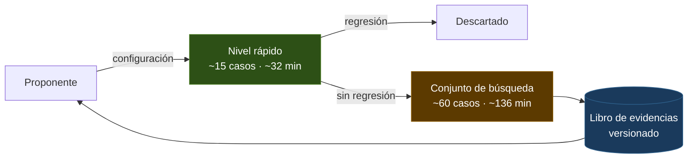

# Loop automejorable sobre el pipeline RAG

Diseño validado el 2026-07-28. Define un arnés que busca automáticamente
configuraciones mejores del pipeline, y los criterios que dicen si está
conseguido.

Antecedente: la auditoría de `8f83c5f` (migración multimodal) encontró que tres
de sus siete hallazgos son defectos del **medidor**, no del runtime: índice que
no se invalida, baseline sin evidencia versionada, métrica de figuras que puntúa
recuperación y se lee como respuesta. Este diseño los absorbe como criterios de
aceptación en vez de tratarlos como deuda aparte.

---

## 1. Objetivo

Un arnés que, partiendo de una configuración dada, busca configuraciones mejores
del pipeline, donde **mejor** significa más casos gold acertados sin empeorar la
latencia por encima de un techo, y donde cada candidato queda registrado de forma
que se pueda reconstruir exactamente.

**Función objetivo:** maximizar la tasa de acierto sobre el conjunto de búsqueda,
sujeta a una restricción dura de latencia. No es un escalar combinado: no se fija
ningún tipo de cambio entre puntos de acierto y minutos. Un candidato que se pasa
del techo queda descalificado aunque acierte más.

**Espacio de acción, primera etapa:** sólo configuración, es decir flags de pipeline,
tamaño de fragmento, top-k, pesos de fusión, parámetros BM25, prompts. Todo lo
que `AppConfig` ya modela como objeto inmutable y serializable. El espacio se
amplía a código cuando el arnés haya demostrado que mide bien, no antes.

> [!IMPORTANT]
> El orden no es cautela decorativa. Un agente que edita código contra una
> función de fitness defectuosa optimiza contra los defectos del medidor antes
> que contra el problema, y lo hace con confianza.

---

## 2. Criterios de aceptación

Los cuatro primeros son del medidor. Un loop sobre una medida que miente no
produce mejoras: produce basura reproducible.

| # | Criterio | Cómo se comprueba |
|---|---|---|
| 1 | **Repetibilidad** (medido 2026-07-29, ver nota abajo) | La misma configuración corrida dos veces aprueba el mismo conjunto de casos. Si no, la dispersión observada queda declarada como suelo de ruido y ningún delta por debajo cuenta como mejora. |
| 2 | **Sensibilidad** | Un sabotaje conocido y acotado (recuperar un solo fragmento; apagar el reranker) hace caer el gate de forma inequívoca. |
| 3 | **No engañable** (evidencia de campo 2026-07-29, ver nota abajo) | Alterar el troceado obliga a reindexar en el run siguiente, en vez de reutilizar el índice por nombre de fichero. |
| 4 | **Métricas separadas** | Un caso de figura que acierta la recuperación no cuenta como respuesta correcta. |
| 5 | **Búsqueda efectiva** | Partiendo de una configuración deliberadamente empeorada, el loop recupera al menos hasta el rendimiento actual sin intervención. |
| 6 | **Techo respetado** | Un candidato que acierta más pero excede la latencia se rechaza, y el informe registra el motivo. |
| 7 | **Reproducibilidad** | Con el informe de una iteración se reconstruye esa configuración y se obtiene el mismo resultado, dentro del suelo de ruido del criterio 1. |
| 8 | **Terminación** | Para por presupuesto o por falta de progreso, y en ambos casos deja informe. |

El criterio 5 se corre con dos proponentes (ver §4) para saber si el razonamiento
del LLM aporta algo sobre un control determinista.

> [!NOTE]
> **Criterio 1, medido el 2026-07-29.** Dos runs del gate completo, misma
> configuración y mismo código, mismo índice (los dos registraron `cache hit`
> en el conjunto dev y en el ciego, así que ninguno reindexó):
> `tests/eval/runs/20260729T020233Z_mineru-jina_clip-faiss.json` y
> `tests/eval/runs/20260729T040824Z_mineru-jina_clip-faiss.json`, ambos
> 44/51 = 0.8627 global. `compare_runs.py` sobre el par: `identical: 51 case(s)
> unchanged`, delta de tasa de acierto +0.0000, es decir cero vuelcos. Eso acota
> el suelo de ruido por debajo de un caso; no demuestra que el pipeline sea
> determinista en general, y dos runs es una muestra pequeña, así que una
> afirmación más amplia exige más pares. Dato llamativo: el generador corre a
> temperatura 0.15, así que una salida idéntica en un run completo no estaba
> garantizada de antemano. Con este suelo, un vuelco de un solo caso ya es
> señal y no ruido, así que el margen de nueve casos que calcula este diseño
> (§3) es aprovechable tal cual.
>
> **Criterio 3, evidencia de campo del mismo par de runs.** Los dos runs
> registraron `cache hit` en ambos corpus (884 y 218 fragmentos), lo cual es
> evidencia de que la huella del índice funciona sobre un corpus real y no
> sólo bajo dobles de prueba, que era la única cobertura que tenía hasta
> ahora. No se marca el criterio como cerrado por esto solo; sólo añade
> evidencia de campo a la que ya daban los tests unitarios.

---

## 3. El corpus, derivado del objetivo

### Por qué hay que ampliarlo

De los 51 casos actuales fallan 9. Ese es el margen de mejora completo: el loop
no puede ganar más de nueve casos porque no hay más que ganar.

La comparación entre dos configuraciones es **pareada** sobre los mismos casos:
se miran los casos que vuelcan de estado, no las tasas globales. Con estas
cantidades hacen falta del orden de seis vuelcos a favor sin ninguno en contra
para que la diferencia no sea atribuible al azar.

Nueve de margen, seis para demostrar algo. Y cuatro de esos nueve son casos de
figura, cuya métrica hoy mide sólo recuperación (criterio 4). El margen real en
el que el loop puede demostrar algo es de unos cinco casos.

> [!NOTE]
> El corpus crece porque el medidor necesita resolución, no por completitud
> temática. Ésa es la única justificación que fija el tamaño.

### Tamaño

Para que el loop demuestre varias mejoras sucesivas antes de agotarse, el pozo de
casos fallidos debe ser varias veces el umbral de detección: alrededor de treinta.

Los casos nuevos vienen de documentos más duros y fallarán más, así que se asume una
tasa de fallo del orden de cuatro de cada diez, frente a dos de cada diez en el
corpus actual. Con esa proporción:

- **~55 casos nuevos**, hasta un total en torno a **110**.
- **~20 documentos**, frente a los 9 actuales.
- ~6 casos por documento.

### Partición

Un loop es un optimizador: todo aquello contra lo que optimiza deja de ser una
muestra independiente. Si el loop usara el gate completo como función objetivo,
el conjunto ciego se consumiría en la primera iteración.

> [!WARNING]
> **Los tiempos de esta sección estaban mal por un factor de ~4.** Medido la
> noche del 2026-07-29 (issue #27): con `OLLAMA_KEEP_ALIVE=0` (el default del
> producto), Ollama descarta los pesos del generador tras cada llamada, así que
> cada caso factual paga una carga en frío completa en la fase de generación:
> 195 a 210 s por caso, de forma uniforme. La estimación original asumía
> ~32 s/caso, extrapolados de un informe (2026-07-27) cuya cifra por caso no
> aislaba generación de recuperación. Los números de la tabla y del diagrama
> siguientes quedan corregidos con ese factor ~4, aplicado de forma plana a
> las cifras originales del diseño -- incluidos los casos `figure_retrieval`
> y `table_retrieval`, que nunca llaman al generador, así que la cifra
> corregida es un límite superior, no una medición por tipo de caso. Son una
> corrección, no una medición directa de este conjunto de búsqueda (que aún
> no existe): la cifra real, una vez aplicado el Cambio 1 (keep-alive del
> generador acotado a la fase de evaluación, `tests/eval/run_eval.py`), queda
> pendiente de medir.

| Conjunto | Papel | Cuándo se toca | Tamaño |
|---|---|---|---|
| **Búsqueda** | Función objetivo del loop | Cada iteración | ~11 docs · ~60 casos · ~136 min (corregido ~4x; pendiente de medir tras el Cambio 1) |
| **Validación** | Detecta sobreajuste al conjunto de búsqueda | Al cerrar una tanda | ~4 docs · ~22 casos |
| **Ciego** | Acepta una versión | Sólo para aceptar; nunca dentro del loop | ~5 docs · ~28 casos |

> [!IMPORTANT]
> Lo que el loop paga en cada iteración es el **conjunto de búsqueda**, no el
> corpus entero. Correr los 110 casos por iteración consumiría el conjunto ciego
> en la primera vuelta y lo convertiría en datos de entrenamiento.

> [!WARNING]
> La partición es **por documento, no por caso**. Dos preguntas sobre el mismo
> PDF comparten extracción, troceado y fragmentos; repartirlas entre búsqueda y
> validación filtra información de un lado al otro y la validación deja de
> validar.

### Composición

Tres ejes, escalonados. Un documento entra si produce **fallos informativos**: el
pipeline lo hace mal y podría plausiblemente hacerlo bien. Un documento que el
extractor destroza no aporta margen, aporta ruido que ninguna configuración
arregla.

| Eje | Qué estresa | Coste de aprovisionamiento |
|---|---|---|
| **Idioma** | Dos de los tres stores que se shipean, hoy sin medir | Cero: los PDFs ya están en `rag/docs/es/` y `rag/docs/ca/` |
| **Dominio** | Vocabulario no compartido con ML ni física; rama léxica | Bajo: arXiv cubre cualquier área |
| **Forma** | Extractor, troceado y ruta multimodal | Alto e incierto: escaneados y tablas densas con licencia abierta |

Las tablas van 5/5 porque las cinco son tablas académicas en LaTeX, donde MinerU
brilla. Un tipo de caso saturado no distingue mejora de empeoramiento: sólo cuesta
minutos por iteración. Documentos con tablas estadísticas densas devuelven
gradiente a ese tipo; hasta entonces, sale del nivel rápido.

### Sonda previa

Antes de invertir autoría humana en ~55 casos, un lote diagnóstico decide, por
eje, si produce fallos informativos o destructivos. Seis documentos, dos o tres
casos cada uno, indexados en **su propia colección aislada** para no alterar los
stores contra los que se mide el producto.

Los casos de la sonda se redactan para sobrevivir: si el eje resulta viable, son
la semilla de la fase completa, no material desechable.

Veredicto por eje, explícito: *viable* · *viable tras arreglo* · *inviable con
esta fuente*.

### Margen inalcanzable

Separar la métrica de figura (criterio 4) hará aflorar casos que fallan porque el
generador nunca ve el contenido visual: se almacena la leyenda o el literal
`[figure] page=N`. Ese margen es real y se mide, pero **ninguna configuración
puede cerrarlo**: exige un cambio de código fuera del espacio de acción de la
primera etapa.

Esos casos se reportan pero quedan **fuera del escalar que el loop maximiza**,
para que no gaste iteraciones persiguiendo casos imposibles. Entran cuando el
espacio de acción se amplíe a código.

---

## 4. Arquitectura del arnés

**Espacio de búsqueda declarado como dato.** Un fichero enumera qué campos son
ajustables y con qué valores. Escrito a mano, no inferido por introspección:
añadir un parámetro debe ser una decisión visible, porque cada uno multiplica el
espacio contra un presupuesto de evaluaciones muy corto.

**Proponente.** A ~2.8 horas por evaluación completa (32 + 136 min: nivel
rápido más conjunto de búsqueda; corregido con el factor de la nota de la
sección 3, pendiente de remedir tras el Cambio 1 del issue #27), una noche da
del orden de tres o cuatro candidatos, no diez o quince como asumía la
estimación original. La búsqueda aleatoria es inútil con ese presupuesto, así
que el proponente natural es un LLM que lea los fallos concretos y razone qué
mover. Para saber si ese razonamiento aporta algo, el arnés incluye un
proponente determinista como control y el criterio 5 se corre con ambos.

**Evaluador.** Aplica la configuración, corre el nivel rápido, descarta si hay
regresión, y sólo entonces paga el conjunto de búsqueda completo. Devuelve el
registro en vez de sólo imprimirlo.

El nivel rápido es un **subconjunto fijo del conjunto de búsqueda** (unos 15
casos elegidos por dar señal: figuras, dominios nuevos, formas difíciles), no una
muestra rotatoria. Una muestra que cambia entre iteraciones introduce varianza en
la comparación, y un ratchet que sólo sube acabaría envenenado por la suerte del
muestreo.

> [!NOTE]
> El nivel rápido **nunca declara una mejora**: no tiene resolución para eso. Es
> un filtro de regresión, no un criterio de aceptación.

**Dónde vive cada umbral.** El ratchet que el loop usa como referencia vive en el
conjunto de búsqueda. El umbral que acepta una versión para integrar se comprueba
contra el conjunto ciego, y esa comprobación ocurre fuera del loop.

**Libro de evidencias.** Registro append-only versionado en git, una entrada por
iteración: configuración exacta, casos aprobados y fallados uno a uno, tiempos, y
veredicto con motivo. Hace posible el criterio 7 y le da expediente al baseline,
que hoy es un `0.77` suelto cuyo run de calibración está fuera del repo.

**Huella del índice.** Resumen de todo lo que afecta al contenido del índice
(extractor, parámetros de troceado, modelo de embedding, flags de indexado),
guardado junto al índice. Si no coincide, se reindexa. Es el criterio 3.

**Ubicación.** El arnés no es producto: no entra en el núcleo hexagonal ni en la
capa de interfaces. Vive en su propio directorio y **consume** el gate como
biblioteca.

> [!CAUTION]
> El arnés puede leer y ejecutar la evaluación, nunca redefinir cómo se puntúa.
> Un optimizador que puede tocar su propio criterio deja de medir.

---

## 5. Supuestos

Adoptados por defecto; cualquiera es revisable.

- **El loop propone, el humano integra.** Nunca fusiona ni despliega solo
  (regla 1 del repo).
- **Techo de latencia:** ningún candidato puede empeorar la latencia mediana por
  consulta más de un 20 % sobre la configuración vigente.
- **Terminación:** presupuesto de iteraciones, o parada tras varias iteraciones
  seguidas sin superar el suelo de ruido.
- **Comparación pareada** sobre los mismos casos, nunca entre tasas de runs
  distintos.
- **El grading sigue siendo determinista.** No hay juez LLM en ninguna etapa. La
  asistencia de LLM se limita a la autoría de casos y a proponer configuraciones.
- **Autoría de casos:** se redactan leyendo las páginas reales del PDF, con
  `verified_pages` anotado; auditoría humana sobre una muestra antes de que el
  lote entre.
- **Procedencia:** todo documento nuevo se reproduce desde un identificador
  estable y abierto, y queda fuera del repo. El corpus del producto se congela en
  sus 6 papers actuales para no engordar el bundle de escritorio.

---

## 6. Decisiones que requieren permiso explícito

Ninguna se ejecuta sin confirmación.

1. **Modificar `tests/eval/run_eval.py`** para que acepte una configuración y un
   subconjunto de casos, y devuelva sus resultados. La regla 9 del repo declara
   `tests/eval/` intocable sin acuerdo previo. No se toca ninguna regla de
   puntuación: `grade.py` queda intacto.

2. **Introducir la huella del índice**, que cambia comportamiento observable del
   producto: documentos antes reutilizados pasarán a reindexarse. Puede hacer
   saltar tests de caracterización. Si ocurre, la regla del repo obliga a parar y
   consultar, no a actualizar el test.

---

## 7. Descomposición

El diseño es coherente como una pieza, pero no cabe en un solo plan de
implementación. Se parte en tres, con una dependencia real entre ellas:

| Bloque | Contenido | Criterios que cierra |
|---|---|---|
| **A · Medición fiable** | Huella del índice, separación de métricas de figura, medida del suelo de ruido, prueba de sensibilidad | 1 · 2 · 3 · 4 |
| **B · Corpus** | Sonda diagnóstica, veredicto por eje, tandas de casos, partición por documento | Habilita 2 y 5 con resolución suficiente |
| **C · Arnés** | Espacio declarado, proponentes, evaluador, libro de evidencias | 5 · 6 · 7 · 8 |

**A va primero y no es negociable.** Es lo que hace que los números de B y C
signifiquen algo. B y C pueden solaparse: el arnés se puede construir y probar
contra el corpus actual, aceptando que su resolución es baja hasta que B entregue.

Cada bloque recibe su propio plan de implementación.

---

## 8. Fuera de alcance

- Edición de código por parte del loop, y todo lo que exigiría: aislamiento por
  rama, revisión automática del diff, criterio de reversión.
- Generación multimodal: que el generador interprete el contenido visual de una
  figura. Es la vía para cerrar el margen inalcanzable de §3, y necesita su propio
  diseño.
- Los tres hallazgos de runtime de la auditoría (worker no thread-safe, VRAM sin
  liberar en web/CLI, script del worker ausente del bundle). Bloquean el producto,
  no el loop, y se tratan aparte.
