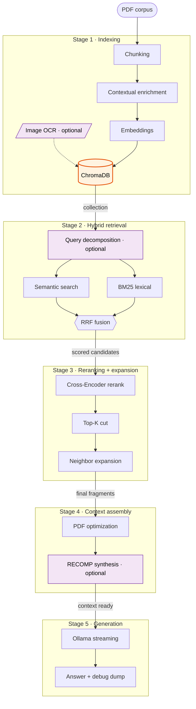

# RAG pipeline — Technical reference

MonkeyGrab implements a fully local RAG (Retrieval-Augmented Generation) pipeline on top of Ollama + ChromaDB. This document describes every stage of the pipeline, the functions that implement it, and the parameters that control it.

> [!TIP]
> Looking to **install and run** MonkeyGrab? See the [user-facing README](../README.md). This document is the engine reference for contributors.

---

## Contents

1. [Overall architecture](#1-overall-architecture)
2. [Stage 1 — Indexing](#2-stage-1--indexing)
3. [Stage 2 — Hybrid retrieval](#3-stage-2--hybrid-retrieval)
4. [Stage 3 — Reranking and context expansion](#4-stage-3--reranking-and-context-expansion)
5. [Stage 4 — Context assembly](#5-stage-4--context-assembly)
6. [Stage 5 — Generation](#6-stage-5--generation)
7. [Cross-cutting modules](#7-cross-cutting-modules)
8. [Global configuration and flags](#8-global-configuration-and-flags)
9. [Appendix A — ChromaDB metadata](#appendix-a--chromadb-metadata)
10. [Appendix B — Runtime synchronization](#appendix-b--runtime-synchronization)
11. [Appendix C — Full example flow](#appendix-c--full-example-flow)

---

## 1. Overall architecture



### Operating modes

| Mode | Description |
|------|-------------|
| **CHAT** | Free conversation with persistent history (no documents used) |
| **RAG**  | Document queries: runs the full 5-stage pipeline |

### Module layout

```
rag/
├── chat_pdfs.py          — Public facade + all global configuration
└── engine/
    ├── runtime.py        — Global synchronization across modules
    ├── indexing.py       — Indexing orchestration
    ├── chunking.py       — Fragment splitting
    ├── contextual.py     — Contextual retrieval + language detection
    ├── images.py         — PDF image OCR extraction
    ├── retrieval.py      — Hybrid retrieval orchestration
    ├── reranking.py      — Query decomposition + Cross-Encoder
    ├── lexical.py        — BM25 lexical search
    ├── context.py        — Context assembly and optimization
    ├── generation.py     — Answer generation + silent evaluation
    ├── history.py        — Chat history persistence
    └── debug.py          — RAG interaction dumps
```

---

## 2. Stage 1 — Indexing

### 2.1 Main function: `indexar_documentos()`

**File**: `rag/engine/indexing.py`

```python
def indexar_documentos(
    carpeta: str,
    collection: chromadb.Collection,
    solo_archivos: Optional[List[str]] = None,
    silent: bool = False,
    progress_callback=None,
) -> int
```

For each PDF found in `carpeta`:

1. Extract text with `pymupdf4llm` (Markdown); on failure, fall back to `pypdf`.
2. Detect the document language (`_detectar_idioma`).
3. Split the text into chunks (`dividir_en_chunks`).
4. Optionally enrich each chunk with situational context (`generar_contexto_situacional`) if `USAR_CONTEXTUAL_RETRIEVAL = True`.
5. Compute embeddings via Ollama (`MODELO_EMBEDDING`), prefixing the text with `EMBED_PREFIX_DOC`.
6. Store in ChromaDB with page, chunk and index metadata.
7. Optionally extract images and index them as special chunks (`USAR_EMBEDDINGS_IMAGEN`).

**Relevant configuration parameters** (defined in `rag/chat_pdfs.py`):

| Constant | Value | Description |
|----------|-------|-------------|
| `CHUNK_SIZE` | 2000 | Maximum chunk size in characters |
| `CHUNK_OVERLAP` | 400 | Overlap between consecutive chunks (~20%) |
| `MIN_CHUNK_LENGTH` | 150 | Discards artifacts shorter than this |
| `CONTEXTUAL_DOC_CHARS` | 24000 | Document sample passed to situational context generation |
| `EMBED_PREFIX_DOC` | `"search_document: "` or `""` | Document prefix for the active embedding model; auto-configured in `chat_pdfs.py` based on `MODELO_EMBEDDING`; empty when the model does not require it |
| `progress_callback` | `None` | Optional callable `(info: dict) → None`; receives `{"file", "file_index", "total_files"}` per processed PDF; used by the web UI to show real-time progress |

---

### 2.2 Chunking: `dividir_en_chunks()`

**File**: `rag/engine/chunking.py`

```python
def dividir_en_chunks(
    texto: str,
    chunk_size: int = CHUNK_SIZE,
    overlap: int = CHUNK_OVERLAP,
) -> List[Dict[str, str]]
```

**Recursive strategy** with hierarchical separators:

```
\n\n  →  \n  →  ". "  →  ", "  →  " "
```

For each resulting chunk:
- Preserves the nearest Markdown header (`# …`) appearing before the fragment.
- Overlap: takes the last `overlap` characters of the previous chunk and prepends them to the next one.
- Discards fragments shorter than `MIN_CHUNK_LENGTH`.
- Strips presentational markup: strikethrough, emphasis asterisks, backticks.
- Collapses `\n{3,}` to `\n\n`.

Returns `[{"text": "...", "header": "..."}]`.

---

### 2.3 Contextual retrieval: `generar_contexto_situacional()`

**File**: `rag/engine/contextual.py`

```python
def generar_contexto_situacional(
    chunk_text: str,
    texto_base: str,
    idioma_doc: str = "",
) -> str
```

Controlled by `USAR_CONTEXTUAL_RETRIEVAL`. When active, before indexing a chunk it calls `MODELO_CONTEXTUAL` (with `OLLAMA_CONTEXTUAL_NUM_CTX` = 32768 tokens of context) using the prompt:

```
System: "Write exactly 2-3 sentences about how this fragment
         fits into the global document."
User:   <document>{texto_base[:CONTEXTUAL_DOC_CHARS]}</document>
        <excerpt>{chunk_text}</excerpt>
```

The output is prepended to the chunk text using the literal separator `\\n\\n` (6 bytes, not a real newline), which lets the retriever distinguish situational context from chunk body unambiguously, without conflicting with the natural line breaks of the PDF.

The final indexed text has the shape:

```
<2-3 situational sentences>\\n\\n<chunk body>
```

**Parameters**:

| Constant | Value |
|----------|-------|
| `MODELO_CONTEXTUAL` | Configurable via `OLLAMA_CONTEXTUAL_MODEL` |
| `OLLAMA_CONTEXTUAL_NUM_CTX` | 32768 |
| `CONTEXTUAL_DOC_CHARS` | 24000 |

---

### 2.4 Language detection: `_detectar_idioma()`

**File**: `rag/engine/contextual.py`

```python
def _detectar_idioma(texto: str) -> str  # → 'Spanish' | 'Catalan' | 'English'
```

Counts tokens indicative of each language (conjunctions, articles, language-specific prepositions) and returns the language with the highest score. The result is forwarded to `generar_contexto_situacional` so the LLM replies in the document's language.

---

### 2.5 Image OCR: `extraer_imagenes_pdf()` + `describir_imagen_con_llm()`

**File**: `rag/engine/images.py`

Controlled by `USAR_EMBEDDINGS_IMAGEN`.

#### Extraction

```python
def extraer_imagenes_pdf(
    ruta_pdf: str,
    max_por_pagina: int = MAX_IMAGENES_POR_PAGINA,   # 5
    min_size_px: int = MIN_IMAGEN_SIZE_PX,            # 100
) -> Dict[int, List[Dict[str, Any]]]
```

Uses PyMuPDF (`fitz`) to iterate pages and extract images as PNG/JPEG bytes. Filters:
- Images smaller than `MIN_IMAGEN_SIZE_PX` (100 px) in either dimension.
- More than `MAX_IMAGENES_POR_PAGINA` (5) per page.
- Detects captions by looking for text within `CAPTION_MARGIN_PX` (80 px) immediately below the image.

#### OCR description

```python
def describir_imagen_con_llm(
    image_bytes: bytes,
    caption: str = "",
    idioma_doc: str = "English",
) -> str
```

Sends the image (base64) to `MODELO_OCR` with a structured prompt that adapts the description to the visual type:
- **Diagram**: blocks, inputs/outputs, data flow.
- **Table**: row/column structure, key values.
- **Chart**: axes, legends, trends.

Degenerate descriptions are dropped by three filters:

| Function | What it detects |
|----------|-----------------|
| `_es_descripcion_spam()` | Repetitive vocabulary (<35% unique words) or >20% "no"/"text" tokens |
| `_es_prompt_echo()` | The model echoes fragments of the prompt itself |
| `_es_solo_caption()` | >85% overlap with the caption without adding new information |

Valid images are indexed as chunks with `format = "image"` and a `chunk_id` shifted by `_IMAGEN_CHUNK_OFFSET` (10 000) so they do not collide with text chunks.

---

## 3. Stage 2 — Hybrid retrieval

### 3.1 Orchestrator: `realizar_busqueda_hibrida()`

**File**: `rag/engine/retrieval.py`

```python
def realizar_busqueda_hibrida(
    pregunta: str,
    collection: chromadb.Collection,
) -> Tuple[List[Dict[str, Any]], float, Dict[str, Any]]
```

Returns `(ranked_fragments, best_score, stats)`. Internally it runs steps A–D in order.

---

### 3.2 A) Query decomposition: `generar_queries_con_llm()`

**File**: `rag/engine/reranking.py`

```python
def generar_queries_con_llm(pregunta: str) -> List[str]
```

Active if `USAR_LLM_QUERY_DECOMPOSITION = True` **and** `len(pregunta) > 60`. Calls `MODELO_CHAT` with `think=False` to generate **3 sub-queries** that cover different aspects of the original question, in the same language. The sub-queries are added to the query list that feeds the semantic step.

---

### 3.3 B) Semantic search + RRF

For each query (original + sub-queries):

1. Prefix the text with `EMBED_PREFIX_QUERY` (auto-configured in `chat_pdfs.py` based on `MODELO_EMBEDDING`; empty when the model needs no prefix).
2. Compute embeddings via Ollama (`MODELO_EMBEDDING`).
3. Query ChromaDB: `collection.query(n_results=N_RESULTADOS_SEMANTICOS)`, with `N_RESULTADOS_SEMANTICOS = 80` by default (`RAG_N_RESULTADOS_SEMANTICOS`).
4. Accumulate in a candidate dictionary:

```python
score_semantic[doc_id] += 1.0 / (rank + RRF_K)   # RRF_K = 60 by default (Cormack et al., 2009)
```

---

### 3.4 C) BM25 lexical search: `busqueda_lexica_bm25()`

**File**: `rag/engine/lexical.py`

```python
def busqueda_lexica_bm25(
    pregunta: str,
    collection: chromadb.Collection,
    top_n: int = N_RESULTADOS_KEYWORD,   # 40 by default
) -> Tuple[List[Dict[str, Any]], Dict[str, Any]]
```

Active if `USAR_BUSQUEDA_HIBRIDA = True`. `rank-bm25` is a mandatory
dependency of the environment; `BM25_AVAILABLE` is kept as a public
compatibility constant and is `True` once `rag.chat_pdfs` has imported
correctly.

Implements classic sparse retrieval **Okapi BM25** (Robertson & Zaragoza,
2009): each fragment is scored by term frequency, term rarity in the
collection (IDF), and length normalization, producing a **real relevance
ranking** rather than a substring filter. It replaces the previous
`$contains` search and the exhaustive search, which were redundant.

#### Tokenization: `_tokenizar_bm25()`

A **single** tokenizer for both corpus and query (BM25 matching requirement):
lowercase, split on non-alphanumeric boundaries (Unicode, preserves
accents), drop multilingual `STOPWORDS` (es/ca/en) and tokens shorter than
3 characters unless they contain digits (identifiers and metrics are kept).

#### Search

The BM25 index is **rebuilt per query**: the whole collection is scanned
in batches, the corpus is tokenized, `BM25Okapi(corpus, k1=BM25_K1,
b=BM25_B)` (`BM25_K1 = 1.5`, `BM25_B = 0.75` by default) is built, and the
query is scored with `get_scores()`. The `top_n` fragments with positive
score are returned, sorted high-to-low. The RRF fusion uses that
**actual rank**:

```python
score_keyword[doc_id] += 1.0 / (rank + RRF_K)   # rank = position by BM25 score
```

> [!NOTE]
> `extraer_keywords()` is kept for metrics/debugging and for query
> decomposition, but no longer drives lexical retrieval.

---

### 3.5 D) Final RRF fusion

Once both lists (semantic + BM25) have collected their candidates:

```python
score_final = (
    score_semantic * PESO_SEMANTICO_RRF
    + score_keyword * PESO_BM25_RRF
)
```

Candidates are sorted by `score_final` in descending order. Defaults are
`PESO_SEMANTICO_RRF = 0.55` and `PESO_BM25_RRF = 0.45`. If the reranker is
active, `score_final` is then replaced by `score_reranker`; the final
relevance filter is applied over the reranker scale, not over the raw RRF
scale.

---

## 4. Stage 3 — Reranking and context expansion

### 4.1 Reranking: `rerank_resultados()`

**File**: `rag/engine/reranking.py`

```python
def rerank_resultados(
    pregunta: str,
    documentos_recuperados: List[Dict[str, Any]],
    top_k: int = TOP_K_FINAL,          # 8
) -> Tuple[List[Dict[str, Any]], Dict[str, Any]]
```

Active if `USAR_RERANKER = True`. `sentence-transformers` is a mandatory
dependency; loading `rag.chat_pdfs` fails at startup if it is missing.

**Configurable tier** (controlled by `RERANKER_QUALITY`):

| Quality | Intended use |
|---------|--------------|
| `"quality"` | Higher precision, higher cost |
| `"fast"` | Lower latency, lower cost |

**Flow**:

1. For each fragment, extract the clean text body: if the text contains `\\n\\n` (contextual separator), take the portion after the separator.
2. Build `(pregunta, texto_cuerpo)` pairs for the `TOP_K_RERANK_CANDIDATES` (200) best candidates by `score_final`.
3. Run `CrossEncoder.rank()` on CPU (FP32) or CUDA (FP16, auto-detected).
4. Replace `score_final` with `score_reranker` (range [0, 1]).
5. Keep the top `TOP_K_FINAL` (8); the relevance filter is applied once in the final context-preparation stage.

---

### 4.2 Neighbor expansion: `expandir_con_chunks_adyacentes()`

**File**: `rag/engine/chunking.py`

```python
def expandir_con_chunks_adyacentes(
    chunk_id: str,
    metadata: Dict[str, Any],
    n_vecinos: int = 1,
) -> List[str]
```

Active if `EXPANDIR_CONTEXTO = True`. For the `N_TOP_PARA_EXPANSION` (3) textual fragments with the highest score in the final top, the IDs of the adjacent chunks (same page, previous page, next page) are built and fetched from ChromaDB when they exist. Image chunks are not expanded with text neighbors.

---

### 4.3 Final evidence preparation: `preparar_fragmentos_para_generacion()`

**File**: `rag/engine/generation.py`

```python
def preparar_fragmentos_para_generacion(
    fragmentos_ranked: List[Dict[str, Any]],
    collection: chromadb.Collection,
    permitir_fallback_bajo_score: bool = False,
) -> Tuple[List[Dict[str, Any]], Dict[str, Any]]
```

Canonical function that turns the reranker-ordered candidates into the final evidence the generator receives. It is the single point of the system where the threshold filter, top-K cut, neighbor expansion and character limit are applied. CLI, web UI and RAGAS evaluation all share it to guarantee identical behavior.

**Internal flow**:

1. `_filtrar_por_umbral_reranker()`: if `USAR_RERANKER = True`, drops fragments with `score_reranker < UMBRAL_SCORE_RERANKER` (0.65). If `permitir_fallback_bajo_score = True` and no fragment passes the threshold, returns all candidates as an evaluation fallback.
2. `[:TOP_K_FINAL]` cut: keeps the first `TOP_K_FINAL` (8) relevant candidates.
3. `_expandir_fragmentos_contexto()`: adds adjacent chunks for the first `N_TOP_PARA_EXPANSION` (3) textual fragments, if `EXPANDIR_CONTEXTO = True`.
4. `_limitar_fragmentos_por_chars()`: discards fragments that no longer fit within the `MAX_CONTEXTO_CHARS` (24000 chars) budget.

Returns `(fragmentos_finales, metricas)`, where `metricas` contains counts for each stage (`candidatos_entrada`, `candidatos_relevantes`, `fragmentos_base`, `fragmentos_expandidos`, `fragmentos_descartados_por_chars`, `fragmentos_finales`).

---

## 5. Stage 4 — Context assembly

### 5.1 Text optimization: `optimizar_texto_contexto()`

**File**: `rag/engine/context.py`

```python
def optimizar_texto_contexto(texto: str) -> str
```

Active if `USAR_OPTIMIZACION_CONTEXTO = True`. Strips common PDF-extraction artifacts that consume tokens without contributing information:
- Markdown headers (`^#{1,6}\s+`)
- Footer patterns (author/date)
- Multiple consecutive spaces
- Trailing whitespace per line
- Orphan single-digit paragraphs (page numbers)
- Three or more line breaks → double line break

The module logs the savings: `"Optimized context: 12000 -> 8500 chars (29.2%)"`.

The helper `_es_continuacion_parrafo()` detects paragraphs broken by PDF extraction using heuristics (does the previous line end in `.?!`? does the current line start lowercase?) and `_reunir_parrafos()` rejoins them.

---

### 5.2 Context assembly: `construir_contexto_para_modelo()`

**File**: `rag/engine/context.py`

```python
def construir_contexto_para_modelo(fragmentos: List[Dict[str, Any]]) -> str
```

Sorts the fragments by `(source, page, chunk)` and produces the context block with the following per-fragment format:

```
--- [Fragment N] ---
[Fragment Context]
<situational context, if present>

[Source Text]
<fragment body, optimized>

[excerpt ends mid-sentence]   ← only if it does not end with .?!:")]
```

Retrieved evidence is capped at `MAX_CONTEXTO_CHARS = 24000` before the final context is built or sent to RECOMP; when exceeded, the fragments that no longer fit are dropped while keeping the relevance order.

---

### 5.3 RECOMP synthesis: `sintetizar_contexto_recomp()`

**File**: `rag/engine/context.py`

```python
def sintetizar_contexto_recomp(
    fragmentos: List[Dict[str, Any]],
    query_usuario: str = "",
) -> str
```

Active if `USAR_RECOMP_SYNTHESIS = True`. Instead of the raw chunks, the fragments are sent to `MODELO_RECOMP` with the prompt:

```
System:
  "You compress fragments into a briefing for a downstream model.
   ONLY information from the fragments. No external knowledge.
   If the question requires a list/count, ENUMERATE ALL items."

User:
  ## User question
  <question>

  ## Evidence excerpts
  <fragments>

  Produce: ## Facts relevant to the question
  - (fact 1)
  - (fact 2)
  ...
```

**Fallback conditions to raw chunks** (synthesis is discarded if):
- Output < 20 characters.
- Output does not contain the `## Facts relevant to the question` header.
- Communication error with Ollama.

Before returning, `_strip_ollama_think_blocks()` is applied to remove `<think>…</think>` blocks emitted by some reasoning models.

---

## 6. Stage 5 — Generation

### 6.1 Main function: `generar_respuesta()`

**File**: `rag/engine/generation.py`

```python
def generar_respuesta(
    pregunta: str,
    fragmentos: List[Dict[str, Any]],
    metricas: Optional[Dict[str, Any]] = None,
    on_token=None,
) -> str
```

**Flow**:

1. `_preparar_mensaje_usuario_rag()`: builds the final user message, interleaving the question and the context inside `<context>…</context>` tags.
2. `_generar_respuesta_stream()`: calls Ollama with streaming and emits tokens to the caller via `on_token`.
3. `guardar_debug_rag()`: dumps the full interaction trace.

---

### 6.2 Streaming: `_ollama_generate_stream()` / `generar_tokens_respuesta()`

**File**: `rag/engine/generation.py`

```python
def _ollama_generate_stream(
    model: str,
    prompt: str,
    options: dict,
    system: Optional[str] = None,
)  # yields str (JSON lines from /api/generate)
```

**RAG generation options**:

```python
{
    "temperature":    0.15,
    "top_p":          0.9,
    "repeat_penalty": 1.15,
    "repeat_last_n":  64,                   # pinned to avoid Ollama default drift
    "num_predict":    -1,                   # no token cap; relies on num_ctx
    "num_ctx":        OLLAMA_RAG_NUM_CTX,   # 16384
}
```

In addition, the payload forces `think=False` so reasoning models (Qwen3, Gemma 4) do not consume `num_predict` on an internal trace before emitting the answer.

If the model name contains `"finetuned"`, the system prompt is baked into the Modelfile and is **not** sent via API. Otherwise `SYSTEM_PROMPT_RAG` is sent explicitly.

The total Ollama timeout is `OLLAMA_REQUEST_TIMEOUT = 900` seconds (15 minutes).

---

### 6.3 Silent evaluation: `evaluar_pregunta_rag()`

**File**: `rag/engine/generation.py`

```python
def evaluar_pregunta_rag(
    pregunta: str,
    collection: chromadb.Collection,
) -> Tuple[str, List[str]]
```

Exclusive path for RAGAS evaluations. Runs the full pipeline but:
- Prints nothing to the terminal.
- Generates no debug dumps.
- Uses the same final fragment preparation as CLI and web UI: single `UMBRAL_SCORE_RERANKER` filter, top `TOP_K_FINAL`, expansion and character limit.
- If `EVAL_RAGBENCH_RERANKER_LOW_SCORE_FALLBACK = True`, relaxes the reranker threshold when no fragment has a sufficient score.

Returns `(answer, list_of_used_contexts)`.

---

## 7. Cross-cutting modules

These modules are not part of any single pipeline stage but are consumed by several stages.

---

### 7.1 Conversation history: `history.py`

**File**: `rag/engine/history.py`

```python
def cargar_historial() -> List[Dict[str, str]]
def guardar_historial(historial: List[Dict[str, str]]) -> None
def limpiar_historial(historial: List[Dict[str, str]]) -> None
```

- `cargar_historial` reads `HISTORIAL_PATH` (JSON); returns `[]` if missing or corrupt.
- `guardar_historial` persists the list truncated to the last `MAX_HISTORIAL_MENSAJES = 40` messages.
- `limpiar_historial` empties the list in-place and persists the empty state.

Messages follow the format `{"role": "user"|"assistant", "content": "..."}`.

---

### 7.2 RAG interaction debug: `debug.py`

**File**: `rag/engine/debug.py`

```python
def guardar_debug_rag(
    pregunta: str,
    mensaje_usuario: str = "",
    respuesta: str = "",
    fragmentos: list | None = None,
    motivo_interrupcion: str | None = None,
    metricas: dict | None = None,
) -> None
```

Gated by `GUARDAR_DEBUG_RAG = True`. Writes a text file under `CARPETA_DEBUG_RAG` (default `rag/debug_rag/`) with naming `TIMESTAMP_SLUG.txt`. The dump includes:

- Generated sub-queries, extracted keywords and critical terms.
- Pipeline flags active at call time.
- System prompt, injected context and full user message.
- Model answer and per-fragment scores (`score_final`, `score_reranker`).

---

## 8. Global configuration and flags

All configuration is centralized in `rag/chat_pdfs.py`. Values are read from environment variables with embedded defaults.

> [!TIP]
> Every variable below is also listed with its default in [`.env.example`](../.env.example). Copy it to `.env` at the project root to override defaults without editing code.

### Ollama models

The pipeline is described by configurable roles. Each role is resolved from
an environment variable and can point to any compatible model available in
Ollama.

| Constant | Configurable variable | Role |
|----------|-----------------------|------|
| `MODELO_RAG` | `OLLAMA_RAG_MODEL` | RAG answer generation |
| `MODELO_CHAT` | `OLLAMA_CHAT_MODEL` | CHAT mode + query decomposition |
| `MODELO_EMBEDDING` | `OLLAMA_EMBED_MODEL` | Document and query embeddings |
| `MODELO_CONTEXTUAL` | `OLLAMA_CONTEXTUAL_MODEL` | Situational context generation |
| `MODELO_RECOMP` | `OLLAMA_RECOMP_MODEL` | RECOMP synthesis |
| `MODELO_OCR` | `OLLAMA_OCR_MODEL` | Image description |
| `RERANKER_MODEL_QUALITY` | `RERANKER_QUALITY` | Local reranker tier: `"quality"` loads `BAAI/bge-reranker-v2-m3`; `"fast"` loads `cross-encoder/ms-marco-MiniLM-L-6-v2` |

### Context windows

| Constant | Value | Consumer |
|----------|-------|----------|
| `OLLAMA_NUM_CTX` | 8192 | General |
| `OLLAMA_RAG_NUM_CTX` | 16384 | `MODELO_RAG` |
| `OLLAMA_AUX_NUM_CTX` | 8192 | Auxiliary models |
| `OLLAMA_QUERY_NUM_CTX` | 2048 | `MODELO_CHAT` (query decomposition) |
| `OLLAMA_CONTEXTUAL_NUM_CTX` | 32768 | `MODELO_CONTEXTUAL` |
| `OLLAMA_RECOMP_NUM_CTX` | 8192 | `MODELO_RECOMP` |
| `OLLAMA_OCR_NUM_CTX` | 8192 | `MODELO_OCR` |
| `OLLAMA_REQUEST_TIMEOUT` | 900 | All |

### Chunking and retrieval parameters

| Constant | Default / env | Description |
|----------|---------------|-------------|
| `CHUNK_SIZE` | 2000 / `RAG_CHUNK_SIZE` | Maximum chunk size (chars) |
| `CHUNK_OVERLAP` | 400 / `RAG_CHUNK_OVERLAP` | Overlap between chunks (~20%) |
| `MIN_CHUNK_LENGTH` | 150 / `RAG_MIN_CHUNK_LENGTH` | Discards excessively short chunks |
| `CONTEXTUAL_DOC_CHARS` | 24000 / `CONTEXTUAL_DOC_CHARS` | Sample passed to situational context |
| `N_RESULTADOS_SEMANTICOS` | 80 / `RAG_N_RESULTADOS_SEMANTICOS` | Results per semantic query |
| `N_RESULTADOS_KEYWORD` | 40 / `RAG_N_RESULTADOS_KEYWORD` | Results per BM25 search |
| `TOP_K_RERANK_CANDIDATES` | 200 / `RAG_TOP_K_RERANK_CANDIDATES` | Candidates fed to the reranker |
| `TOP_K_FINAL` | 8 / `RAG_TOP_K_FINAL` | Fragments sent to the LLM |
| `N_TOP_PARA_EXPANSION` | 3 / `RAG_N_TOP_PARA_EXPANSION` | Fragments that receive neighbor expansion |
| `RRF_K` | 60 / `RAG_RRF_K` | RRF damping factor (canonical value from Cormack et al., 2009) |
| `PESO_SEMANTICO_RRF` | 0.55 / `RAG_PESO_SEMANTICO_RRF` | Weight of the semantic contribution in RRF |
| `PESO_BM25_RRF` | 0.45 / `RAG_PESO_BM25_RRF` | Weight of the BM25 contribution in RRF |
| `BM25_K1` | 1.5 / `RAG_BM25_K1` | BM25 term-frequency saturation |
| `BM25_B` | 0.75 / `RAG_BM25_B` | BM25 length normalization |
| `UMBRAL_SCORE_RERANKER` | 0.65 / `RAG_UMBRAL_SCORE_RERANKER` | Minimum Cross-Encoder score (raised from 0.55 after the 2026-05-14 probe) |
| `MAX_CONTEXTO_CHARS` | 24000 / `MAX_CONTEXTO_CHARS` | Max chars of retrieved evidence before context/RECOMP |
| `MIN_LONGITUD_PREGUNTA_RAG` | 10 / `RAG_MIN_LONGITUD_PREGUNTA` | Minimum question length that activates the RAG pipeline |
| `MAX_IMAGENES_POR_PAGINA` | 5 / `RAG_MAX_IMAGES_PER_PAGE` | Max images extracted per PDF page |
| `MIN_IMAGEN_SIZE_PX` | 100 / `RAG_MIN_IMAGE_SIZE_PX` | Minimum extracted-image size |
| `CAPTION_MARGIN_PX` | 80 / `RAG_CAPTION_MARGIN_PX` | Pixels below the image searched for the caption |

### Boolean pipeline flags

| Flag | Default | Effect when `True` |
|------|---------|--------------------|
| `USAR_CONTEXTUAL_RETRIEVAL` | `True` | Enriches each chunk with situational context at indexing time |
| `USAR_LLM_QUERY_DECOMPOSITION` | `True` | Generates 3 sub-queries for multi-aspect retrieval |
| `USAR_BUSQUEDA_HIBRIDA` | `True` | Adds Okapi BM25 lexical search (rank-bm25) fused with RRF |
| `USAR_RERANKER` | auto | Applies the Cross-Encoder after RRF fusion |
| `EXPANDIR_CONTEXTO` | `True` | Adds adjacent chunks to the top fragments |
| `USAR_OPTIMIZACION_CONTEXTO` | `True` | Strips PDF artifacts from the context |
| `USAR_RECOMP_SYNTHESIS` | `True` | Synthesizes the context before sending it to the LLM |
| `USAR_EMBEDDINGS_IMAGEN` | `True` | Indexes PDF images via OCR |
| `EVAL_RAGBENCH_RERANKER_LOW_SCORE_FALLBACK` | `False` | Relaxes the reranker threshold in evaluations |
| `LOGGING_METRICAS` | `True` | Prints per-stage metrics |
| `GUARDAR_DEBUG_RAG` | `True` | Saves a dump of every RAG interaction |

---

## Appendix A — ChromaDB metadata

Each indexed fragment carries the following metadata:

```python
{
    "source":               "paper.pdf",         # PDF file name
    "page":                 3,                   # page (0-indexed)
    "chunk":                1,                   # chunk index in the page
    "total_chunks_in_page": 5,                   # total chunks in that page
    "format":               "markdown",          # "markdown" | "plain_text" | "image"
    "section_header":       "## Methodology",    # nearest Markdown header
    # Image chunks only:
    "image_width":          800,
    "image_height":         600,
}
```

Image chunk IDs are computed as `chunk_num + _IMAGEN_CHUNK_OFFSET` (10 000) to avoid collisions with text chunks.

---

## Appendix B — Runtime configuration access

**File**: `rag/engine/runtime.py`

```python
def get_runtime() -> ModuleType
```

Every module in `rag/engine/` binds `cfg = get_runtime()` once at import and then reads configuration lazily as `cfg.NAME` (e.g. `cfg.USAR_RERANKER`, `cfg.MODELO_RAG`). Because `cfg` is a live reference to `rag/chat_pdfs.py`, toggles applied through the CLI or the web API (which mutate variables in `chat_pdfs`) take effect immediately, without restarting the process. Engine functions also reach sibling re-exported pipeline functions through `cfg`, so monkeypatching `chat_pdfs.X` in tests still affects internal call sites.

### Runtime model-role switching

```python
MODEL_ROLE_VARS: dict[str, str]                          # role key -> MODELO_* variable name
def get_model_roles() -> dict[str, str]
def set_model_roles_runtime(overrides: dict[str, str]) -> dict[str, str]
```

`set_model_roles_runtime()` reassigns the model bound to any pipeline role (`rag`, `chat`, `embedding`, `contextual`, `recomp`, `ocr`) for the current process; the web control panel (`POST /api/models`) uses it. Because the engine reads `cfg.MODELO_*` lazily, the new model is used on the next call. Changing `embedding` also re-derives `PATH_DB`, `COLLECTION_NAME` and the embedding prefixes through `_derivar_paths_db()` / `_derivar_prefijos_embedding()` (the same helpers used at import and by `set_docs_folder_runtime()`), because the vector store path is namespaced by the embedding model — callers must rebind the Chroma collection and re-index afterwards.

---

## Appendix C — Full example flow

Query: `"What components does a Transformer architecture have?"`

```
1. QUERY DECOMPOSITION  (len > 60, USAR_LLM_QUERY_DECOMPOSITION=True)
   Generated sub-queries:
     a) "Main components of the Transformer model"
     b) "Multi-head attention mechanism in Transformers"
     c) "Encoder and decoder in the Transformer architecture"

2. SEMANTIC SEARCH  (4 queries × 80 results)
   Embeddings via MODELO_EMBEDDING with prefix "search_query: "
   ChromaDB.query() → RRF with k=60 by default
   Candidates accumulated with score_semantic

3. BM25 LEXICAL SEARCH  (USAR_BUSQUEDA_HIBRIDA=True)
   Tokenize the full collection and the query with _tokenizar_bm25()
   BM25Okapi(corpus, k1=1.5, b=0.75).get_scores(query_tokens)
   Top-N fragments by BM25 score; RRF accumulated in score_keyword

4. RRF FUSION
   score_final = score_semantic × PESO_SEMANTICO_RRF + score_keyword × PESO_BM25_RRF
   Default weights: 0.55 semantic, 0.45 BM25
   Result: ~50-80 ordered candidates

5. RERANKING  (USAR_RERANKER=True)
   Input: top 200 candidates by score_final
   CrossEncoder.rank(pairs=[(pregunta, texto_chunk)])
   Output: top 8 fragments with score_reranker

6. FINAL FRAGMENT PREPARATION
   Single default filter: score_reranker >= 0.65
   Keeps TOP_K_FINAL=8 base fragments
   Applies expansion and MAX_CONTEXTO_CHARS limit from a shared function

7. NEIGHBOR EXPANSION  (EXPANDIR_CONTEXTO=True)
   For the 3 highest-scoring fragments: fetch adjacent chunks
   Add neighbors to the final fragment set

8. CONTEXT ASSEMBLY
   USAR_RECOMP_SYNTHESIS=True → synthesis with MODELO_RECOMP:
     "## Facts relevant to the question
      - The Transformer consists of an encoder and a decoder...
      - The multi-head attention mechanism..."
   USAR_OPTIMIZACION_CONTEXTO=True → PDF artifact cleanup

9. GENERATION
   User message: question + <context>synthesis</context>
   System prompt: SYSTEM_PROMPT_RAG (if the model does not have it baked in)
   Ollama streaming: temperature=0.15, num_ctx=16384
   Tokens emitted in real time to the terminal/web UI

10. DEBUG
   File: rag/debug_rag/YYYYMMDD_HHMMSS_what_components.txt
   Contents: flags, sub-queries, keywords, per-fragment scores,
             injected context, full answer
```
