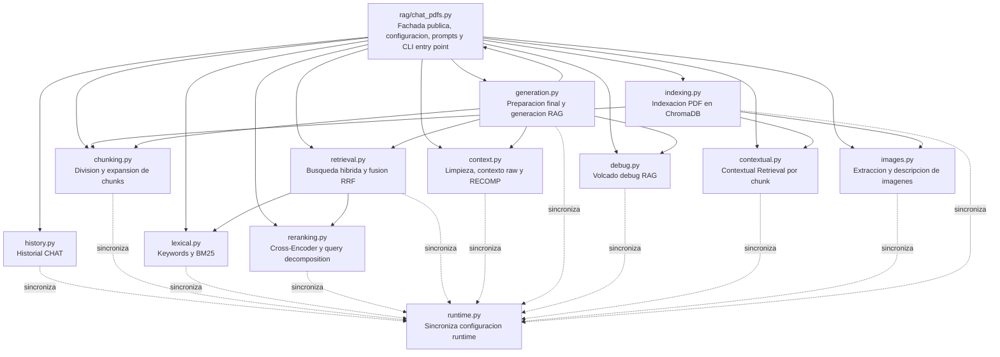

# Mapa del engine RAG

Fecha de analisis: 2026-05-23.

Este documento describe el papel de `rag/chat_pdfs.py` y de cada archivo de
`rag/engine/`, sus funciones principales y la relacion funcional entre modulos.
Para construir el mapa se ha usado `codegraph sync .`, `codegraph files` y la
base `.codegraph/codegraph.db`, y se ha contrastado con el AST del codigo actual.

## Resumen ejecutivo

`rag/chat_pdfs.py` es la fachada publica del sistema: centraliza configuracion,
flags, prompts, rutas, modelos y compatibilidad con llamadas antiguas. La logica
real esta separada en `rag/engine/*`.

El engine se organiza en cinco bloques:

- Persistencia y runtime: `runtime.py`, `history.py`, `debug.py`.
- Indexacion: `indexing.py`, `chunking.py`, `contextual.py`, `images.py`.
- Recuperacion: `retrieval.py`, `lexical.py`, `reranking.py`.
- Contexto y generacion: `context.py`, `generation.py`.
- Paquete: `__init__.py`.

Hay una decision arquitectonica importante: la configuracion sigue viviendo en
`rag/chat_pdfs.py`. Cada modulo del engine importa `sync_runtime_globals()` desde
`runtime.py` y refresca sus globals antes de ejecutar sus funciones publicas. Asi
los toggles de web, CLI, tests y evaluacion siguen afectando al engine aunque la
implementacion este dividida.

## Grafo funcional

## Relaciones detectadas con CodeGraph

CodeGraph detecta 13 archivos bajo `rag/engine/`:

- `__init__.py`
- `chunking.py`
- `context.py`
- `contextual.py`
- `debug.py`
- `generation.py`
- `history.py`
- `images.py`
- `indexing.py`
- `lexical.py`
- `reranking.py`
- `retrieval.py`
- `runtime.py`

Tambien detecta los imports explicitos de `rag/chat_pdfs.py` hacia:
`history`, `chunking`, `lexical`, `reranking`, `retrieval`, `context`,
`debug`, `generation`, `contextual`, `images` e `indexing`.

En llamadas entre archivos, CodeGraph resuelve directamente estas relaciones:

- `generation.py` llama a `context.py` para construir contexto raw o RECOMP.
- `generation.py` llama a `chunking.py` para expansion de vecinos.
- `generation.py` llama a `debug.py` para guardar el debug de RAG.
- `generation.py` llama a `retrieval.py` en el flujo silencioso de evaluacion.
- `generation.py` llama a `_modelo_necesita_system_prompt()` de `chat_pdfs.py`.
- `retrieval.py` llama a `lexical.py` para keywords y BM25.
- `retrieval.py` llama a `reranking.py` para query decomposition, validacion y reranking.
- Varios modulos llaman a `runtime.py` para sincronizar globals.

Hay llamadas que CodeGraph no siempre representa como edges completas porque se
resuelven por sincronizacion dinamica de nombres desde `chat_pdfs.py`. Por eso el
grafo funcional anterior tambien se ha contrastado con el AST del codigo actual.
El caso mas importante es `indexing.py`, que en ejecucion llama a `dividir_en_chunks`,
`generar_contexto_situacional`, `extraer_imagenes_pdf` y `describir_imagen_con_llm`.

## Flujo principal del pipeline

### 1. Arranque y fachada

`rag/chat_pdfs.py` define configuracion, prompts, rutas, flags y funciones de
compatibilidad. Despues importa funciones desde `rag.engine.*` y las reexporta.
La CLI entra por `main()`, crea `MonkeyGrabCLI` y le pasa `rag.chat_pdfs` como
API runtime.

### 2. Indexacion

`indexing.indexar_documentos()` recorre PDFs, extrae texto por pagina con
`pymupdf4llm` o `pypdf`, divide el texto con `chunking.dividir_en_chunks()`, y
opcionalmente enriquece cada chunk con `contextual.generar_contexto_situacional()`.

Si `USAR_EMBEDDINGS_IMAGEN` esta activo, `images.extraer_imagenes_pdf()` extrae
imagenes relevantes y `images.describir_imagen_con_llm()` crea una descripcion
textual que se indexa como otro chunk en ChromaDB.

### 3. Recuperacion

`retrieval.realizar_busqueda_hibrida()` genera variantes de consulta, hace
busqueda semantica con embeddings, puede hacer busqueda lexical BM25, fusiona con
RRF y, si esta activo, reordena con `reranking.rerank_resultados()`.

La salida de este bloque son candidatos ya ordenados por relevancia. No construye
el contexto final para el generador; esa responsabilidad esta en `generation.py`.

### 4. Preparacion final de evidencia

`generation.preparar_fragmentos_para_generacion()` toma los candidatos ranked,
aplica el umbral de relevancia del reranker, corta a `TOP_K_FINAL`, expande
vecinos cuando procede y aplica `MAX_CONTEXTO_CHARS`.

Esta es la frontera canonica entre "recuperar candidatos" y "decidir que
evidencia entra al generador".

### 5. Contexto y respuesta

`generation.generar_respuesta()` construye el mensaje final con
`_preparar_mensaje_usuario_rag()`. Si `USAR_RECOMP_SYNTHESIS` esta activo,
`context.sintetizar_contexto_recomp()` comprime la evidencia en un briefing; si
no, `context.construir_contexto_para_modelo()` formatea los chunks raw.

Despues `generation.generar_tokens_respuesta()` llama a Ollama con `MODELO_RAG`.
Finalmente `debug.guardar_debug_rag()` puede guardar pregunta, prompt, respuesta,
fragmentos usados y metricas.

## Desglose por archivo

### `rag/chat_pdfs.py`

Proposito general: fachada publica del RAG. Mantiene la configuracion global del
pipeline y expone una API estable para CLI, web, tests y evaluacion aunque la
implementacion viva en `rag/engine/`.

Funciones propias:

- `_leer_env_int(nombre_variable, default)`: lee enteros desde variables de entorno con fallback.
- `_leer_env_float(nombre_variable, default)`: lee floats desde variables de entorno con fallback.
- `_inferir_descripcion_modelo(nombre_modelo)`: convierte nombres de modelo en una descripcion legible para debug.
- `set_ragbench_reranker_low_score_fallback(enabled)`: activa o desactiva el fallback de evaluacion con reranker de bajo score.
- `get_pipeline_flags()`: devuelve los flags runtime actuales del pipeline.
- `set_pipeline_flags(overrides)`: aplica overrides runtime a flags conocidos.
- `set_docs_folder_runtime(carpeta)`: cambia la carpeta de documentos usada en ejecucion.
- `_modelo_necesita_system_prompt(nombre_modelo)`: decide si hay que enviar `SYSTEM_PROMPT_RAG` explicitamente a Ollama.
- `main()`: arranca la CLI `MonkeyGrabCLI`.

Reexporta funciones de todos los modulos principales del engine.

### `rag/engine/__init__.py`

Proposito general: marca `rag/engine` como paquete Python. No contiene logica de
negocio ni funciones publicas.

### `rag/engine/runtime.py`

Proposito general: mantener sincronizados los modulos del engine con la
configuracion viva de `rag/chat_pdfs.py`.

Datos relevantes:

- `_RUNTIME_MODULE`: nombre del modulo runtime principal, `rag.chat_pdfs`.
- `_RUNTIME_NAMES`: conjunto de constantes, modelos, flags, imports y funciones que se copian al namespace de cada modulo auxiliar.

Funciones:

- `get_runtime()`: obtiene el modulo runtime. Si `chat_pdfs.py` se ejecuta como script directo, detecta `__main__` por la presencia de `MODELO_RAG`.
- `sync_runtime_globals(namespace)`: copia al `namespace` recibido todos los nombres disponibles en el runtime.

### `rag/engine/history.py`

Proposito general: persistencia del historial del modo CHAT.

Funciones:

- `_sync_runtime_globals()`: refresca constantes como `HISTORIAL_PATH` y `MAX_HISTORIAL_MENSAJES`.
- `cargar_historial()`: carga el historial desde JSON; acepta tanto formato lista como formato dict con clave `chat`.
- `guardar_historial(historial)`: guarda el historial recortado al maximo configurado.
- `limpiar_historial(historial)`: vacia la lista en memoria y persiste el estado vacio.
- `_with_runtime_sync(func)`: wrapper interno que sincroniza globals antes de cada llamada publica.

### `rag/engine/chunking.py`

Proposito general: convertir texto extraido de PDFs en chunks recuperables y
calcular vecinos adyacentes para expansion de contexto.

Funciones:

- `_sync_runtime_globals()`: refresca constantes como `CHUNK_SIZE`, `CHUNK_OVERLAP` y `MIN_CHUNK_LENGTH`.
- `extraer_header_markdown(texto)`: devuelve el ultimo header Markdown encontrado.
- `dividir_en_chunks(texto, chunk_size=CHUNK_SIZE, overlap=CHUNK_OVERLAP)`: limpia marcas simples, detecta secciones, divide por separadores naturales y aplica overlap.
- `_split_recursivo(text, max_size, depth=0)`: funcion interna de `dividir_en_chunks()` que parte texto por jerarquia de separadores.
- `expandir_con_chunks_adyacentes(chunk_id, metadata, n_vecinos=1)`: construye IDs de chunks anteriores/posteriores, incluyendo bordes de pagina.
- `_with_runtime_sync(func)`: wrapper interno de sincronizacion.

### `rag/engine/lexical.py`

Proposito general: busqueda lexical complementaria a la semantica.

Datos relevantes:

- `STOPWORDS`: stopwords en castellano, ingles y valenciano/catalan.
- `TERMINOS_EXPANSION`: diccionario reservado para expansion manual de terminos.
- `GENERIC_TERMS_BLACKLIST`: terminos genericos que no aportan especificidad.
- `_BM25_TOKEN_RE`: regex de tokenizacion BM25.

Funciones:

- `_sync_runtime_globals()`: refresca configuracion BM25 y flags.
- `extraer_keywords(texto)`: extrae siglas, terminos entre parentesis, bigramas, tokens tecnicos y keywords deduplicadas.
- `_es_keyword_valida(kw)`: funcion interna que descarta keywords demasiado largas o con signos de pregunta.
- `_tokenizar_bm25(texto)`: tokeniza corpus y query de forma consistente para BM25.
- `busqueda_lexica_bm25(pregunta, collection, top_n=N_RESULTADOS_KEYWORD)`: reconstruye un indice BM25 sobre ChromaDB y devuelve chunks con score positivo.
- `_with_runtime_sync(func)`: wrapper interno de sincronizacion.

### `rag/engine/reranking.py`

Proposito general: reordenar candidatos con Cross-Encoder y generar subconsultas
auxiliares para preguntas largas.

Datos relevantes:

- `_reranker_model`: singleton lazy del Cross-Encoder.

Funciones:

- `_sync_runtime_globals()`: refresca flags y modelos de reranking.
- `_detectar_dispositivo_reranker()`: devuelve `cuda` si PyTorch detecta GPU; si no, `cpu`.
- `obtener_modelo_reranker()`: carga el Cross-Encoder segun `RERANKER_MODEL_QUALITY` y lo reutiliza.
- `rerank_resultados(pregunta, documentos_recuperados, top_k=TOP_K_FINAL)`: puntua candidatos con Cross-Encoder, copia `score_reranker` y devuelve los `top_k`.
- `generar_queries_con_llm(pregunta)`: genera hasta 3 queries auxiliares con `MODELO_CHAT`.
- `_validar_coherencia_query(query)`: rechaza queries tipo bolsa de palabras incoherente.
- `_with_runtime_sync(func)`: wrapper interno de sincronizacion.

### `rag/engine/retrieval.py`

Proposito general: orquestar la recuperacion hibrida.

Funciones:

- `_sync_runtime_globals()`: refresca modelos, pesos RRF, flags y limites de recuperacion.
- `realizar_busqueda_hibrida(pregunta, collection)`: ejecuta query decomposition, busqueda semantica, extraccion de keywords, BM25, fusion RRF y reranking opcional.
- `_with_runtime_sync(func)`: wrapper interno de sincronizacion.

Salida principal:

- Lista de fragmentos ranked.
- Mejor score.
- Diccionario de metricas con fases semantica, keywords, reranking, queries y keywords usadas.

### `rag/engine/context.py`

Proposito general: limpiar texto recuperado y convertir fragmentos en contexto
consumible por el modelo RAG, ya sea raw o sintetizado con RECOMP.

Datos relevantes:

- `_RECOMP_FACTS_HEADER`: cabecera esperada en la salida de RECOMP.

Funciones:

- `_sync_runtime_globals()`: refresca flags, modelos RECOMP y limites de contexto.
- `_es_continuacion_parrafo(linea_previa, linea_actual)`: heuristica para unir lineas partidas por extraccion PDF.
- `_reunir_parrafos(texto)`: reconstruye parrafos cortados.
- `optimizar_texto_contexto(texto)`: elimina ruido PDF, headers, paginas sueltas, espacios repetidos y artefactos.
- `_marcar_fragmento_incompleto(texto)`: anade `[excerpt ends mid-sentence]` si el chunk termina sin cierre claro.
- `_texto_fuente_fragmento(doc)`: separa el cuerpo original del resumen contextual almacenado con `\n\n` literal.
- `_strip_ollama_think_blocks(text)`: elimina bloques `<think>...</think>`.
- `_normalizar_salida_recomp(texto)`: asegura la cabecera Markdown esperada si la salida parece una lista de hechos.
- `construir_contexto_para_modelo(fragmentos)`: ordena y formatea chunks raw para `<context>`.
- `sintetizar_contexto_recomp(fragmentos, query_usuario="")`: comprime evidencia con `MODELO_RECOMP` y hace fallback a contexto raw si falla.
- `_with_runtime_sync(func)`: wrapper interno de sincronizacion.

### `rag/engine/generation.py`

Proposito general: frontera final entre recuperacion y generacion. Decide que
evidencia entra al modelo, construye el prompt y llama a Ollama.

Funciones:

- `_sync_runtime_globals()`: refresca modelos, flags, prompts y limites.
- `_ollama_generate_stream(model, prompt, options, system=None)`: stream de `/api/generate` de Ollama con `think=False`.
- `_preparar_mensaje_usuario_rag(pregunta, fragmentos)`: construye `pregunta + <context>...</context>`.
- `generar_tokens_respuesta(mensaje_usuario)`: yield de tokens con parametros canonicos de `MODELO_RAG`.
- `_generar_respuesta_stream(mensaje_usuario, on_token=None)`: concatena tokens y opcionalmente los envia a callback.
- `_score_relevancia_fragmento(fragmento)`: obtiene score activo, priorizando `score_reranker`.
- `_filtrar_por_umbral_reranker(fragmentos_ranked, permitir_fallback_bajo_score=False)`: aplica `UMBRAL_SCORE_RERANKER` si el reranker esta activo.
- `_fragmento_expandible(fragmento)`: evita expandir imagenes y comprueba metadatos de chunk textual.
- `_expandir_fragmentos_contexto(fragmentos, collection)`: anade vecinos de los primeros `N_TOP_PARA_EXPANSION` fragmentos.
- `_limitar_fragmentos_por_chars(fragmentos)`: aplica `MAX_CONTEXTO_CHARS`.
- `preparar_fragmentos_para_generacion(fragmentos_ranked, collection, permitir_fallback_bajo_score=False)`: funcion canonica de seleccion final de evidencia.
- `generar_respuesta(pregunta, fragmentos, metricas=None, on_token=None)`: genera respuesta y guarda debug.
- `generar_respuesta_silenciosa(pregunta, fragmentos, metricas=None)`: genera sin imprimir ni guardar debug.
- `evaluar_pregunta_rag(pregunta, collection)`: flujo silencioso completo para evaluacion.
- `_with_runtime_sync(func)`: wrapper interno de sincronizacion.

### `rag/engine/debug.py`

Proposito general: guardar una traza completa de una interaccion RAG para
auditoria y depuracion.

Funciones:

- `_sync_runtime_globals()`: refresca rutas, flags y prompts.
- `guardar_debug_rag(pregunta, mensaje_usuario="", respuesta="", fragmentos=None, motivo_interrupcion=None, metricas=None)`: escribe en `debug_rag/` la configuracion, pregunta, prompt, respuesta, fragmentos y metricas.
- `_with_runtime_sync(func)`: wrapper interno de sincronizacion.

### `rag/engine/contextual.py`

Proposito general: generar contexto situacional en la fase de indexacion para
mejorar la recuperacion posterior.

Funciones:

- `_sync_runtime_globals()`: refresca modelos y flags de contextual retrieval.
- `_detectar_idioma(texto)`: heuristica simple para distinguir castellano, catalan/valenciano e ingles.
- `generar_contexto_situacional(chunk_text, texto_base, idioma_doc="")`: pide a un LLM 2-3 frases sobre como encaja el chunk en el documento.
- `_with_runtime_sync(func)`: wrapper interno de sincronizacion.

### `rag/engine/images.py`

Proposito general: incorporar contenido visual de PDFs al indice textual del RAG.

Datos relevantes:

- `_PROMPT_ECHO_MARKERS`: fragmentos usados para detectar si el modelo ha repetido el prompt.

Funciones:

- `_sync_runtime_globals()`: refresca flags, modelos OCR y parametros de imagen.
- `_es_descripcion_spam(texto)`: detecta salidas degeneradas por baja diversidad lexical o repeticion de "no text".
- `_es_prompt_echo(descripcion)`: detecta si la descripcion contiene el prompt.
- `_es_solo_caption(descripcion, caption)`: detecta si la salida solo repite el caption.
- `extraer_imagenes_pdf(ruta_pdf, max_por_pagina=MAX_IMAGENES_POR_PAGINA, min_size_px=MIN_IMAGEN_SIZE_PX)`: extrae imagenes raster validas con PyMuPDF y captions cercanos.
- `describir_imagen_con_llm(image_bytes, caption="", idioma_doc="English")`: envia la imagen a Ollama, filtra salidas malas y devuelve una descripcion textual.
- `_with_runtime_sync(func)`: wrapper interno de sincronizacion.

### `rag/engine/indexing.py`

Proposito general: crear o actualizar el indice ChromaDB desde documentos PDF.

Funciones:

- `_sync_runtime_globals()`: refresca modelos, flags, rutas y parametros de indexacion.
- `indexar_documentos(carpeta, collection, solo_archivos=None, silent=False, progress_callback=None)`: procesa PDFs, crea chunks, embeddings y metadatos, y los inserta en ChromaDB.
- `_indexar_chunk(id_doc, chunk_text, chunk_doc_text, metadata, collection_ref)`: funcion interna de `indexar_documentos()` que calcula embedding y hace retry con truncado si hay error de longitud.
- `_preparar_texto_base_doc(textos_paginas)`: funcion interna de `indexar_documentos()` que construye la muestra del documento usada por contextual retrieval.
- `obtener_documentos_indexados(collection)`: devuelve los `source` unicos presentes en ChromaDB.
- `_with_runtime_sync(func)`: wrapper interno de sincronizacion.

## Responsabilidades que no conviene mezclar

- `retrieval.py` debe recuperar y ordenar candidatos, no decidir el contexto final.
- `generation.py` debe centralizar el corte final, expansion, limite de chars y generacion.
- `context.py` debe formatear o sintetizar contexto, no hacer busquedas.
- `indexing.py` debe preparar la base documental, no responder preguntas.
- `runtime.py` debe seguir siendo el unico puente de sincronizacion con `chat_pdfs.py`.

Mantener estas fronteras evita duplicar cortes, aplicar filtros dos veces o tener
diferentes comportamientos entre CLI, web y evaluacion.
