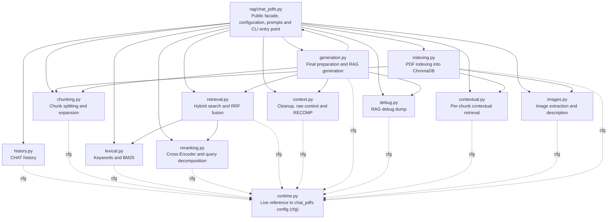

# RAG engine map

Analysis date: 2026-05-24.

This document describes the role of `rag/chat_pdfs.py` and of every file in
`rag/engine/`, their main functions, and the functional relationships between
modules. The map was built with `codegraph sync .`, `codegraph files` and the
`.codegraph/codegraph.db` base, and cross-checked against the AST of the
current code.

## Executive summary

`rag/chat_pdfs.py` is the public facade of the system: it centralizes
configuration, flags, prompts, paths, models, and compatibility with legacy
call sites. The real logic lives in `rag/engine/*`.

The engine is organized into five blocks:

- Persistence and runtime: `runtime.py`, `history.py`, `debug.py`.
- Indexing: `indexing.py`, `chunking.py`, `contextual.py`, `images.py`.
- Retrieval: `retrieval.py`, `lexical.py`, `reranking.py`.
- Context and generation: `context.py`, `generation.py`.
- Package: `__init__.py`.

One architectural decision is important: configuration still lives in
`rag/chat_pdfs.py`. Every engine module binds `cfg = get_runtime()` once at
import (from `runtime.py`) and then reads configuration lazily as `cfg.NAME`,
so that toggles applied from the web UI, the CLI, tests and evaluation take
effect immediately even though the implementation has been split. Engine
functions also call sibling re-exported pipeline functions through `cfg`
(e.g. `cfg.generar_respuesta_silenciosa`), so monkeypatching `chat_pdfs.X`
still reaches internal call sites.

## Functional graph

## Relationships detected with CodeGraph

CodeGraph detects 13 files under `rag/engine/`:

- `__init__.py`
- `chunking.py`
- `context.py`
- `contextual.py`
- `debug.py`
- `generation.py`
- `history.py`
- `images.py`
- `indexing.py`
- `lexical.py`
- `reranking.py`
- `retrieval.py`
- `runtime.py`

It also detects the explicit imports from `rag/chat_pdfs.py` into:
`history`, `chunking`, `lexical`, `reranking`, `retrieval`, `context`,
`debug`, `generation`, `contextual`, `images` and `indexing`.

For inter-file calls, CodeGraph resolves these relationships directly:

- `generation.py` calls `context.py` to build raw or RECOMP context.
- `generation.py` calls `chunking.py` for neighbor expansion.
- `generation.py` calls `debug.py` to save the RAG debug trace.
- `generation.py` calls `retrieval.py` in the silent evaluation flow.
- `generation.py` calls `_modelo_necesita_system_prompt()` in `chat_pdfs.py`.
- `retrieval.py` calls `lexical.py` for keywords and BM25.
- `retrieval.py` calls `reranking.py` for query decomposition, validation and reranking.
- Every module calls `runtime.get_runtime()` once to bind `cfg`.

Some calls are not always represented as complete edges by CodeGraph because
they are resolved lazily through `cfg.NAME` lookups against `chat_pdfs.py`.
That is why the functional graph above was also cross-checked against the AST
of the current code. The most relevant case is `indexing.py`, which at runtime
calls `dividir_en_chunks`, `generar_contexto_situacional`,
`extraer_imagenes_pdf` and `describir_imagen_con_llm`.

## Main pipeline flow

### 1. Startup and facade

`rag/chat_pdfs.py` defines configuration, prompts, paths, flags and
compatibility functions. It then imports functions from `rag.engine.*` and
re-exports them. The CLI enters through `main()`, which creates
`MonkeyGrabCLI` and passes `rag.chat_pdfs` as the runtime API.

### 2. Indexing

`indexing.indexar_documentos()` iterates over PDFs, extracts text per page
with `pymupdf4llm` or `pypdf`, splits the text with
`chunking.dividir_en_chunks()`, and optionally enriches each chunk with
`contextual.generar_contexto_situacional()`.

If `USAR_EMBEDDINGS_IMAGEN` is active, `images.extraer_imagenes_pdf()`
extracts relevant images and `images.describir_imagen_con_llm()` produces a
text description that is indexed as another chunk in ChromaDB.

### 3. Retrieval

`retrieval.realizar_busqueda_hibrida()` generates query variants, runs
semantic search via embeddings, optionally runs lexical BM25 search, fuses
with RRF and, if active, reorders with `reranking.rerank_resultados()`.

The output of this block is candidates already ordered by relevance. It does
not build the final context for the generator; that responsibility lives in
`generation.py`.

### 4. Final evidence preparation

`generation.preparar_fragmentos_para_generacion()` takes the ranked
candidates, applies the reranker relevance threshold, truncates to
`TOP_K_FINAL`, expands neighbors when appropriate, and applies
`MAX_CONTEXTO_CHARS`.

This is the canonical boundary between "retrieve candidates" and "decide
which evidence reaches the generator".

### 5. Context and answer

`generation.generar_respuesta()` builds the final message with
`_preparar_mensaje_usuario_rag()`. If `USAR_RECOMP_SYNTHESIS` is active,
`context.sintetizar_contexto_recomp()` compresses the evidence into a
briefing; otherwise `context.construir_contexto_para_modelo()` formats the
raw chunks.

`generation.generar_tokens_respuesta()` then calls Ollama with `MODELO_RAG`.
Finally, `debug.guardar_debug_rag()` may save the question, prompt, answer,
used fragments and metrics.

## File-by-file breakdown

### `rag/chat_pdfs.py`

General purpose: public facade for the RAG system. Holds the global pipeline
configuration and exposes a stable API for the CLI, web UI, tests and
evaluation even though the implementation lives in `rag/engine/`.

Own functions:

- `_leer_env_int(nombre_variable, default)`: reads integers from environment variables with a fallback.
- `_leer_env_float(nombre_variable, default)`: reads floats from environment variables with a fallback.
- `_inferir_descripcion_modelo(nombre_modelo)`: turns model names into a human-readable description for debug.
- `set_ragbench_reranker_low_score_fallback(enabled)`: enables or disables the evaluation fallback with low-score reranker.
- `get_pipeline_flags()`: returns the current runtime pipeline flags.
- `set_pipeline_flags(overrides)`: applies runtime overrides to known flags.
- `set_docs_folder_runtime(carpeta)`: changes the documents folder used at runtime.
- `_modelo_necesita_system_prompt(nombre_modelo)`: decides whether `SYSTEM_PROMPT_RAG` must be sent explicitly to Ollama.
- `main()`: starts the `MonkeyGrabCLI`.

Re-exports functions from every main engine module.

### `rag/engine/__init__.py`

General purpose: marks `rag/engine` as a Python package. Contains no business
logic or public functions.

### `rag/engine/runtime.py`

General purpose: expose a live reference to the module that owns the
configuration of `rag/chat_pdfs.py` so engine modules can read it lazily.

Relevant data:

- `_RUNTIME_MODULE`: name of the main runtime module, `rag.chat_pdfs`.

Functions:

- `get_runtime()`: returns the runtime module. If `chat_pdfs.py` runs as a direct script, detects `__main__` by the presence of `MODELO_RAG`.

### `rag/engine/history.py`

General purpose: persistence of the CHAT mode history.

Functions:

- `cargar_historial()`: loads the history from JSON; accepts either a list format or a dict with a `chat` key.
- `guardar_historial(historial)`: saves the history truncated to the configured maximum.
- `limpiar_historial(historial)`: empties the list in memory and persists the empty state.

### `rag/engine/chunking.py`

General purpose: convert text extracted from PDFs into retrievable chunks and
compute adjacent neighbors for context expansion.

Functions:

- `dividir_en_chunks(texto)`: strips simple marks, detects sections, splits by natural separators and applies overlap (reads `cfg.CHUNK_SIZE`, `cfg.CHUNK_OVERLAP`, `cfg.MIN_CHUNK_LENGTH`).
- `_split_recursivo(text, max_size, depth=0)`: internal function of `dividir_en_chunks()` that splits text by a separator hierarchy.
- `expandir_con_chunks_adyacentes(chunk_id, metadata, n_vecinos=1)`: builds previous/next chunk IDs, including page boundaries.

### `rag/engine/lexical.py`

General purpose: lexical search complementary to the semantic one.

Relevant data:

- `STOPWORDS`: stopwords in Spanish, English and Valencian/Catalan.
- `GENERIC_TERMS_BLACKLIST`: generic terms that do not contribute specificity.
- `_BM25_TOKEN_RE`: BM25 tokenization regex.
- `_bm25_index_cache`: module-level cache of the tokenized corpus and `BM25Okapi` index, keyed by `(collection, count)`.

Functions:

- `extraer_keywords(texto)`: extracts acronyms, parenthesized terms, technical tokens and deduplicated keywords (query fallback + metrics).
- `_es_keyword_valida(kw)`: internal function that discards keywords that are too long or contain question marks.
- `_tokenizar_bm25(texto)`: tokenizes corpus and query consistently for BM25.
- `_obtener_indice_bm25(collection)` / `_construir_indice_bm25(collection)`: build and cache the BM25 index, invalidating on `(collection, count)` changes.
- `busqueda_lexica_bm25(pregunta, collection)`: queries the cached BM25 index over ChromaDB and returns chunks with positive score.

### `rag/engine/reranking.py`

General purpose: reorder candidates with a Cross-Encoder and generate
auxiliary sub-queries for long questions.

Relevant data:

- `_reranker_model`: lazy Cross-Encoder singleton.

Functions:

- `_detectar_dispositivo_reranker()`: returns `cuda` if PyTorch detects a GPU; otherwise `cpu`.
- `obtener_modelo_reranker()`: loads the Cross-Encoder according to `RERANKER_MODEL_QUALITY` and reuses it.
- `rerank_resultados(pregunta, documentos_recuperados, top_k=None)`: scores candidates with the Cross-Encoder, copies `score_reranker` and returns the `top_k`.
- `generar_queries_con_llm(pregunta)`: generates up to 3 auxiliary queries with `MODELO_CHAT`.
- `_validar_coherencia_query(query)`: rejects incoherent bag-of-words queries.

### `rag/engine/retrieval.py`

General purpose: orchestrate hybrid retrieval.

Functions:

- `realizar_busqueda_hibrida(pregunta, collection)`: runs query decomposition, semantic search, keyword extraction, BM25, RRF fusion and optional reranking.

Main output:

- List of ranked fragments.
- Best score.
- Metrics dict with semantic phase, keywords, reranking, queries and keywords used.

### `rag/engine/context.py`

General purpose: clean retrieved text and turn fragments into context
consumable by the RAG model, either raw or synthesized with RECOMP.

Relevant data:

- `_RECOMP_FACTS_HEADER`: header expected in the RECOMP output.

Functions:

- `_es_continuacion_parrafo(linea_previa, linea_actual)`: heuristic to join lines split by PDF extraction.
- `_reunir_parrafos(texto)`: rebuilds broken paragraphs.
- `optimizar_texto_contexto(texto)`: removes PDF noise, headers, orphan page numbers, repeated whitespace and artifacts.
- `_marcar_fragmento_incompleto(texto)`: appends `[excerpt ends mid-sentence]` if the chunk ends without a clear closure.
- `_texto_fuente_fragmento(doc)`: separates the original body from the contextual summary stored with literal `\n\n`.
- `_strip_ollama_think_blocks(text)`: removes `<think>...</think>` blocks.
- `_normalizar_salida_recomp(texto)`: ensures the expected Markdown header if the output looks like a list of facts.
- `construir_contexto_para_modelo(fragmentos)`: orders and formats raw chunks for `<context>`.
- `sintetizar_contexto_recomp(fragmentos, query_usuario="")`: compresses evidence with `MODELO_RECOMP` and falls back to raw context on failure.

### `rag/engine/generation.py`

General purpose: final boundary between retrieval and generation. Decides
which evidence enters the model, builds the prompt and calls Ollama.

Functions:

- `_ollama_generate_stream(model, prompt, options, system=None)`: streams `/api/generate` from Ollama with `think=False`.
- `_preparar_mensaje_usuario_rag(pregunta, fragmentos)`: builds `pregunta + <context>...</context>`.
- `generar_tokens_respuesta(mensaje_usuario)`: yields tokens with the canonical parameters of `MODELO_RAG`.
- `_generar_respuesta_stream(mensaje_usuario, on_token=None)`: concatenates tokens and optionally forwards them to a callback.
- `_score_relevancia_fragmento(fragmento)`: gets the active score, prioritizing `score_reranker`.
- `_filtrar_por_umbral_reranker(fragmentos_ranked, permitir_fallback_bajo_score=False)`: applies `UMBRAL_SCORE_RERANKER` when the reranker is active.
- `_fragmento_expandible(fragmento)`: avoids expanding images and checks textual chunk metadata.
- `_expandir_fragmentos_contexto(fragmentos, collection)`: adds neighbors of the first `N_TOP_PARA_EXPANSION` fragments.
- `_limitar_fragmentos_por_chars(fragmentos)`: applies `MAX_CONTEXTO_CHARS`.
- `preparar_fragmentos_para_generacion(fragmentos_ranked, collection, permitir_fallback_bajo_score=False)`: canonical function for final evidence selection.
- `generar_respuesta(pregunta, fragmentos, metricas=None, on_token=None)`: generates an answer and saves the debug dump.
- `generar_respuesta_silenciosa(pregunta, fragmentos, metricas=None)`: generates without printing or saving debug.
- `evaluar_pregunta_rag(pregunta, collection)`: full silent flow for evaluation.

### `rag/engine/debug.py`

General purpose: save a complete trace of a RAG interaction for audit and
debugging.

Functions:

- `guardar_debug_rag(pregunta, mensaje_usuario="", respuesta="", fragmentos=None, motivo_interrupcion=None, metricas=None)`: writes configuration, question, prompt, answer, fragments and metrics into `debug_rag/`.

### `rag/engine/contextual.py`

General purpose: generate situational context during indexing to improve
later retrieval.

Functions:

- `_detectar_idioma(texto)`: simple heuristic to distinguish Spanish, Catalan/Valencian and English.
- `generar_contexto_situacional(chunk_text, texto_base, idioma_doc="")`: asks an LLM for 2-3 sentences on how the chunk fits into the document.

### `rag/engine/images.py`

General purpose: incorporate visual PDF content into the textual RAG index.

Relevant data:

- `_PROMPT_ECHO_MARKERS`: fragments used to detect whether the model has echoed the prompt.

Functions:

- `_es_descripcion_spam(texto)`: detects degenerate outputs by low lexical diversity or "no text" repetition.
- `_es_prompt_echo(descripcion)`: detects whether the description contains the prompt.
- `_es_solo_caption(descripcion, caption)`: detects whether the output only repeats the caption.
- `extraer_imagenes_pdf(ruta_pdf, max_por_pagina=MAX_IMAGENES_POR_PAGINA, min_size_px=MIN_IMAGEN_SIZE_PX)`: extracts valid raster images with PyMuPDF and nearby captions.
- `describir_imagen_con_llm(image_bytes, caption="", idioma_doc="English")`: sends the image to Ollama, filters bad outputs and returns a text description.

### `rag/engine/indexing.py`

General purpose: create or update the ChromaDB index from PDF documents.

Functions:

- `indexar_documentos(carpeta, collection, solo_archivos=None, silent=False, progress_callback=None)`: processes PDFs, builds chunks, embeddings and metadata, and inserts them into ChromaDB.
- `_indexar_chunk(id_doc, chunk_text, chunk_doc_text, metadata, collection_ref)`: internal function of `indexar_documentos()` that computes the embedding and retries with truncation on length errors.
- `_preparar_texto_base_doc(textos_paginas)`: internal function of `indexar_documentos()` that builds the document sample used by contextual retrieval.
- `obtener_documentos_indexados(collection)`: returns the unique `source` values present in ChromaDB.

## Responsibilities that should not be mixed

> [!IMPORTANT]
> These module boundaries are intentional — respect them when extending the engine.

- `retrieval.py` must retrieve and order candidates, not decide the final context.
- `generation.py` must centralize the final cut, expansion, character limit and generation.
- `context.py` must format or synthesize context, not perform searches.
- `indexing.py` must prepare the document base, not answer questions.
- `runtime.py` must remain the only bridge to `chat_pdfs.py`; engine modules read config via `cfg` and never duplicate it.

Keeping these boundaries avoids duplicate cuts, double-applied filters or
divergent behavior between the CLI, the web UI and evaluation.
