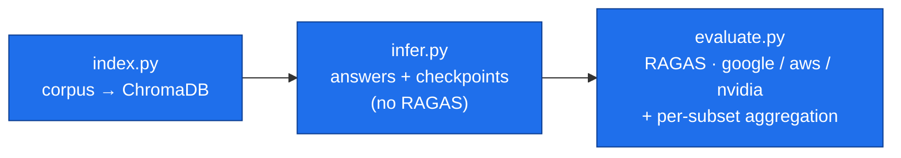

# RAG pipeline evaluation protocol

This guide describes the RAGAS evaluation protocol and the exact commands to
reproduce it. The flow has **three phases**, backed by three CLIs in
`research/evaluation/` plus the shared `_lib/` package:

1. **`index.py`** — index the corpus into ChromaDB.
2. **`infer.py`** — generate RAG answers and persist checkpoints (no RAGAS).
3. **`evaluate.py`** — run RAGAS from a checkpoint with `--provider google|aws|nvidia` and aggregate results by dataset subset.



Legacy scripts (`run_eval.py`, `eval_ragas_*_from_checkpoints.py`,
`run_ragbench_visual_inference.py`, `evaluate_ragas_bertscore.py`,
`judge_benchmark.py`, `aggregate_comparison_by_conjunto.py`) **have been
superseded**; their logic now lives in `_lib/` or as subcommands of the three CLIs.

> [!IMPORTANT]
> **Definitive run — completed 2026-05-25.** Generator `phi4-finetuned:latest`;
> pipeline: Okapi BM25 (`rank-bm25`, `k1 = 1.5`, `b = 0.75`) fused with RRF
> (`RRF_K = 60`, Cormack et al., 2009), weighted `PESO_SEMANTICO_RRF = 0.55` /
> `PESO_BM25_RRF = 0.45`; RAGAS judge AWS Bedrock
> `eu.anthropic.claude-haiku-4-5-20251001-v1:0` +
> `amazon.titan-embed-text-v2:0` (`eu-north-1`, workers=8, batch=8). Definitive
> labels: `bm25rerun_es`, `bm25rerun_ca_ca`, `bm25rerun_ragbench_dev` (paired
> `baseline_all_on` + `all_off`), `bm25rerun_ragbench_eval` (200q,
> `baseline_all_on` only), `bm25rerun_ragbench_visual` (125q,
> `baseline_all_on` only). Full analysis:
> [`../evaluation/runs/ragas/comparisons/ANALISIS_RAGAS_AWS.md`](../evaluation/runs/ragas/comparisons/ANALISIS_RAGAS_AWS.md)
> and [`ANALISIS_METRICAS_ENTRENAMIENTO.md`](../evaluation/runs/ragas/comparisons/ANALISIS_METRICAS_ENTRENAMIENTO.md)
> (§6 BERTScore↔RAGAS cross-check).

---

## 1. Indexing

```powershell
python research\evaluation\index.py --corpus es              # rag/docs/es → ChromaDB
python research\evaluation\index.py --corpus ca --force      # rebuild from scratch
python research\evaluation\index.py --corpus en
python research\evaluation\index.py --corpus ragbench-eval   # uses the RagBench EN manifest file-filter
python research\evaluation\index.py --docs-dir path\custom --force
```

The destination is derived from `rag.chat_pdfs.PATH_DB`
(`rag/vector_db/{folder}_{embed_slug}/`). The DB is created only if it does not
exist; use `--force` to drop and reindex.

---

## 2. Inference (checkpoints, no RAGAS)

### 2.1. Local corpora

Corpus presets:

| Corpus | Default dataset | Default PDFs |
| --- | --- | --- |
| `es` | `research/evaluation/datasets/local/dataset_eval_es.json` | `rag/docs/es` |
| `ca` | `research/evaluation/datasets/local/dataset_eval_ca.json` | `rag/docs/ca` |
| `en` | no default local dataset; use `--dataset` or the RagBench subcommands | `rag/docs/en` |

Dataset format (any supported — JSON/CSV/Excel): a `question` or `pregunta`
column, optional `ground_truth` (accepted aliases: `reference`,
`respuesta_esperada`, `respuesta_referencia`).

```powershell
# 1 variant (baseline_all_on) on the given corpus
python research\evaluation\infer.py single --corpus es

# Default final suite (2 variants: baseline_all_on + all_off)
python research\evaluation\infer.py compare --corpus ca --label my_eval_ca_final --reindex

# Legacy full ablation suite (8 variants)
python research\evaluation\infer.py compare --corpus ca --suite ablation --label my_eval_ca_ablation --reindex

# List variants
python research\evaluation\infer.py list-variants
```

### 2.2. Variant suites

The default suite is `final`: only `baseline_all_on` and `all_off`. It is the
one used in the definitive run to avoid multiplying analyses. The `ablation`
suite remains available as a legacy flow: it adds the `no_*` variants, each
disabling exactly one optional stage. All variants of a comparison share the
ChromaDB collection; `--reindex` only affects the first.

| Variant | Change |
| --- | --- |
| `baseline_all_on` | All optional stages enabled |
| `no_query_decomposition` | Disables `USAR_LLM_QUERY_DECOMPOSITION` |
| `no_lexical_search` | Disables `USAR_BUSQUEDA_HIBRIDA` (BM25) |
| `no_reranker` | Disables `USAR_RERANKER` |
| `no_context_expansion` | Disables `EXPANDIR_CONTEXTO` |
| `no_context_optimization` | Disables `USAR_OPTIMIZACION_CONTEXTO` |
| `no_recomp_synthesis` | Disables `USAR_RECOMP_SYNTHESIS` |
| `all_off` | All optional stages disabled (pure semantic retrieval + threshold filter) |

Stages excluded from the default suite: `USAR_CONTEXTUAL_RETRIEVAL` and
`USAR_EMBEDDINGS_IMAGEN` affect the **indexed** content, not inference. Comparing
them requires a different collection per configuration (reindex). They are run as
separate, explicitly labelled experiments.

### 2.3. RagBench EN (fixed final corpus)

```powershell
python research\evaluation\infer.py ragbench-prepare   # downloads PDFs + manifest
python research\evaluation\infer.py ragbench-eval      # inference over the manifest
```

- Manifest: `research/evaluation/datasets/ragbench/en_eval/ragbench_en_eval_manifest_40p.json`
- PDFs: `rag/docs/en_ragbench_eval/`
- Excludes the frozen dev split declared in `research/evaluation/datasets/ragbench/dev_frozen/ragbench_en_dev_manifest_10p_5q_frozen.json`.
- ChromaDB: `rag/vector_db/en_ragbench_eval_<embed_slug>/`

### 2.4. RagBench visual (tables and images)

```powershell
python research\evaluation\infer.py visual --n-papers 25 --max-q 5
```

- Filters only `text-image` and `text-table` questions from the split.
- PDFs: `rag/docs/en_ragbench_visual/`
- ChromaDB: `rag/vector_db/en_ragbench_visual_<embed_slug>/`
- The `visual` subcommand prepares the dataset and runs an all-on inference. For
  the final comparison (`baseline_all_on` vs `all_off`) use
  `infer.py compare --dataset research/evaluation/datasets/ragbench/visual/dataset_ragbench_visual_image_table_25p_5q.json --docs-dir rag/docs/en_ragbench_visual`.
- Output: `research/evaluation/runs/ragas/ragbench_visual/inference/<tag>/results.{csv,json}` and `checkpoint.json`.

### 2.5. RagBench reranker fallback

In any RagBench flow (`ragbench-eval`, `visual`, and any dataset prepared under
`research/evaluation/datasets/ragbench/`) the runner enables a *fallback*: if the
reranker scores every candidate below `UMBRAL_SCORE_RERANKER`, it keeps the best
retrieved candidates instead of returning empty context. This is **not** the same
as turning the reranker off — it still reorders fragments; it only stops acting
as a hard filter when that would leave the question with no context. Reason:
RagBench has very short factual questions where the cross-encoder sometimes
scores useful evidence below the threshold calibrated to avoid noise in
interactive chat.

### 2.6. Checkpoint schema

Each inference writes a resumable JSON checkpoint that `evaluate.py` consumes. It
contains at least:

- `dataset_path`, `questions_count`, `eval_corpus`, `docs_dir`
- `pipeline_flags` (snapshot of the effective flags)
- `modelo_rag`, `modelo_chat`, `modelo_embedding`, `modelo_recomp` (invalidate the checkpoint if they change between runs)
- `answers`, `contexts_list`, `question_statuses` (per-question state)
- `ragbench_reranker_low_score_fallback` (boolean, see §2.5)

### 2.7. Environment configuration before launching

All settings are **environment variables** read by `chat_pdfs.py` at import.
Set them in the PowerShell session before invoking `infer.py`:

```powershell
# Model variables are exported here to make the run explicit and reproducible;
# they need not match the module defaults in rag/chat_pdfs.py.

$env:OLLAMA_CHAT_MODEL       = "gemma4:e4b"               # sub-queries
$env:OLLAMA_EMBED_MODEL      = "embeddinggemma:latest"
$env:OLLAMA_CONTEXTUAL_MODEL = "gemma4:e4b"
$env:OLLAMA_RECOMP_MODEL     = "gemma4:e4b"
$env:OLLAMA_OCR_MODEL        = "gemma4:e4b"

# Ollama context sizes (root cause of the truncation seen in the old pass)
$env:OLLAMA_NUM_CTX             = "8192"
$env:OLLAMA_RAG_NUM_CTX         = "16384"
$env:OLLAMA_AUX_NUM_CTX         = "8192"
$env:OLLAMA_QUERY_NUM_CTX       = "8192"
$env:OLLAMA_RECOMP_NUM_CTX      = "8192"
$env:OLLAMA_CONTEXTUAL_NUM_CTX  = "32768"
$env:OLLAMA_OCR_NUM_CTX         = "8192"
$env:OLLAMA_REQUEST_TIMEOUT     = "900"

# Retrieval/ranking defaults. Leave unset for the documented baseline, or set
# explicitly when running a sensitivity analysis.
$env:RAG_BM25_K1                = "1.5"
$env:RAG_BM25_B                 = "0.75"
$env:RAG_RRF_K                  = "60"
$env:RAG_PESO_SEMANTICO_RRF     = "0.55"
$env:RAG_PESO_BM25_RRF          = "0.45"
$env:RAG_UMBRAL_SCORE_RERANKER  = "0.65"
```

`UMBRAL_SCORE_RERANKER` is env-overridable as `RAG_UMBRAL_SCORE_RERANKER`, but
the documented baseline keeps **0.65**. **Closed default decision
(2026-05-14): raised 0.55 → 0.65**, informed by the reranker score probe
(`research/evaluation/probe_reranker_scores.py`):
0.70 collapsed CA-Q3 to a single candidate (multi-evidence risk); 0.65 keeps the
post-noise plateau across the three corpora (ES 30 candidates, CA 15,
EN-RagBench 34 over 8 questions). Rationale: precision > recall in context — the
RAGAS judge penalizes irrelevant chunks.

> [!NOTE]
> **Resilience to truncated/empty answers (verified 2026-05-14).** On resume,
> `_lib/inference.py` applies two detection layers before computing pending work:
> (1) **empty answers** — `indices_respuestas_vacias` (`checkpoints.py`) returns
> indices with no non-empty answer; (2) **truncated answers** —
> `respuesta_truncada` (`checkpoints.py`) flags non-empty answers whose last
> character is not terminal punctuation (`. ! ? » " ' ) …`) as
> `status=failed/respuesta_truncada` and re-queues them. Therefore **re-running
> `infer.py compare` with the same `--label` is enough**: the checkpoint in
> `runs/ragas/comparisons/<label>/checkpoints/<variant>.json` is loaded on start
> and only pending questions are regenerated (no `--resume` needed). If pipeline
> flags or models change between passes, `checkpoint_pipeline_flags_match` /
> `checkpoint_models_match` invalidate the checkpoint and the variant restarts.

---

## 3. RAGAS from checkpoint (`evaluate.py`)

`evaluate.py` **never** generates answers — it only applies RAGAS to the
checkpoints produced by `infer.py`. It supports three judges:

```powershell
# Google Gemini (default; requires GOOGLE_API_KEY)
python research\evaluation\evaluate.py --provider google `
  --source-root research\evaluation\runs\ragas\comparisons\my_eval_ca_ablation

# NVIDIA NIM (requires NVIDIA_API_KEY; tunable rate limit)
python research\evaluation\evaluate.py --provider nvidia --all-known `
  --nvidia-rate-limit-per-minute 40

# AWS Bedrock (requires AWS_BEARER_TOKEN_BEDROCK or a boto3 profile)
python research\evaluation\evaluate.py --provider aws --all-known --dry-run
```

Checkpoint selection:

- `--checkpoint PATH` — one or many (repeatable) or a directory (`*.json`).
- `--all-known` — auto-discovers known checkpoints under `--source-root`
  (`comparisons/*/checkpoints/*.json`, `single/**/checkpoint*.json`,
  `ragbench/**/checkpoint.json`, `ragbench_visual/**/checkpoint.json`,
  `ragbench_visual/**/results.json`).
- `--source-root PATH` — with `--all-known`, restricts discovery.
- `--retry-failed` — re-evaluates **only** rows with NaN cells in the previous `scores.csv` and merges the result.
- `--limit N` — truncates to the first N questions per checkpoint (smoke tests).
- `--dry-run` — lists what it would evaluate without running RAGAS.

Default RAGAS metrics (with ground truth):

- `answer_correctness` — factual precision vs reference (TP/FP/FN, F1).
- `faithfulness` — answer ↔ retrieved-context consistency.
- `answer_relevancy` — answer ↔ question adequacy.
- `context_precision` — ordering of retrieved fragments.
- `context_recall` — coverage of the required context.

Filter to a subset with `--metrics faithfulness,answer_relevancy` or all with
`--metrics all`.

### 3.1. Outputs

Each provider writes under its own root, mirroring the checkpoint's relative path:

```
runs/ragas_google_revaluation/    runs/ragas_aws_revaluation/    runs/ragas_nvidia_revaluation/
└── comparisons/<label>/<variant>/
    ├── scores.csv         # RAGAS table (one row per question + metrics)
    ├── debug.json         # answers, context previews, judge justifications
    └── ...
└── <provider>_ragas_summary.json   # index of every evaluated checkpoint
```

`scores.csv` columns are the selected metrics plus the canonical RAGAS fields
(`user_input`, `response`, `retrieved_contexts`, `reference`). `debug.json` adds
the judge's internal justifications for traceability.

### 3.2. Training-style metrics

`training_metrics.py` computes Token F1, ROUGE-L and BERTScore directly from the
`infer.py` checkpoints. It does not call RAGAS or regenerate answers.

```powershell
python research\evaluation\training_metrics.py `
  --checkpoint-dir research\evaluation\runs\ragas\comparisons\bm25rerun_es\checkpoints
```

By default it writes `training_metrics/<variant>.csv`,
`training_metrics/comparison_training_metrics.csv` and, if several directories
are passed, a shared `training_metrics_comparison_all.csv`.

---

## 4. Per-subset aggregation (built into `evaluate.py`)

After a comparison run, `evaluate.py` automatically produces
**variant × subset × metric** means by aligning each debug row with the dataset
position. Controlled with:

```powershell
# Default: group by source_type
python research\evaluation\evaluate.py --provider google --all-known

# Multiple groupings + Spanish labels for the thesis
python research\evaluation\evaluate.py --provider google `
  --source-root research\evaluation\runs\ragas\comparisons\my_eval_ca_ablation `
  --aggregate-group-by source_type,language `
  --aggregate-etiquetas-es

# Opt-out
python research\evaluation\evaluate.py --provider nvidia --all-known --no-aggregate
```

Supported subsets:

| Value | Grouped by |
| --- | --- |
| `source_type` | Dataset `source_type` field (default) |
| `language` | `language` field if the dataset includes it |
| `source_type_language` | `source_type` + `language` |
| `id_prefix` | `id` prefix before the final numeric block (e.g. `wiki_es` in `wiki_es_001`) |

Outputs (next to the comparison run, mirroring `output_root`):

- `aggregates/by_conjunto_<criterion>.json` (or `_metricas_es.json` with Spanish labels).
- `aggregates/resumen_por_conjunto_<criterion>.csv` — long table (variant × subset × metric), ready to import into the thesis.

Only comparison runs (`comparisons/<label>/`) are auto-aggregated. `single`,
`ragbench-eval` and `visual` are not, since by construction they have a single
variant.

**Cumulative aggregation (verified 2026-05-15):** the aggregation step is not
limited to the variants evaluated in the current call. Before aggregating it
scans `output_root/comparisons/<label>/*/debug.json` and incorporates every
variant already evaluated in earlier passes. This allows **variant-by-variant**
evaluation (`--checkpoint <variant>.json`) while still getting a complete
aggregate: already-evaluated variants are `[skip] exists` unless `--overwrite`,
and the aggregate always reflects the cumulative total.

---

## 5. Evaluation protocol (main table per language)

Canonical commands:

```powershell
# Phase 1 — inference (final suite: baseline_all_on + all_off)
python research\evaluation\infer.py compare --corpus es --label my_eval_es_final --reindex
python research\evaluation\infer.py compare --corpus ca --label my_eval_ca_final --reindex
python research\evaluation\infer.py compare --corpus en --dataset <dataset_en.json> --label my_eval_en_final --reindex

# Phase 2 — RAGAS + aggregation
python research\evaluation\evaluate.py --provider aws `
  --source-root research\evaluation\runs\ragas\comparisons\my_eval_es_final `
  --aggregate-etiquetas-es
```

### 5.1. Recommended interpretation

- `answer_correctness` measures closeness to the reference (TP/FP/FN over facts atomized by the judge).
- `faithfulness` measures consistency of the answer with the **contexts exported to RAGAS** (`retrieved_contexts`).
- `answer_relevancy` measures whether the answer addresses the user's question.
- `context_precision` / `context_recall` are computed over `retrieved_contexts`, the **raw** chunks returned by final retrieval. Stages like RECOMP or context optimization can change the generated answer without changing those chunks → a `faithfulness` drop when disabling RECOMP means answers less faithful to the raw context *without* the retriever recall being affected.

To reduce LLM-judge variability the protocol separates generation (`infer.py`,
once) from evaluation (`evaluate.py`, reproducible and rerunnable against the
same checkpoints). Changing judge or provider does not require regenerating
answers.

### 5.2. Cross-provider re-evaluation

Because inference and evaluation are decoupled, the same ablation run can be
scored by all three judges to report correlation/robustness:

```powershell
python research\evaluation\evaluate.py --provider google  --source-root … --aggregate-etiquetas-es
python research\evaluation\evaluate.py --provider nvidia  --source-root … --nvidia-rate-limit-per-minute 40
python research\evaluation\evaluate.py --provider aws     --source-root … --aws-region eu-north-1
```

Each provider writes to `runs/ragas_<provider>_revaluation/` without clobbering.

---

## 6. Quick verification

After any change to the pipeline or runner:

```powershell
# Smoke test (10 questions, 1 variant)
python research\evaluation\infer.py single --corpus es
python research\evaluation\evaluate.py --provider google `
  --checkpoint research\evaluation\runs\ragas\single\dataset_eval_es_es\checkpoint_recomp_on.json `
  --limit 10 --dry-run

# Plumbing tests (checkpoint I/O, RagBench filters, visual export)
pytest research\tests\evaluation
```
